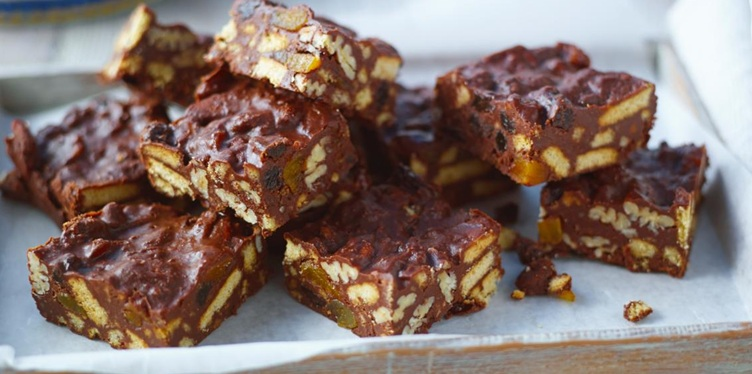

# Chocolate Fridge Cake

*Fridge cake is the catch-all British no-bake bar: chocolate, butter, golden syrup, broken biscuits and whatever fruit and nuts the cupboard offers. This version balances milk and dark chocolate so it isn't cloying, and uses dried apricots, raisins and pecans for a more grown-up bite than its rocky-road cousin.*

**Makes:** 12 squares

**Prep Time:** 15 minutes (plus 1 to 2 hours chilling)

## Overview
A no-bake chocolate slab built on a half-and-half blend of milk and dark chocolate, melted with butter and golden syrup, then loaded with broken digestives, dried apricots, raisins and pecans. Not as sweet as rocky road, not as dense as tiffin: the agnostic family recipe that uses up the bottom of the cupboard.

## Ingredients

### Chocolate base
- 150 g milk chocolate (broken into pieces)
- 150 g dark chocolate (broken into pieces)
- 100 g unsalted butter
- 150 g golden syrup

### Mix-ins
- 250 g digestive biscuits
- 100 g dried apricots (chopped)
- 75 g raisins
- 60 g pecan nuts (chopped, optional)

## Method

### Stage 1 – Prepare the tin and biscuits
1. Line a 20 cm (8 inch) shallow square tin with cling film, leaving plenty of overhang on two sides for lifting the cake out later.
1. Place the digestive biscuits in a food bag and bash with a rolling pin until you have a mix of small chunks and coarse crumbs (don't reduce to powder).

### Stage 2 – Melt the chocolate base
1. Combine the milk chocolate, dark chocolate, butter and golden syrup in a heatproof bowl.
1. Set over a pan of simmering water, making sure the bowl doesn't touch the water. Stir occasionally as the mixture melts together.
1. Remove from the heat as soon as the chocolate is fully melted; over-heating dulls the gloss.

### Stage 3 – Combine
1. Add the broken biscuits, chopped apricots, raisins and pecans (if using) to the melted chocolate.
1. Fold gently with a spatula until everything is evenly coated.

### Stage 4 – Set
1. Spoon the mixture into the lined tin.
1. Level the surface by pressing down with a potato masher or the back of a large spoon (a masher gives a neater finish without compacting too much).
1. Refrigerate for 1 to 2 hours, or until fully set.

### Stage 5 – Cut
1. Turn out of the tin using the cling film overhang and peel off the wrapping.
1. Cut into 12 squares with a sharp knife (warm in hot water and wipe dry between cuts for clean edges).

## Notes
- **Mix the chocolates:** All milk chocolate ends up cloying; all dark chocolate is too bitter without a strong fruit balance. Half-and-half hits the sweet spot.
- **Mix-ins are flexible:** The proportions are loose, anything totalling about 230 g of fruit or nuts will work. Glace cherries, dried cranberries, chopped marshmallows, popcorn and meringue pieces all slot in.
- **Rich tea instead of digestives:** Slightly drier and crisper. Use whichever you prefer.
- **Gluten-free version:** Swap in gluten-free digestives and the rest of the recipe is naturally GF.
- **Doesn't need the fridge to keep:** Once set, the cake stores fine in a tin at room temperature; only refrigerate on hot days.

## Variations
**Rocky road style:** Add 100 g mini marshmallows along with the dried fruit for a softer, bouncier bar.
**Festive:** Use 75 g glace cherries and 75 g chopped nuts in place of the apricots for a Christmas tin.
**Boozy:** Soak the raisins and apricots in 2 tablespoons of dark rum or brandy for an hour before adding; drain briefly before folding in.
**Salted top:** Sprinkle flaky sea salt across the surface before chilling.

## Serving
Serve with: A cup of strong tea or coffee; a generous wedge after Sunday lunch.
Garnish with: A dusting of cocoa powder or icing sugar just before serving.

## Storage
- Keeps in an airtight tin at cool room temperature for up to 2 weeks.
- Refrigerate on warm days; chocolate softens above ~22°C.
- Freezes well in airtight wrap for up to 3 months; defrost in the fridge before serving.
