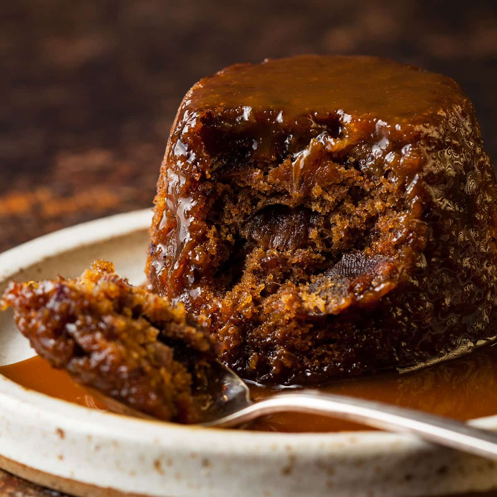

# Sticky Toffee Pudding

*Date sponge with a deeply caramel toffee sauce that gets poured over and around the pudding to soak in. The British end-of-Sunday-lunch winter pudding; debatably invented in the Lake District in the 1970s; entirely beloved.*

**Serves:** 6-8

**Prep Time:** 20 minutes

**Cook Time:** 35 minutes

## Overview
Dates soak in boiling water with bicarbonate of soda (which softens them and gives the sponge its dark colour). The dates blend smooth, mix into a butter-sugar-egg-flour batter, and bake. While it bakes, a toffee sauce builds: butter, brown sugar, cream, simmered to glossy. Holes get poked in the warm pudding; sauce pours over.

## Ingredients

### Sponge
- 200 g pitted Medjool dates (chopped)
- 250 ml boiling water
- 1 teaspoon bicarbonate of soda
- 175 g self-raising flour
- 1 teaspoon baking powder
- 75 g unsalted butter (softened)
- 175 g soft dark brown sugar
- 2 large eggs
- 1 teaspoon vanilla extract

### Toffee sauce
- 175 g soft dark brown sugar
- 100 g unsalted butter
- 250 ml double cream
- 1 teaspoon vanilla extract
- A pinch of flaky sea salt

### To serve
- Vanilla ice cream or extra cream

## Method

### Stage 1 – Soften the dates
1. Heat the oven to 180°C (160°C fan).
1. Place the chopped dates in a small bowl with the bicarbonate of soda.
1. Pour over the boiling water; let sit 10 minutes.
1. Blend smooth with an immersion blender (or push through a sieve).

### Stage 2 – Sponge batter
1. Cream the butter and brown sugar in a bowl until light.
1. Beat in the eggs one at a time.
1. Stir in the vanilla.
1. Fold in the flour and baking powder alternately with the date paste.
1. The batter is loose; that's correct.

### Stage 3 – Bake
1. Pour into a buttered 22 x 22 cm baking dish (or 6-8 small ramekins).
1. Bake 30-35 minutes (or 18-20 for ramekins) until well-risen and a skewer comes out with moist crumbs.

### Stage 4 – Toffee sauce
1. Combine the brown sugar, butter, cream and vanilla in a heavy pan.
1. Heat gently until the butter melts and sugar dissolves.
1. Bring to a simmer; cook 4-5 minutes until glossy and slightly thickened.
1. Stir in the salt.

### Stage 5 – Soak and serve
1. Remove the pudding from the oven.
1. Poke holes all over with a skewer.
1. Pour about half the sauce over slowly, letting it soak in.
1. Rest 5 minutes.
1. Serve warm in bowls; pour extra sauce over.
1. Top with ice cream or pour cold cream alongside.

## Notes
- **Medjool dates:** Bigger, softer, more caramel. Standard cooking dates work but soak them slightly longer.
- **Bicarbonate of soda is structural:** Reacts with the dates to give the deep brown colour and tender crumb.
- **Don't undercook the sauce:** A pale sauce tastes flat. Simmer until glossy and thick enough to coat a spoon.

## Storage
- Pudding keeps 3 days refrigerated; reheat at 160°C for 12 minutes (or microwave a portion 60 seconds).
- Sauce keeps 1 week refrigerated; warm to pour.
- Pudding freezes 2 months baked.
