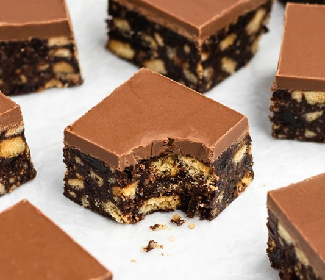

# Chocolate Tiffin

*Tiffin is the Scottish answer to the no-bake chocolate slab: a single dense layer of crushed digestive biscuits and plump raisins bound in a butter-cocoa-syrup mixture, finished with a smooth milk-chocolate top. It travels brilliantly in a lunchbox, keeps almost indefinitely in a tin, and disappears faster than anything you'll bake all week.*

**Makes:** 16 squares

**Prep Time:** 15 minutes (plus 2 hours chilling)

## Overview
A two-layer Scottish bakery classic: a chocolate-cocoa biscuit base packed with raisins, sealed under a glossy milk-chocolate top. No oven needed and no chocolate measured for the base, just cocoa for depth and golden syrup plus butter for binding. The fridge does the work.

## Ingredients

### Base
- 375 g digestive biscuits (3 ¾ cups crumbs)
- 200 g unsalted butter
- 110 g golden syrup (1/3 cup)
- 40 g cocoa powder (1/3 cup + 1 tbsp)
- 40 g caster sugar (3 tbsp)
- 180 g raisins (optional, see notes)

### Topping
- 300 g milk chocolate (broken into pieces)

## Method

### Stage 1 – Crush the biscuits
1. Grease and line a 20 cm (8 inch) square tin with baking paper, leaving an overhang on two sides for easy lift-out.
1. Place the digestive biscuits in a zip-lock bag and bash with a rolling pin until mostly fine crumbs with a few larger chunks remaining.

### Stage 2 – Make the base
1. Melt the butter, golden syrup, sugar and cocoa powder together in a large saucepan over low heat, stirring frequently until smooth.
1. Take the pan off the heat. Add the crushed biscuits and raisins (if using) and stir until everything is fully coated in the butter-cocoa mixture.
1. Tip the mixture into the prepared tin and press down firmly with the back of a spoon to form a compact, even layer.

### Stage 3 – Top with chocolate
1. Melt the milk chocolate in the microwave in 30-second bursts, stirring between each, until smooth.
1. Pour over the pressed base and tilt the tin so the chocolate covers the surface evenly.
1. Tap the tin gently on the work surface to release any bubbles.

### Stage 4 – Set and cut
1. Refrigerate for at least 2 hours, until fully set.
1. Bring the tiffin back to room temperature before slicing; chilled chocolate cracks under the knife while warmer chocolate cuts cleanly.
1. Lift out using the parchment overhang and cut into 16 squares with a long sharp knife.

## Notes
- **Biscuit alternatives:** Digestives are the classic; rich tea biscuits give a drier, lighter result. In North America, graham crackers work but tilt sweeter. Abernethy biscuits are another Scottish option. The biscuit needs enough structure not to dissolve into the butter mixture but to crush cleanly.
- **Raisins are optional:** Some Scottish bakeries always include them, others never. The version Kelsier grew up with had none. Decide on your own preference; the base holds together either way.
- **Press firmly:** Tiffin needs a compact base or it crumbles when sliced. The back of a spoon plus a bit of force gives the right density.
- **Don't slice cold:** Letting the slab come back to room temperature before cutting prevents the milk chocolate top from cracking. If it does crack, you can score the warm chocolate (5 minutes after pouring) so cuts open along the score lines.

## Variations
**With glace cherries:** Add 50 g chopped glace cherries to the base for a richer, more Christmassy slab.
**With chopped nuts:** A handful of chopped walnuts or pecans in the base adds welcome crunch.
**Rum tiffin:** Soak the raisins in 2 tablespoons of dark rum for an hour before adding. Drain briefly before folding in.
**Dark chocolate top:** Swap the milk chocolate top for 70% dark for a less sweet, more grown-up version.

## Storage
- Keeps in an airtight tin for up to 2 weeks at cool room temperature.
- Refrigerate in summer or warm kitchens; chocolate softens above ~22°C.
- Freezes well for up to 3 months in airtight wrap; defrost in the fridge.
