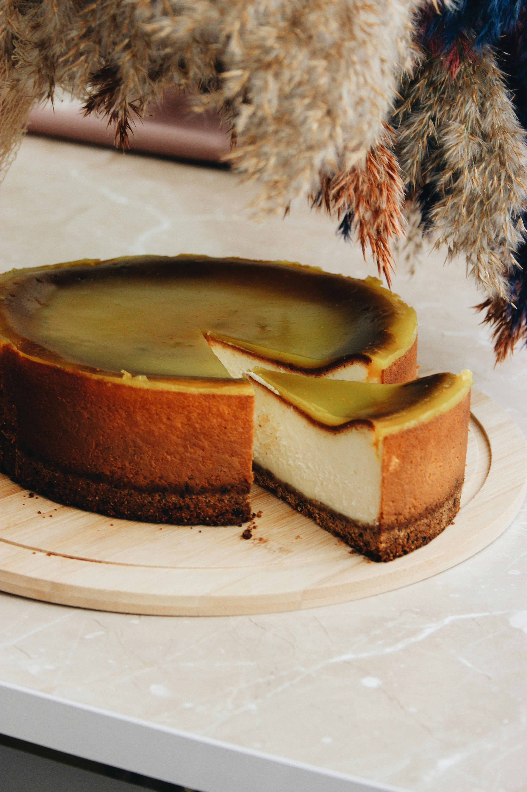

# Baked chocolate cheesecake with espresso sauce

*A rich cheesecake with a smooth velvety coffee sauce*

**Serves:** 4

## Ingredients
### For the pastry
- 175 grams plain flour
- 100 grams chopped butter
- 25 grams caster or icing sugar
- a little cold water
- zest of one orange

### For the filling
- 100 grams caster sugar
- 75 grams butter
- 200 grams dark chocolate(75% cocoa solids)
- 500 grams cream cheese
- 2 eggs, beaten

## For the sauce
- 150 ml Tia Maria or other coffee liqueur
- 2 tablespoons espresso coffee powder
- 2 tablespoons caster sugar

## Overview
A rich and elegant chocolate cheesecake with a delicate shortcrust pastry base, silky chocolate-cream cheese filling, and a distinctive espresso-coffee liqueur sauce. This sophisticated dessert balances the intensity of chocolate with the subtle bitterness of coffee, creating a complex flavor profile suitable for elegant entertaining.

## Method
### For the pastry
1. Make the pastry by rubbing the flour, butter and sugar together with the orange zest and binding together with the water. 
1. Knead a little and leave to rest.
1. Line an 18 cm loose-bottom tin with the pastry, don't trim the edges but leave them to hang over.
1. Bake blind at 200° C for 15 minutes. 
1. Remove the baking beans and paper and cook for a further 5 minutes. 
1. Turn the oven down to 180°C.

### For the filling
1. Cream together the butter and sugar until light and fluffy.
1. Melt the chocolate, then add to the butter and sugar. 
1. Add the cream cheese and mix well.
1. Add the eggs and mix well.
1. Turn into the pastry case and bake for 30-35 minutes.
1. Leave to cool and then turn out.

### For the sauce
1. Place the liqueur in a saucepan and bring to the boil.
1. Stir in the coffee powder making sure it is well dissolved. 
1. Add the sugar and stir well.
1. Reduce the heat and simmer until it is the consistency of a thick syrup. 
1. Remove from the heat and leave to cool.

## Notes
- The pastry should be blind-baked to prevent a soggy bottom layer; finishing with an additional 5 minutes of baking without baking beans ensures crispness
- The filling should be smooth and creamy rather than whipped, which would incorporate too much air and cause cracks; mixing gently is essential
- Baking at 180°C for the specified time (30-35 minutes) creates a cheesecake that is just set at the edges with a slight-wobble in the center; overbaking results in cracks and dryness
- The espresso sauce provides elegant bitterness that balances cheesecake richness; serving it warm alongside cold cheesecake creates temperature contrast

## Serving
Slice the cooled cheesecake with a sharp knife dipped in hot water (wipe between cuts) for clean presentation. Serve chilled with warm espresso sauce drizzled over or pooled around the slice. The contrast between cold cheesecake and warm sauce is essential.

## Storage
Baked cheesecake keeps refrigerated for up to 4 days, tightly wrapped to prevent absorption of refrigerator odors; the flavor actually matures and improves. Do not freeze, as freezing alters the texture of cream cheese. The espresso sauce can be made 2-3 days ahead and reheated gently before serving. Serve chilled from the refrigerator.

