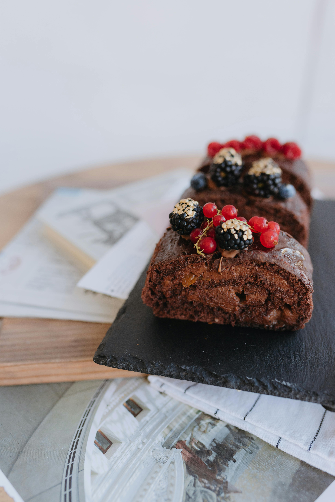

# Chocolate Roulade

**Prep Time:** 45 minutes
**Cook Time:** 20 minutes
**Serves:** 10

## Ingredients
### For the meringue
- 4 egg whites
- 250 g golden unrefined caster sugar
- 1 tsp cornflour
- 1 tsp white wine vinegar
- icing sugar to dust

### For the filling
- 100 g plain chocolate
- 15 g butter
- 1 tbsp golden syrup
- 4 tbsp cream liqueur
- 300 ml double cream, whipped

## Overview
An elegant and impressive dessert of crispy meringue rolled around a rich chocolate filling, creating a beautiful spiral when sliced. The contrast between the light, airy meringue and the dense, silky chocolate filling provides the perfect balance of textures and flavors in this sophisticated French-inspired creation.

## Method
1. Heat the oven to 170°C.
1. Place the egg whites in a clean grease-free bowl and whisk until they stand in stiff peaks. 
1. Gradually add the sugar, 1 tbsp at a time until glossy. Whisk in the cornflour and vinegar.
1. Spread out the mixture in the tin, then bake for 20 minutes until the top is crisp. 
1. Dust a sheet of baking parchment with icing sugar, then top the meringue on to the paper and peel off the lining paper. Leave to cool.
1. Melt the chocolate, butter and syrup in a bowl over a pan of pre-boiled water. 
1. Reserve 4 tbsp of the chocolate sauce for decoration.
1. Stir in the liqueur in to the cream.
1. Spread the cream over the meringue, then spoon over the chocolate sauce.
1. Roll up the meringue from one short end. Dust with the icing sugar, drizzle with the reserved chocolate sauce and serve.
## Notes
- The meringue must be baked at 170°C to create a crisp top while maintaining a slightly chewy interior that makes rolling possible; too-low heat creates a soft, wet meringue that cannot be rolled
- The cornflour and vinegar both contribute to meringue texture: cornflour provides stability and vinegar (or lemon juice) helps prevent crystallization and maintain flexibility
- Cool the meringue on the paper before removing; this allows it to set without cracking or breaking during transfer
- Roll the roulade firmly but gently; a jerky motion will cause it to crack

## Serving
Slice the roulade with a sharp, thin-bladed knife dipped in hot water (wipe between cuts) to reveal the beautiful chocolate-striped interior. Dust the cut surface lightly with icing sugar and drizzle with the reserved chocolate sauce. Serve immediately for the best texture contrast.

## Storage
The roulade can be assembled up to 2-3 hours before serving and kept covered lightly in a cool location (not refrigerated, as cold makes the meringue hard). The meringue base can be baked the day before and kept in an airtight container at room temperature. Do not refrigerate the assembled roulade or the meringue will become tough and hard; instead, keep in a cool room.

