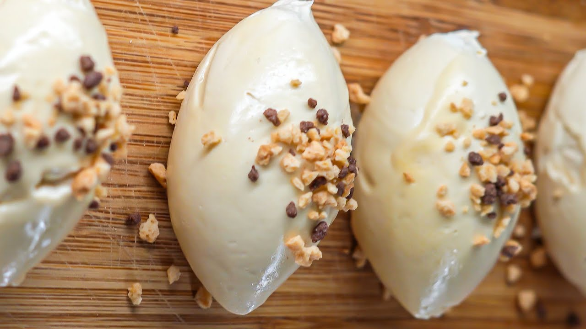

# Mascarpone with dates and candied peel

*This simple dessert takes only minutes to assemble. A few turns of the pepper mill over the quenelle makes this dessert triumphant.*

**Serves:** 4

## Ingredients
- 120 grams Candied fruit peel (preferably grapefruit)
- 4 dates
- 200 grams mascarpone cheese
- 200 ml whipping cream
- 200 ml Crème anglaise (preferably pistachio)

## Overview
An elegant and simple Italian dessert of candied fruit and dates folded into luxurious mascarpone cream, shaped into a quenelle and served with crème anglaise and candied fruit garnish. This sophisticated yet straightforward dessert celebrates the natural sweetness of dates and the richness of mascarpone without unnecessary complication.

## Method
1. Cut the candied grapefruit peel strips into large dice. 
1. Quarter and stone the dates. Set aside 4 date quarters and a spoonful of the candied peel for decoration. Dice the rest of the dates.
1. Put the mascarpone into a large bowl. In another bowl, whip the cream to a ribbon consistency, then fold into the mascarpone using a rubber spatula.
1. Now fold in the diced dates and candied fruit, without overworking.
1. Using 2 large spoons dipped in hot water, shape a quenelle from the mascarpone mixture and place on an individual plate. 
1. Repeat for the other 3 servings. Decorate with the reserved date pieces and candied fruit.
1. Pour a little Crème anglaise around each quenelle and serve chilled.

## Notes
- Mascarpone should be at room temperature when whipping with cream; cold mascarpone can become grainy and thick rather than creamy
- The whipped cream should reach ribbon consistency only (slightly thickened but still pourable); overwhipping causes graininess and density
- Using a quenelle shape (two hot spoons) creates an elegant presentation; dipping the spoons in hot water between each quenelle ensures clean shape
- The candied citrus peel adds beautiful color and textural contrast; grapefruit peel has particularly elegant bitter-sweet flavor

## Serving
Shape and place the mascarpone quenelle on the plate, scatter reserved candied fruit and date pieces decoratively, and pour a thin ring of crème anglaise around the base. Serve immediately, showing appreciation for the simplicity and quality of ingredients.

## Storage
The mascarpone cream mixture can be prepared several hours ahead and kept refrigerated, covered. Shape and serve the quenelle no more than 20-30 minutes before serving to maintain its definition; warmer rooms cause it to soften and lose shape. The candied fruit and dates can be prepared 1 day ahead.

