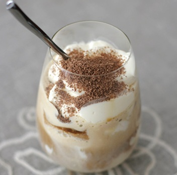

# Tiramisu

**Serves:** 4

*The Amaretto in this Tiramisu really enhances the flavour and aroma of this classic Italian dessert.*

## Ingredients
- 90 ml  Amaretto liqueur
- 300 ml Espresso coffee (cold)
- 45 grams caster sugar
- 250 ml double cream (whipped)
- 2 eggs (separated)
- 250 grams mascarpone cheese
- 30 Savoiardi Biscuits
- cocoa powder (to dust)

## Overview
The iconic Italian dessert of coffee-soaked Savoiardi biscuits layered with a light mascarpone cream enriched with whipped cream and Amaretto liqueur, finished with a dusting of cocoa powder. This no-bake elegant dessert delivers coffee flavor, textural contrast, and the satisfaction of an assembled-to-order presentation rather than baked creation.

## Method
1. Pour the coffee into a large bowl, mix in 3 tablespoons of Amaretto liqueur and set aside.
1. Beat the egg yolks and sugar in another large bowl for about 5 minutes until thick and pale. 
1. Add the mascarpone cheese and beat thoroughly to mix. 
1. Use a metal spoon to gently fold in the whipped cream.
1. Beat the egg whites in a third large bowl until soft peaks form. 
1. Fold them quickly, but gently into the cream mixture, add the remaining liqueur, trying not to lose the volume.
1. Dip each biscuit into the coffee for just 2 seconds and no longer, otherwise the biscuits will go soggy. 
1. Drain and use to cover the bottom of 4 dessert glasses. 
1. Spoon some of the cream mixture over the biscuits, and then repeat the process. 
1. Smooth the surface with a knife, cover with cling film and chill for about 2 hours to allow the flavours to combine.
1. Just before serving, dust with cocoa powder (Do not dust earlier than this or the cocoa will turn the tiramisu bitter)

## Notes
- Dipping biscuits for exactly 2 seconds (not longer) ensures they soften and absorb flavor without becoming soggy and falling apart; practice and quick work are essential
- The egg yolks and sugar should be beaten until pale and thick (ribbon stage) to aerate the mixture and incorporate maximum volume
- Folding the whipped cream gently preserves the air bubbles created by whisking; rough folding deflates the mixture and results in dense texture
- Chilling for the recommended 2 hours allows flavors to develop and components to set; even 1 hour provides adequate setting, though overnight improves flavor integration

## Serving
Serve directly from chilled glasses, using a spoon to enjoy the layered presentation and textured components. Dust generously with cocoa powder only immediately before service, not before refrigerating (as noted in the recipe, cocoa can turn bitter with extended contact).

## Storage
Assembled tiramisu keeps refrigerated in a covered container for up to 3 days; the flavors actually improve over time as the coffee and Amaretto integrate. Do not freeze, as the whipped cream texture deteriorates. Dust with cocoa powder only immediately before serving. The unassembled components (egg mixture, whipped cream) should not be made more than 2-3 hours ahead.

