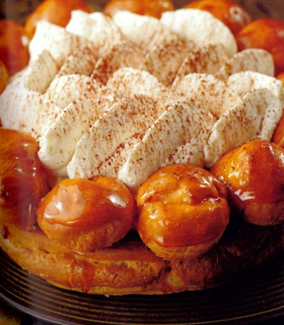

# Gâteau St. Honoré with cocoa dusted chantilly cream

*This impressive dessert represents the pinnacle of the patissier's craft.*

**Serves:** 8

## Ingredients
- 200 grams [puff pastry](../../baking/pastry/puff-pastry.md)
- 1 quantity freshly made [choux paste](../../baking/pastry/choux-pastry.md)
- eggwash (1 egg yolk mixed with 1 tablespoon milk)
- Filling
- 600 grams [chantilly cream](../../baking/cremes/creme-chantilly.md) (flavoured generously with vanilla)
- 2 tablespoons cocoa powder
- Caramel
- 200 grams caster sugar

## Overview
The pinnacle of classical French pastry work, this elaborate gâteau consists of a puff pastry base topped with a choux ring, surrounded by small caramel-topped choux puffs, and filled with vanilla-infused crème chantilly dusted with cocoa. This architectural masterpiece demands skill and precision but delivers stunning visual impact and sophisticated flavor.

## Method
### Pastry base
1. On a lightly floured surface, roll out the puff pastry to a 24 cm diameter disc, 2 mm thick.
1. Roll it loosely over a rolling pin and unroll it onto a baking sheet lightly moistened with cold water.
1. Lay a 22 cm diameter flan ring on the pastry and cut off the excess pastry around the ring with a knife tip.
1. Prick the base in about 10 places with a fork and refrigerate for 20 minutes.
1. Preheat the oven to 180°C.

### Choux base
1. Put a little less than two-thirds of the choux paste into a piping bag fitted with a 1 cm plain nozzle.
1. Starting from the centre of the pastry base and working outwards, pipe a spiral, holding the nozzle 2 mm above the pastry and stopping 3 cm from the edge of the pastry to leave a clear border.
1. Brush the border with eggwash, then pipe a 'crown' of choux paste onto the border, holding the nozzle at least 5 cm above the pastry.
1. Brush the crown with eggwash and bake in the oven for 35 minutes.
As soon as it is cooked, slide it onto a wire rack with the aid of a palette knife.

### Choux puffs
1. Put the rest of the choux paste into a piping bag fitted with a 5 mm plain nozzle and pipe 16 puffs, 2 cm in diameter, onto a lightly greased baking sheet.
1. Brush with eggwash and press the tops lightly with the back of a fork.
1. Bake in the oven for 20 minutes.
1. Carefully make a small hole in the base of each puff with a knife tip, then place on a wire rack.

### Caramel
1. Put 50 ml of water and the sugar in a heavy based saucepan and slowly bring to the boil.
1. Drip a very clean pastry brush into cold water and brush down the inside of the pan near the boiling sugar to prevent it from crystalising as it caramelises.
1. When the temperature reaches 160°C, lower the heat and cook to a pale amber caramel.
1. Spear the base of one choux puff with a knife tip, dip the top in the caramel to coat, then stand the puff on a chilled baking sheet.
1. Repeat to coat the tops of the other 15 puffs.
1. Leave until completely cold.

### To assemble
1. Put a fifth of the chantilly cream into a piping bag fitted with a 5 mm plain nozzle and pipe it into the puffs through the holes in the pastries.
1. Arrange the puffs all round the edge of the choux pastry crown, attaching them firmly with a dab of caramel.
1. Put the rest of the chantilly cream into a piping bag fitted with a St. Honoré nozzle (or a large fluted nozzle).
1. Pipe the cream attractively and generously into the centre of the crown and dust with a veil of cocoa powder.
1. Transfer the St. Honoré to a large flat plate and serve at once.

## Notes
- All components must be perfectly executed: the puff pastry thin and crisp, the choux rings properly shaped, the puffs uniform in size
- The spiral of choux piped on the pastry base must be continuous and evenly spaced; this base provides structural support for the crown
- Caramel coating the puffs must be at precisely 160°C; cooler caramel becomes sticky and ruins the crisp puff, hotter caramel becomes too hard to bite through
- Final assembly should happen as close to serving as possible; the cocoa dust absorbs moisture from the cream and becomes muddy rather than velvety if applied too far ahead

## Serving
Present the St. Honoré on a decorative serving plate and bring to the table whole for drama, then carefully cut into wedges at the table. Each slice shows the beautiful architectural layers. Serve immediately for maximum crispness and visual impact.

## Storage
All components can be prepared ahead: puff pastry base baked 1 day ahead, choux elements baked several hours ahead. Assemble no more than 1-2 hours before serving; beyond that, the crisp choux begins to soften from the moisture in the cream and the cocoa dust becomes damp. This is emphatically a dessert to execute near service time.

