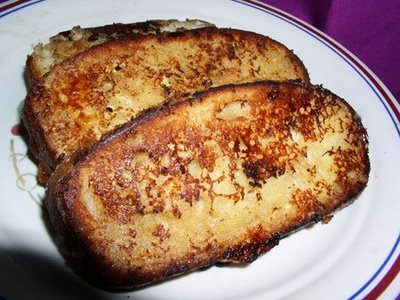

# Pain perdu

*Pain perdu or French toast is bread that has been soaked in eggs then fried. Milk, sugar and cinnamon are often mixed in with the pain perdu, and butter, fruit and syrup are sometimes served on top.*

**Serves:** 4

## Ingredients
- 600 grams [brioche dough](../../baking/pastry/brioche-dough.md)
- 120 grams sultanas
- 1 egg yolk (mixed with 2 tablespoons milk)
- 250 ml cold milk
- 50 ml crème fraîche 
- 30 grams caster sugar
- 1 whole egg
- 1 egg yolk
- pinch of salt
- 140 grams butter
- 50 grams granulated sugar to sprinkle

## Overview
French toast at its most elegant: thick-cut slices of rich brioche dotted with sultanas, soaked in a custard-like mixture of egg and milk, then pan-fried until golden and served with a crispy sugar crust. This luxurious interpretation of humble bread transforms it into a sophisticated dessert or brunch dish that tastes decadent without being overly heavy.

## Method
1. Knead the sultanas into the brioche dough, then shape into a roll 3 cm in diameter, on a lightly floured surface and place on a baking tray.
1. Leave for 1½ hours at about 24°C until nearly doubled in size.
1. Preheat the oven to 200°C.
1. Brush the brioche with the glaze.
1. Using a sharp knife, dipped in cold water, slice the brioche at 2 cm intervals at a depth of 1 cm.
1. Bake in the oven for 10 minutes, then lower the temperature to 170°C and bake for a further 20 minutes.
1. Allow to cool on a wire rack.
1. Put the milk, crème fraîche, sugar, egg, egg yolks and salt into a bowl and mix together lightly, using a balloon whisk.
1. Cut the brioche into at least 8 slices, about 1.5 cm thick.
1. Pour the milk and egg mix into a shallow dish large enough to fit all the brioche slices.
1. Lay the sliced in the dish to soak and turn them over after 2 minutes.
1. In a large non-stick frying pan, heat 80 grams of the butter.
1. When it begins to foam, lay the brioche slices in the pan.
1. After 1 minute, add the remaining butter in little pieces in between the brioche slices. and turn the slices over; they should be light brown in colour.
1. Cook for 1 - 2 minutes on the other side until nicely golden, then sprinkle with the granulated sugar.

## Notes
- The brioche dough containing sultanas must rise properly before baking; underdeveloped dough creates a dense texture unsuitable for soaking
- Slicing the brioche at 2cm intervals partway through the height creates decorative scoring that also helps it absorb the custard mixture evenly
- The soaking liquid must contain both egg (for richness) and crème fraîche (for subtle tang); milk alone creates a bland result
- Butter must be foaming hot when the brioche slices are added; this creates the essential golden crust and crispy exterior

## Serving
Serve the pain perdu warm, still with the sugar crust crispy and glistening. Accompany with whipped cream, fresh berries, or a warm fruit compote. The contrast between the crisp exterior, soft brioche interior, and accompanying sauce creates a memorable dish.

## Storage
Pain perdu is best served immediately while warm and the sugar crust is crisp. The brioche can be baked the day before and kept wrapped at room temperature. The soaking mixture can be prepared several hours ahead. Soak and fry the brioche only when ready to serve, as softness develops quickly after cooking.

