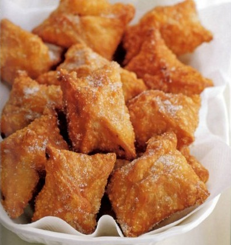

# Parcels of poached pears

*Crisp on the outside, meltingly soft within, these hot little parcels are delectable. They can be prepared several hours in advance, up to the stage where you cook them, and the pears can be poached a day ahead.*

**Serves:** 6

## Ingredients
- 500 grams caster sugar
- 8 cloves
- 4 perfectly ripe pears
- 300 grams [puff pastry](../../baking/pastry/puff-pastry.md)
- 6 [crêpes](../../desert/crepes/crepes.md) (20 cm in diameter)
- 8 fresh mint leaves (finely chopped)
- groundnut oil (to fry)
- granulated sugar (to dust)

## Overview
Elegant little parcels of crispy puff pastry encasing tender poached pear wrapped in delicate crêpes and perfumed with mint. These impressive individual presentations combine multiple sophisticated elements and layers of flavor, making them perfect for elegant dinner parties or French restaurant-style service.

## Method
### To cook the pears
1. Put 500 ml of water into a saucepan with the sugar and cloves and bring to the boil over a gentle heat.
1. Keep the syrup at a bare simmer (90°C).
1. Peel, halve and core the pears, then add to the syrup and poach gently for 10 minutes.
1. Remove from the heat and leave the pears to cool in the syrup.
1. Once cool, place in the fridge.

### To make the parcels
1. On a lightly floured surface, roll out half the pastry as thinly as possible, no more than 2 mm thick.
1. Transfer to a baking sheet lined with greaseproof paper and refrigerate.
1. Roll out the remaining pastry the same way, then layer on the other rolled-out sheet in the fridge, with a sheet of greaseproof paper between.

### To assemble
1. Drain the pears and cut into 2 cm dice.
1. Cut the crêpes into pieces just big enough to wrap the pear pieces.
1. Roll each pear dice in snipped mint, then wrap in a crêpe piece.
1. Cut the pastry into 8 cm squares, and place a crêpe-covered piece of pear in the centre of each pastry square, then bring the sides of the square up over the top and pinch the edges together to seal.
1. Refrigerate for 10 minutes.
1. Heat the oil in a heavy saucepan to 170°C.
1. Cook the parcels in batches of 8 - 10 at a time in the hot oil for 4 - 5 minutes, until nutty brown in colour and crisp.
1. Drain on kitchen paper; keep hot while cooking the rest.
1. Serve the little parcels, hot, dusted with granulated sugar.

## Notes
- Rolling the puff pastry very thin (2mm maximum) ensures it fries to a light, crispy texture rather than thick and doughy
- The pears must be ripe enough to be tender but firm enough to hold their shape and cut into neat dice; under ripe pears are tough and overripe ones disintegrate
- The crêpes wrap the pear pieces and provide moisture and delicate flavor; they soften in the poaching syrup but remain structurally intact
- The oil temperature of exactly 170°C is critical; hotter oil burns the pastry exterior before the interior heats and colder oil results in soggy, greasy parcels

## Serving
Serve the parcels hot, dusted with granulated sugar which adds crunch and sweetness. The contrast between the crispy fried pastry exterior and the soft, meltingly tender pear and crêpes inside is the dessert's appeal. Serve with a small jug of the poaching syrup or vanilla crème anglaise.

## Storage
The poached pears can be prepared 1 day ahead and refrigerated in their syrup. The puff pastry and crêpes can be prepared several hours ahead and kept refrigerated separately (crêpes wrapped to prevent drying). Assemble the parcels just before frying (up to 30 minutes ahead, refrigerated) to prevent sogginess. Fry only when ready to serve; do not attempt to reheat as they will lose their crispness.

