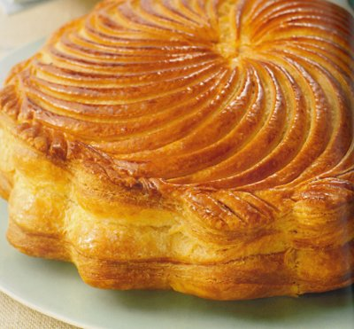

# Pithiviers

**Serves:** 8

## Ingredients
- 500 grams [feuilletage](../../baking/pastry/puff-pastry.md) (classic puff pastry)
- 250 grams [crème d'amande](../../baking/cremes/creme-damande.md)
- 50 grams [crème pâtissière](../../baking/cremes/creme-patissiere.md)
- 1 tablespoon rum (optional)
- eggwash (1 egg yolk mixed with 1 tablespoon of milk)
- 30 grams icing sugar (to glaze)

## Overview
A stunning and elegant puff pastry tart filled with almond cream and topped with decorative curved rays and petal shapes, finished with a shimmering icing sugar glaze. This classical French pastry requires precision and skill but rewards with an impressive presentation and the delicious combination of buttery pastry, almond cream, and caramelized sugar.

## Method
### Prepare the pastry
1. Cut the pastry into 2 pieces, one weighing 300 grams and the other 200 grams.
1. On a lightly floured surface, roll out the smaller piece of pastry to a round, giving it several quarter turns, until you have a 24 cm diameter disc, 3 mm thick.
1. Roll it loosely on a rolling pin, then unroll it onto a baking sheet lightly brushed with cold water to form the pithiviers base.
1. Roll out the large piece of pastry for the top in the same way to make a 24 cm disc, 4 mm thick.

### Make the pithiviers
1. Mix the crème d'amande and crème pâtissière together and flavour with the rum if you wish.
1. Spoon the mixture into the middle of the pastry base and spread it evenly with a spoon, leaving a 3 - 4 cm margin around the edge.
1. Brush the exposed pastry with eggwash.
1. Lift the other pastry disc over the top and press the edges together firmly with your fingertips to seal.
1. Refrigerate for 30 minutes.

### Decorate the pithiviers
1. Press a pithiviers marker or a 16 cm flan ring onto the pithiviers.
1. Use a knife to cut the pastry extending outside the marker into small regular 'petals'.
1. Remove the excess pastry and lift off the marker or flan ring.
1. Brush the whole surface of the pastry with eggwash.
1. Using a knife tip, score curved rays, 1 mm deep, arcing from the centre of the pastry out to the edge.
1. Mark the outside petals with diagonal lines.

### Bake the pithiviers
1. Preheat the oven to 200°C.
1. Bake the pithiviers for 10 minutes, then reduce the oven temperature to 160°C and bake for another 25 minutes.
1. Increase the oven temperature back up to 200°C.
1. Immediately dust the pithiviers with icing sugar and return it to the oven for 2 - 3 minutes to give an attractive glaze.
1. Serve the pithiviers warm, on its own or with crème anglaise if you prefer.

## Notes
- The puff pastry for the bottom should be thinner (3mm) than the top (4mm) to ensure the base doesn't rise as much as the top, creating an elegant dome shape
- Brushing the edges with eggwash before topping creates a seal that prevents the layers from separating during baking
- The decorative scoring (curved rays and diagonal lines on petals) must be shallow (1mm) to create visual interest without cutting through both pastry layers
- The final temperature increase to 200°C and icing sugar glaze create the characteristic caramelized, glossy finish; watch carefully to avoid burning

## Serving
Slice the pithiviers at the table with a sharp knife to reveal the beautiful interior. Serve warm or at room temperature with a spoonful of crème anglaise alongside if desired. The visual presentation with its decorative top layer and the contrast between crispy pastry and smooth filling make this a showstopper.

## Storage
The assembled but unbaked pithiviers can be refrigerated for up to 4 hours before baking, allowing you to bake when ready to serve. The baked pithiviers is best served warm or at room temperature on the day it's baked; once cool, the pastry gradually becomes soft. Cover lightly with foil if keeping warm for an hour or so after baking.

