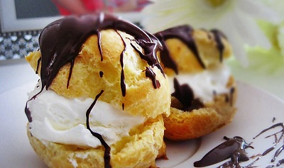

# Profiteroles with ice cream and chocolate sauce

*One of the delights of this  luscious  dessert is that all the elements can be prepared a few hours in advance.*

**Serves:** 10

## Ingredients
- 1 quantity freshly made [choux paste](../../baking/pastry/choux-pastry.md)
- eggwash (1 egg yolk mixed with 1 tablespoon milk)

### Filling
- 1 quantity vanilla ice cream

### Chocolate sauce
- 250 grams dark bitter chocolate
- 200 ml milk
- 3 tablespoons double cream
- 40 grams caster sugar
- 30 grams butter (diced)

## Overview
One of the most beloved French desserts: light choux buns traditionally filled with vanilla ice cream and drowned in warm chocolate sauce, creating a beautiful contrast between cold and hot, crispy and soft. This uncomplicated yet utterly luxurious dessert requires only quality components and careful technique for showstopping results.

## Method
### To make the choux buns
1. Preheat the oven to 180°C.
1. Line a baking sheet with greaseproof paper.
1. Put the choux paste into a piping bag fitted with a 1 cm plain nozzle and pipe out about 40 puffs, 3 cm in diameter. Pipe these out in staggered rows.
1. Brush the pastries with eggwash and bake in the oven for 20 minutes until dry and crisp on the outside, but still soft on the inside.
1. As soon as they are cooked, transfer them to a wire rack and leave until cold.
1. Using a serrated knife, cut across the top one-fifth of each puff, leaving a hinge to make a lid.
1. Set the puffs aside.

### To make the chocolate sauce
1. Chop the chocolate and place in a heatproof bowl over a pan of hot water to melt gently, stirring occasionally with a wooden spoon.
1. Put the milk, cream and sugar into a saucepan and bring to the boil, whisking continuously.
1. Take off the heat, and whilst still whisking, pour on the melted chocolate, then return to the heat.
1. Still whisking, let the sauce bubble over a medium heat.
1. Turn off the heat and whisk in the pieces of butter, one at a time.
1. Pass the sauce through a chinois or fine-meshed conical sieve into a bowl.
1. Cover with cling film and keep warm in a bain-marie.

### To serve
1. Generously fill the choux puffs with ice cream, then reposition the lids.
1. Serve in glass dishes.
1. Pour on some of the chocolate sauce and serve the profiteroles immediately.
1. Serve the rest of the chocolate sauce in a sauceboat.

## Notes
- The choux buns must be piped small (3cm diameter) and baked until completely crisp on the outside while remaining slightly soft inside; this allows filling without breaking and creates the signature textural contrast
- Propping the oven door open during the final minutes of baking allows steam to escape, ensuring crispness rather than chewiness
- The chocolate sauce should remain warm and pourable when served; keeping it in a bain-marie over barely warm water prevents scorching while maintaining temperature
- Fill the buns only as you serve to prevent sogginess; the sauce will soften the pastry if sitting too long

## Serving
Arrange the filled profiteroles in shallow bowls or pedestal dishes, pour warm chocolate sauce over generously, and serve additional sauce in a sauceboat. Serve immediately while the pastry is still crisp and the ice cream cold. The contrast between temperatures creates the essential appeal.

## Storage
Baked choux buns keep for 1-2 days in an airtight container at room temperature. The chocolate sauce can be made several hours ahead and reheated gently before serving. Vanilla ice cream should be freshly made or from the freezer. Fill the buns only when ready to serve to prevent softening. Do not refrigerate filled profiteroles as the cold will harden the pastry.

