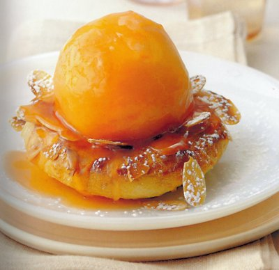

# Roasted peaches on choux crowns

*This is a lovely way to serve fresh peaches at the height of their season. For the best flavour, use perfectly ripe fruit.*

**Serves:** 4

## Ingredients
- 4 ripe peaches
- ½ quantity freshly made [choux paste](../../baking/pastry/choux-pastry.md)
- eggwash (1 egg yolk mixed with 1 tablespoon milk)
- 25 grams flaked almonds
- 75 grams caster sugar
- 100 grams butter
- 1 tablespoon grenadine syrup (optional)
- juice of 1 lemon
- icing sugar (to dust)

## Overview
A simple yet elegant celebration of ripe peaches served on crispy choux crowns topped with flaked almonds, surrounded by a butterscotch caramel enriched with grenadine. This refined dessert showcases the peak flavor of fresh summer peaches, treating them as the star ingredient while providing textural contrast with the choux.

## Method
### To peel the peaches
1. Lightly run the tip of a knife around the circumference of each peach, then immerse them in a pan of boiling water.
1. As soon as the skin starts to lift along the incision, take out the peaches and refresh them in a bowl of iced water.
1. Remove and pull off the skin.
1. Put the peaches in a roasting dish, cover and leave to cool.

### To make the choux crowns
1. Preheat the oven to 200°C.
1. Put the choux paste into a piping bag fitted with a 7 mm plain nozzle.
1. Pipe 4 discs, 6 - 7 cm in diameter onto a lightly greased baking sheet.
1. Brush with eggwash and sprinkle with the almonds.
1. Bake for about 20 minutes, propping the oven door slightly ajar halfway through the cooking to allow the steam to escape (the choux will become crisp on the outside).
1. Transfer the crowns to a wire rack and increase the oven temperature to 220°C.

### To roast the peaches
1. Melt the sugar and butter in a small pan and cook gently, stirring with a wooden spatula to make a very pale caramel.
1. Carefully add the grenadine syrup if using, and the lemon juice.
1. Still stirring, let bubble gently for 5 minutes.
1. Spoon the caramel over the peaches and roast in the oven for about 10 minutes, basting them every 3 or 4 minutes (allow an extra 5 minutes roasting if the peaches are not very ripe).
1. Leave to cool completely, basting every 10 minutes with the caramel until the peaches are cold.

### To serve
1. Put the choux crowns on individual plates.
1. Using a palette knife, place a roasted peach in the middle of each crown and dust with a veil of icing sugar.
1. Spoon a little caramel over the peaches and serve the rest separately in a small jug.

## Notes
- Ripe peaches are essential; unripe ones taste tart and mealy, overripe ones become mushy during roasting; select peaches that yield slightly to gentle finger pressure
- The choux crowns (piped as discs) are propped open at halfway through cooking to allow steam to escape, ensuring crispness of the exterior with slight softness inside
- The caramel made from sugar and butter must be very pale (light golden) rather than dark; the grenadine adds depth and beautiful color without overpowering
- Continuous basting during roasting keeps the peaches moist and coats them with caramel; this is essential to prevent drying

## Serving
Place a crispy choux crown on each plate, top with a roasted peach using a palette knife, dust with icing sugar for elegant presentation, and spoon additional caramel over and around. Serve at room temperature or lightly chilled. The contrast between the crispy choux, soft peach, and silky caramel creates a harmonious, sophisticated dessert.

## Storage
The choux crowns can be baked 1 day ahead and kept in an airtight container at room temperature. The peaches can be roasted and cooled in caramel up to 4 hours ahead, then gently rewarmed before serving. Assemble only when ready to serve to maintain the crispness of the choux. This is a dessert best served fresh rather than held for extended periods.

