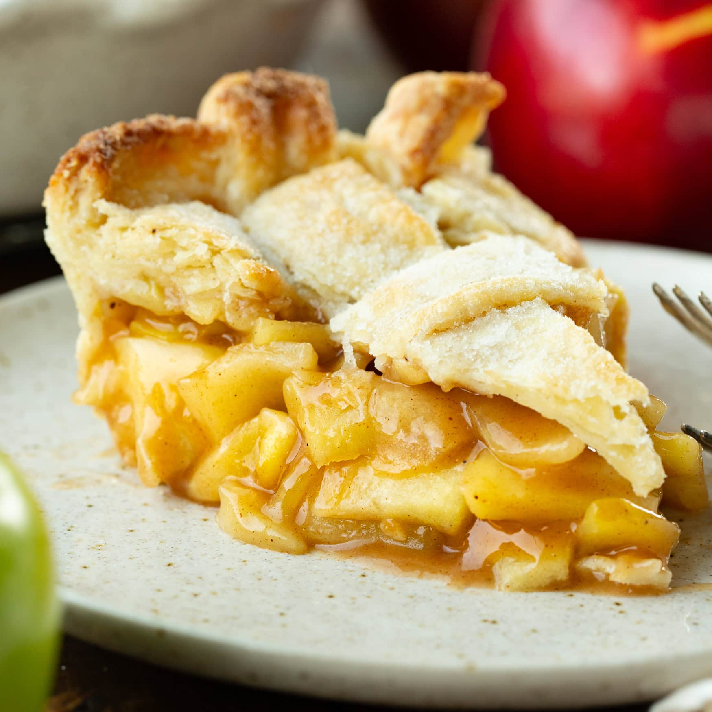

# Classic Apple Pie

*Double-crust shortcrust pie filled with cinnamon-spiced apples. The American/British family standby; equally at home for a Sunday lunch as a Boxing Day pudding. The apples should be a mix of cooking and eating types so some break down and some hold their shape.*

**Serves:** 8

**Prep Time:** 30 minutes (plus 30 minutes pastry rest)

**Cook Time:** 50 minutes

## Overview
Buttery shortcrust rests then rolls; one disc lines a pie dish, fills with sliced spiced apples, the second disc tops it. Egg-washed, sugared, vented, baked golden. The juices thicken with cornflour as they cook so the bottom doesn't go soggy.

## Ingredients

### Pastry
- 350 g plain flour
- 175 g cold unsalted butter (cubed)
- 75 g caster sugar
- 1 large egg yolk
- 3-4 tablespoons ice-cold water
- ½ teaspoon salt

### Filling
- 1 kg apples (a mix: 600 g Bramley + 400 g Cox or Braeburn)
- 100 g caster sugar
- 50 g soft light brown sugar
- 1 teaspoon ground cinnamon
- ¼ teaspoon ground nutmeg
- Juice of ½ lemon
- 2 tablespoons cornflour
- 25 g unsalted butter (cubed, for dotting)

### To finish
- 1 egg (beaten with 1 tablespoon milk)
- 1 tablespoon caster sugar (for sprinkling)

### To serve
- Vanilla ice cream, double cream, or custard

## Method

### Stage 1 – Pastry
1. Pulse the flour, salt, butter and sugar in a food processor until breadcrumb-textured.
1. Add the egg yolk and water; pulse until just coming together.
1. Tip out, divide into 2 discs (one slightly larger), wrap and chill 30 minutes.

### Stage 2 – Filling
1. Peel, core and slice the apples about 5 mm thick.
1. Toss with both sugars, cinnamon, nutmeg, lemon juice and cornflour.

### Stage 3 – Assemble
1. Heat the oven to 200°C (180°C fan).
1. Roll the larger disc to a 30 cm circle, 4 mm thick. Line a 23 cm pie dish; let the edges hang over.
1. Pile in the apple mixture; dot with butter cubes.
1. Roll the second disc to fit; lay on top.
1. Trim the overhang to 1 cm; pinch and crimp to seal.
1. Cut a small steam hole in the centre and a few decorative slashes.

### Stage 4 – Bake
1. Brush all over with egg wash; sprinkle with caster sugar.
1. Bake for 20 minutes at 200°C, then drop to 180°C (160°C fan) and bake another 30-35 minutes until deep golden and the filling bubbles through the steam hole.
1. If the edges brown too quickly, cover with foil strips.

### Stage 5 – Rest and serve
1. Cool at least 30 minutes (cutting too soon gives a runny filling).
1. Serve warm with ice cream, cream or custard.

## Notes
- **Mix of apples:** Bramley breaks down into a sauce; Cox or Braeburn keeps shape. The contrast is what makes the filling.
- **Cornflour thickens the juices:** Without it the bottom crust is soaked. 2 tablespoons is the right dose for 1 kg of apples.
- **Don't skip the rest:** Cutting hot apple pie gives a runny mess. 30 minutes lets the filling set.

## Storage
- Keeps 3 days at room temperature, longer refrigerated.
- Reheats well at 160°C for 15 minutes.
- Freezes 2 months baked or unbaked.
