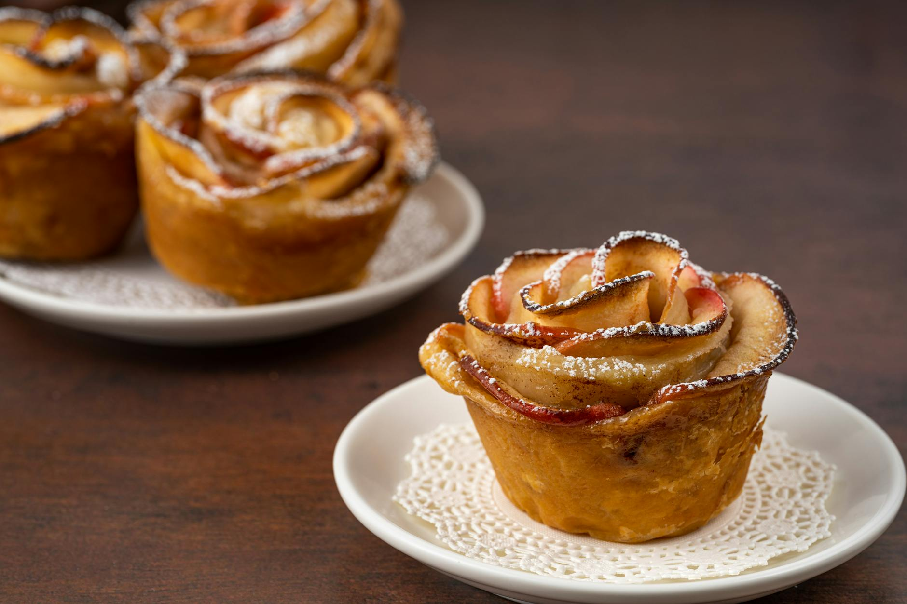

# Baked apples in a pastry cage

*Enveloped in crisp sugar-glazed pastry is an impressive way to serve baked apples.*

**Serves:** 4

## Ingredients
- 520 grams [pâte brisée](../../baking/pastry/shortcrust-pastry.md) (Shortcrust pastry)
- 8 dates (pitted and diced)
- 50 ml very fragrant jasmine tea
- 4 medium crisp apples (preferable Cox's)
- 30 grams caster sugar (to dust)

## Overview
An impressive individual dessert presentation featuring whole apples at their center, filled with date-soaked in fragrant jasmine tea, and encased in a beautifully decorated shortcrust pastry cage. This elegant combination of warming spices (jasmine), natural sweetness (dates), and crisp pastry creates a sophisticated presentation suitable for special occasions.

## Method
### Prepare the fruit
1. Put the dates in a bowl and pour the tea over them and leave to infuse for 20 minutes.
1. Prise out the core from each apple, using an apple corer, and prick the skin in several places with the tip of a knife.
1. Fill the cavities with the dates.
1. Preheat the oven to 160°C.

### Prepare the pastry
1. Roll out a quarter of the pastry to a 22 cm diameter disc, 2 mm thick.
1. Cut a 2 cm hole in the centre using a pastry cutter.
1. Starting 1.5 cm from the hole, use the tip of a small sharp knife to make a series of 4 cm long incisions in the pastry, 1 cm apart, radiating out from the hole.
1. Make short 1.5 cm cuts inwards from the outer edge at 1.5 cm intervals to make a serrated border.

### Assemble the cage
1. Brush an apple with water, then immediately lift the pastry disc with a palette knife and place it over the apple.
1. Brush a little water over the base of the apple, gather the edges of the pastry underneath and press together with your fingertips to seal it.
1. Put the 'caged' apple on a baking sheet and prepare the others in the same way.
1. Bake in the oven for about 90 minutes, checking with a knife tip that the apples are cooked; it should slide in with no resistance.
1. Remove the apples from the oven, dust with the sugar and glaze with a cook's blowtorch or place under a very hot grill until the sugar begins to melt on the pastry.
1. Serve within half an hour.

## Notes
- Jasmine tea provides subtle floral character without overpowering the delicate apple flavor; strong tea would be unpleasant, so use fragrant jasmine sparingly
- The pastry cage is purely decorative and serves no structural purpose; precise cutting creates a lace-like appearance that impresses 
- Long, slow baking (90 minutes at moderate temperature) ensures the apple fully cooks through while the pastry becomes golden and crisp
- The final torching or broiling of the sugar coating must be quick; excessive heat burns the sugar rather than creating a caramelized gloss

## Serving
Present each apple still in its pastry cage on an individual plate for maximum drama. The contrast between the delicate carved pastry and the whole fruit inside creates visual interest. Serve warm, accompanied by vanilla crème anglaise or whipped cream.

## Storage
Baked apples in pastry are best served warm, shortly after baking. They can be prepared ahead through the pastry assembly stage and refrigerated unbaked for several hours. Bake when ready to serve for freshness. If baked ahead, they can be gently reheated in a 160°C oven for 10 minutes, though the pastry gradually softens. Do not refrigerate baked apples as the pastry becomes tough in the cold.

