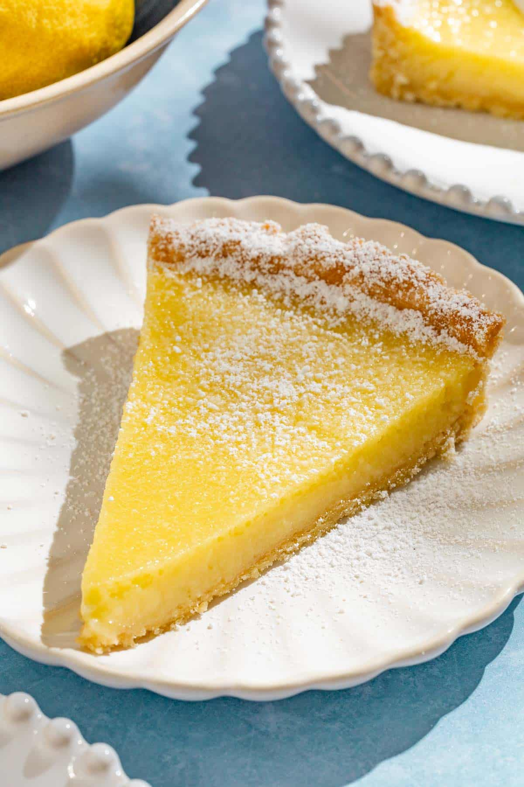

# Lemon Tart

*Tarte au citron: crisp sweet shortcrust shell with a smooth, sharp lemon custard filling. The bistro classic: pale yellow, glossy surface, almost-translucent. Sharp enough to make you blink; sweet enough to want another slice.*

**Serves:** 8

**Prep Time:** 30 minutes (plus 1 hour pastry rest)

**Cook Time:** 45 minutes

## Overview
Sweet shortcrust pastry blind-bakes to set the base. A custard of eggs, sugar, lemon juice, zest and butter cooks gently to a smooth glossy curd. The curd pours into the still-warm shell, the tart bakes briefly to set, cools fully. Served plain or with a dusting of icing sugar.

## Ingredients

### Pastry (pâte sucrée)
- 200 g plain flour
- 100 g cold unsalted butter (cubed)
- 50 g icing sugar
- 1 large egg yolk
- 2 tablespoons ice-cold water
- A pinch of salt

### Lemon filling
- 4 large eggs
- 200 g caster sugar
- Zest of 4 lemons (washed)
- 200 ml lemon juice (from the zested lemons; about 4-5 lemons)
- 100 g unsalted butter (cubed)

### To finish
- Icing sugar (for dusting)

## Method

### Stage 1 – Pastry
1. Pulse the flour, butter, icing sugar and salt in a food processor until breadcrumb-textured.
1. Add the egg yolk and water; pulse until just coming together.
1. Tip out, bring together as a disc, wrap and chill 1 hour.

### Stage 2 – Blind-bake
1. Heat the oven to 180°C (160°C fan).
1. Roll the pastry to a 30 cm circle, 4 mm thick. Line a 23 cm tart tin; press into the corners; leave a 1 cm overhang.
1. Prick the base with a fork. Line with parchment and fill with baking beans.
1. Blind-bake for 15 minutes; remove beans and parchment, bake another 8-10 minutes until pale gold and fully cooked.
1. Trim the overhang flush with the tin while still warm.

### Stage 3 – Filling
1. Whisk the eggs, sugar, zest and lemon juice in a heatproof bowl until smooth.
1. Set over a pan of barely-simmering water; cook gently, whisking continuously, for 10-12 minutes until thickened and glossy (the curd should coat the back of a spoon).
1. Off the heat, whisk in the cubed butter a few pieces at a time until fully incorporated.
1. Pass through a fine sieve to remove the zest and any lumps.

### Stage 4 – Bake the tart
1. Lower the oven to 150°C (130°C fan).
1. Pour the warm filling into the warm tart shell.
1. Bake for 15-20 minutes until just set with a slight wobble in the centre.
1. Cool completely in the tin (at least 2 hours).

### Stage 5 – Serve
1. Lift the tart out of the tin.
1. Dust with icing sugar.
1. Cut with a hot knife (dipped in hot water and wiped) for clean slices.

## Notes
- **Blind-bake fully:** A par-baked shell goes soggy under wet filling.
- **Curd cooked gently:** Bain-marie + steady whisking. Direct heat scrambles the eggs.
- **Sieve before pouring:** Removes zest fibres for a glassy-smooth top. Worth the extra step.

## Storage
- Keeps 3 days refrigerated.
- Don't freeze; the curd separates.
