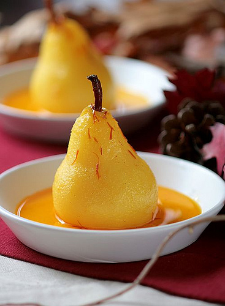

# Poached pears stuffed with figs and dates

*Simple to prepare and delectable to eat - owing to the harmonious combination of flavours - this autumn and winter dessert par excellence.*

**Serves:** 6

## Ingredients
- 6 William or conference pears (ripe)
- 1 lemon juice
- 400 grams caster sugar
- 1 cinnamon stick (broken up)
- 200 grams dates (stoned)
- 100 grams soft dried figs
- 1.5 teaspoons rum (optional)
- 400 ml Sauce caramel

## Overview
An elegant and simple dessert of whole ripe pears poached in a delicate sugar syrup infused with cinnamon, then stuffed with a fragrant compote of figs and dates, and served in caramel sauce. The combination of tender fruit, complementary flavors, and beautiful presentation makes this a timeless classic suitable for formal dinner parties.

## Method
1. Using a small, very sharp knife, mark a decorative scalloped shaped collar in the skin around the top of each pear, then peel away the skin from the collar to the base of the pear. 
1. Using a melon baller and working through the base, scoop out the core and pips.
1. Stand the pears upright in a saucepan just large enough to hold them snugly.
1. Pour in 1 litre of water and add the lemon juice, sugar and cinnamon stick. 
1. Slowly bring to the boil over a gentle heat and poach the pears at a light simmer for 10 - 15 minutes, depending on their ripeness. 
1. Transfer the poached pears and their syrup to a dish and set aside to cool completely.
1. Finely dice the dates and figs in a bowl. 
1. Pour on the rum (or 1 1/2 tablespoons of water) and mix together lightly using your fingertips.
1. When ready to serve, carefully drain the pears. Using a teaspoon, fill the cavity of each pear generously with the date and fig mixture, from the base. 
1. Place each pear on an individual serving plate and pour the caramel sauce all around. 
Any excess stuffing can be spooned alongside the fruit.

## Notes
- Selection of pear variety is important: William or Conference pears have the right balance of texture and flavor; other varieties may be too soft or too firm
- The poaching temperature of 90°C ensures gentle, even cooking without breaking the delicate fruit; too-high heat results in mushy texture
- The decorative scallop collar cut around the top of each pear is purely aesthetic but adds significant elegance to the presentation
- The fig and date filling adds textural interest and depth of flavor; the rum (or water) hydrates the dried fruits while keeping them distinct

## Serving
Arrange each pear on an individual serving plate, placing a generous spoonful of caramel sauce around the base. The pale pears against the dark caramel create striking visual contrast. Serve at room temperature or lightly chilled, allowing the different elements to shine.

## Storage
The poached pears and their syrup can be prepared 1 day ahead and kept refrigerated in a covered container. The fig and date filling can be made several hours ahead and kept at room temperature. Assemble the filled pears only when ready to serve (no more than 1 hour ahead) to prevent the filling from absorbing moisture and becoming mushy. The caramel sauce can be made the day before and reheated gently.

