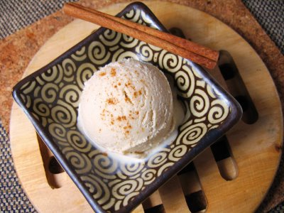

# Cinnamon Ice Cream

*Adding double cream makes this classic ice cream extra rich and creamy.*

**Serves:** 8

## Ingredients
- 750 ml [crème anglaise](../../baking/cremes/creme-anglaise.md) (warm, infused with a stick of cinnamon)
- 100 ml double cream

## Overview
A warm and aromatic ice cream infused with the sweet spice of cinnamon, creating a sophisticated frozen dessert with a distinctive flavor that bridges the gap between elegant and comforting. The exotic spice complemented by rich cream makes this an excellent accompaniment to apple desserts, pumpkin dishes, and warm spiced cakes.

## Method
1. Pour the crème anglaise into a bowl, set over ice to hasten the cooling, stirring from time to time to prevent a skin from forming.
1. Once cold, remove the cinnamon and discard.
1. Stir the cream into the crème anglaise.
1. Pour the mixture into an ice-cream maker and churn for about 20 minutes, until the ice cream is firm but still creamy.
1. Transfer the ice cream to a chilled freezer-proof container for half an hour before serving.

## Notes
- The cinnamon stick should be added to the crème anglaise while the milk is heating; this infuses the flavor throughout the custard base without requiring additional processing
- After cooling, the cinnamon stick must be removed and discarded before churning to prevent any remaining solid pieces from damaging the ice cream machine
- The cinnamon flavor develops more fully as the ice cream freezes; it may taste subtle when warm but becomes more pronounced once fully frozen
- Because of the spice's flavor intensity, this ice cream pairs wonderfully with fruit compotes and warm puddings, where its warmth complements fruit flavors

## Serving
Serve scoops of cinnamon ice cream alongside warm apple crisps, spiced pear desserts, or moist cinnamon cakes for a perfect flavor pairing. The subtle spice also complements chocolate desserts beautifully. A light wafer cookie or shortbread provides pleasant textural contrast.

## Storage
Store in the freezer for up to two weeks in an airtight, freezer-safe container. The ice cream keeps best for the first week; after that, ice crystals may begin to form on the surface despite proper covering. Allow to temper for 10-15 minutes at room temperature if the ice cream becomes very hard, making scooping easier.

