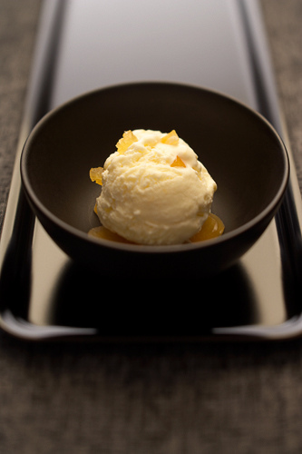

# Stem ginger ice cream

**Serves:** 8

## Ingredients
- 750 ml [crème anglaise](../../baking/cremes/creme-anglaise.md) (warm)
- 75 grams stem ginger
- 30 grams desiccated coconut
- 100 ml double cream

## Overview
A sophisticated ice cream infused with the warm spice and slight heat of stem ginger, balanced with the tropical sweetness of desiccated coconut. This bold-flavored frozen dessert creates an exciting flavor profile that stands on its own and provides an exotic accompaniment to warm cakes and caramelized fruit desserts.

## Method
1. While still hot, pour the crème anglaise into a food processor with the stem ginger and whiz for one minute.
1. Strain the crème anglaise through a chinois or fine-meshed conical sieve into a bowl, set over ice to hasten the cooling, stirring from time to time to prevent a skin from forming.
1. Once cold, remove the vanilla pod and discard.
1. Stir the cream and desiccated coconut into the crème anglaise.
1. Pour the mixture into an ice-cream maker and churn for about 20 minutes, until the ice cream is firm but still creamy.

## Notes
- Fresh stem ginger processed into the hot crème anglaise releases its flavor more effectively than steeping whole pieces; the heat also breaks down the ginger fibers for a smooth texture
- The gelatine-thickened crème anglaise must be strained through a fine sieve immediately after processing to remove any remaining ginger fiber pieces that could affect texture
- The desiccated coconut adds textural interest and complements the ginger perfectly; stir it in after cooling to prevent clumping or separation
- The strength of stem ginger varies by producer; start with the 75 grams and add more if desired for a ginger-forward result, or reduce if the heat feels overpowering

## Serving
Serve this distinctive ice cream with warm spiced apple cakes, caramelized pear tarts, or alongside tropical fruit desserts. The ginger and coconut combination works particularly well with chocolate-based cakes and pastries. A simple butter cookie or langue de chat provides textural contrast without competing flavors.

## Storage
Stem ginger ice cream keeps for up to two weeks in an airtight freezer container, though it's best served within the first week for optimal flavor and smoothness. The desiccated coconut particles may gradually settle or rise during freezing; briefly stir if visible separation occurs (this is purely aesthetic). Allow to soften for 10-15 minutes if too hard to scoop.

