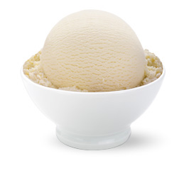

# Vanilla ice cream

*Adding double cream makes this classic ice cream extra rich and creamy.*

**Serves:** 8

## Ingredients
- 750 ml [crème anglaise](../../baking/cremes/creme-anglaise.md) (warm)
- 100 ml double cream

## Overview
Classic vanilla ice cream with a luxurious, creamy texture enriched with double cream, creating a silky and rich frozen dessert that is pure indulgence. This timeless favorite serves as both a standalone dessert and the perfect accompaniment to warm pies, cakes, and compotes.

## Method
1. Pour the crème anglaise into a bowl, set over ice to hasten the cooling, stirring from time to time to prevent a skin from forming.
1. Once cold, remove the vanilla pod and discard.
1. Stir the cream into the crème anglaise.
1. Pour the mixture into an ice-cream maker and churn for about 20 minutes, until the ice cream is firm but still creamy.
1. Transfer the ice cream to a chilled freezer-proof container for half an hour before serving.

## Notes
- The crème anglaise should be made from a good-quality vanilla pod, splitting it lengthwise to release the seeds for maximum flavor impact
- Cooling the crème anglaise over ice hastens the process and prevents condensation from forming on its surface, which would water down the mixture
- Adding double cream to the custard increases richness and improves freezing texture; the higher fat content creates smoother, less icy results
- Transfer the churned ice cream to a chilled container and allow 30 minutes in the freezer for the texture to set before serving; this prevents the soft, slushy consistency of just-churned ice cream

## Serving
Scoop generously onto plates or into chilled bowls and serve as a standalone dessert, or as an elegant accompaniment to warm cakes, fruit crisps, or berry-based desserts. Serve immediately from the freezer for optimal texture. A simple wafer cookie or fresh fruit provides nice complementary texture.

## Storage
Vanilla ice cream keeps well in the freezer for up to two weeks in an airtight container, though the texture and flavor are best within the first week. To prevent ice crystals from forming, cover the surface with plastic wrap before sealing the container. If the ice cream becomes too hard, soften it in the refrigerator for 10-15 minutes before serving.

