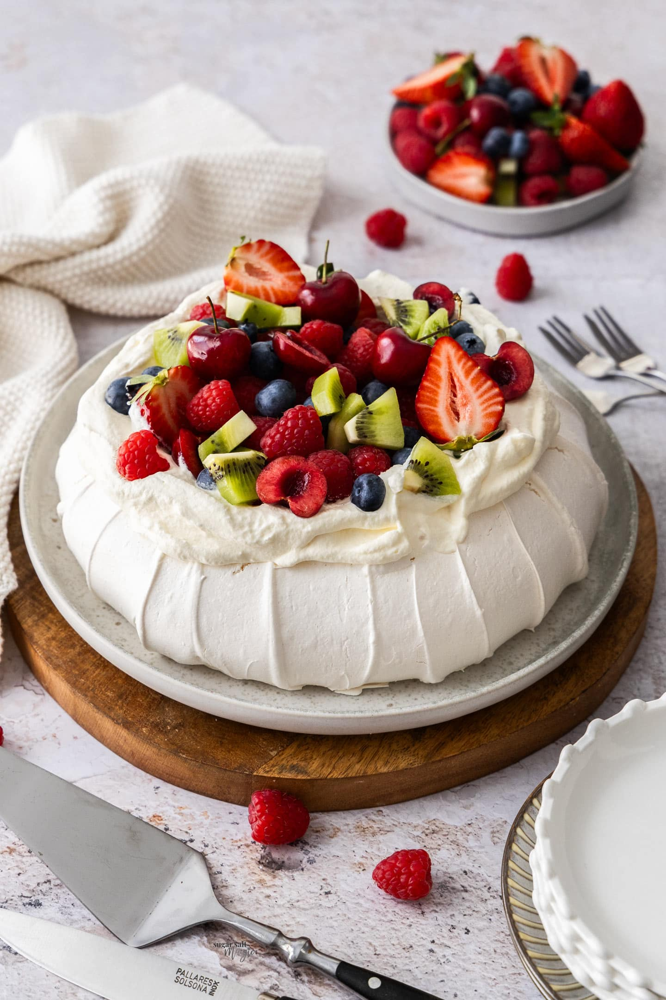

# Pavlova

*Crisp-on-the-outside, marshmallow-on-the-inside meringue base, topped with whipped cream and fresh seasonal fruit. Australia and New Zealand both claim it; both names honour Anna Pavlova. Either way, it's the easiest spectacular dessert you can make.*

**Serves:** 8

**Prep Time:** 20 minutes

**Cook Time:** 1¼ hours (plus 1 hour cooling in oven)

## Overview
Egg whites whip with sugar to stiff glossy peaks; cornflour and white wine vinegar fold in (these are what give the marshmallow centre). Spread into a circle on parchment, baked low and slow until crisp on the outside but still soft within. Cool completely; top with cream and fruit just before serving.

## Ingredients

### Meringue base
- 6 large egg whites (room temperature)
- 350 g caster sugar
- 2 teaspoons cornflour
- 1 teaspoon white wine vinegar (or lemon juice)
- 1 teaspoon vanilla extract
- A pinch of salt

### Topping
- 500 ml double cream
- 2 tablespoons icing sugar
- 1 teaspoon vanilla extract
- 400 g mixed berries (strawberries, raspberries, blackberries) or passion fruit + mango or whatever's in season
- A small handful of fresh mint leaves

## Method

### Stage 1 – Prep
1. Heat the oven to 150°C (130°C fan).
1. Line a baking sheet with parchment paper. Draw a 23 cm circle on it (turn the paper over so you don't draw on the food).

### Stage 2 – Meringue
1. Place the egg whites in the bowl of a stand mixer (or a clean dry bowl).
1. Add the salt; whisk on medium until soft peaks form.
1. Increase the speed to high; add the sugar a tablespoon at a time, allowing each to dissolve before the next.
1. Continue whisking until the meringue is stiff, glossy, and holds firm peaks (about 8-10 minutes total).
1. Sprinkle the cornflour over and drizzle in the vinegar and vanilla; fold gently with a spatula.

### Stage 3 – Shape
1. Spoon the meringue into the centre of the circle on the parchment.
1. Spread to fill the circle, building up the sides slightly higher than the centre (creates a well for the cream).
1. The texture should look swooshy and pillowy, not smooth.

### Stage 4 – Bake
1. Bake for 1¼ hours.
1. Turn the oven OFF; leave the meringue inside for at least 1 hour to cool slowly (sudden cooling cracks the surface).
1. Once completely cool, peel off the parchment.

### Stage 5 – Top
1. Whip the cream with the icing sugar and vanilla to soft peaks (don't overwhip; just-set is glossy).
1. Spread the cream over the meringue base.
1. Pile fresh fruit on top.
1. Scatter mint leaves.

### Stage 6 – Serve
1. Cut into wedges with a sharp knife.
1. Eat within an hour of assembly; the meringue softens under the cream.

## Notes
- **Cornflour and vinegar:** The chemistry that gives the marshmallow centre. Skip and you have plain meringue.
- **Cool slowly:** Pulling the meringue from a hot oven into a cold kitchen cracks the shell. Leaving it in the dying oven keeps it intact.
- **Top close to serving:** Cream-on-meringue more than 1-2 hours = soggy disc. Plan timing accordingly.

## Storage
- Plain meringue keeps 3-4 days in an airtight tin.
- Topped pavlova doesn't keep; eat within 2 hours.
