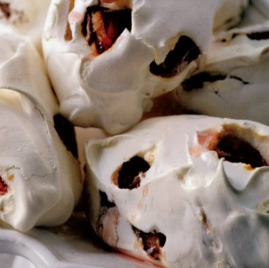

# Plum meringues

*These are delicious eaten within 24 hours of making, with the plum juice slightly oozing from them. You can also substitute the plums for fresh stoned cherries.*

**Serves:** 4

## Ingredients
- 300 grams plums
- 300 ml sirop a sorbet
- 2 bay leaves
- 275 grams [meringue Francaise](../../baking/meringue/meringue-francais.md)

## Overview
Large, soft meringues studded with plums, creating a beautiful contrast between glossy poached fruit and fluffy meringue that softens into the plums. These rustic yet elegant individual showpieces celebrate the simplicity of fresh plums combined with light, delicate meringue.

## Method
1. Using a small knife, remove the stones from the plum, without cutting them entirely in half and place in a dish.
1. Heat the sirop a sorbet with the bay leaves in a saucepan over a medium heat.
1. As soon as it reaches the boil, pour the syrup over the plums and set aside to cool completely.
1. Preheat the oven to 100°C.
1. Line a baking sheet with baking parchment or a silicone liner.
1. Drain the cooled plums and dab them lightly on kitchen paper to remove as much syrup as possible.
1. Using a large spoon, fold them lightly into the meringue mixture.
1. Using 2 large spoons, take a quarter of the meringue and shape into a large quenelle by passing it between the spoons, then place on the prepared baking sheet.
1. Repeat to make another 3 meringues.
1. Cook in the oven for 2 hours.
1. Leave the meringues on the baking sheet to cool a little, then using a palette knife to transfer them to a wire rack.
1. Leave in a dry place to cool completely before serving.

## Notes
- Remove plum stones while keeping the fruit intact (using a small, thin knife inserted sideways) to maintain the plum's attractive appearance before poaching
- The meringue should be folded gently into the plums, not mixed vigorously, to prevent breaking down the meringue structure and crushing the fruit
- Large quenelles (one-quarter of the mixture each) result in show-stopping individual portions; smaller quenelles work but lose visual impact
- Baking at 100°C for 2 hours creates tender meringues that yield slightly when pressed, quite different from crispy meringues; this texture beautifully complements the soft plums

## Serving
Serve each large meringue on its own plate or in a shallow bowl, allowing the plum juice that has bled into the meringue to create an attractive mottled appearance. A spoonful of the reserved poaching syrup can be spooned alongside. Serve at room temperature or lightly chilled.

## Storage
Plum meringues are best served within 24 hours of making, while the plum juice has just begun to stain the meringue and before it becomes overly soft. They can be kept covered at room temperature for up to 2 days, though the meringues gradually absorb moisture and soften. The poached plums and syrup can be prepared the day before and refrigerated in a covered container; fold them into the meringue just before baking.

