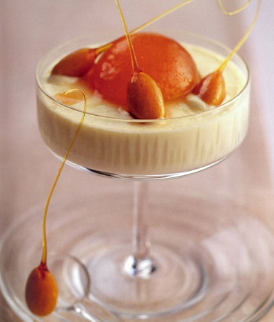

# Apricot and cognac mousse with caramelised almonds

*For this elegant and delicate dessert, the crunch of the almond caramel coating contrasts beautifully with the silkiness of the apricot mousse.*

**Serves:** 6 - 8

## Ingredients
- 850 ml [sirop a sorbet](../../base-ingredients/syrup/sirop-a-sorbet.md)
- 1 vanilla pod (split length-ways)
- 10 ripe apricots
- 2 sheets leaf gelatine
- 30 ml Cognac
- 250 ml very cold double cream
- caramelised almonds
- 125 grams caster sugar
- 40 grams liquid glucose
- 32 blanched almonds

## Overview
An elegant and sophisticated mousse showcasing the delicate flavor of ripe apricots enriched with Cognac, crowned with candied almonds that provide a beautiful crunch. This refined dessert balances fruit flavor with alcohol warmth and almond texture, making it a memorable finale to a refined dinner.

## Method
1. Put 750 ml of the sirop a sorbet and the vanilla pod into a medium saucepan and bring to the boil.
1. Add the apricots and simmer gently for 3 - 5 minutes, depending on the ripeness, then leave the fruit to cool in the syrup.
1. Chill the remaining 100 ml syrup.

### For the almonds
1. Put 50 ml water into a small pan, add the sugar and bring slowly to the boil.
1. Add the glucose and heat to 155°C, then take off the heat.
1. One at a time, spear the almonds onto a cocktail stick and dip in the syrup, then lift out and hold over the pan to drain until an elongated drip forms and slightly hardens.
1. Transfer to a lightly oiled baking sheet, remove the cocktail stock and set aside in a dry place.

### For the mousse
1. Soften the gelatine in cold water to cover for about 5 minutes.
1. Drain the apricots, halve and remove the stones.
1. Set aside 6 - 8 perfect  apricot halves for decoration.
1. Purée the rest of the apricots in a food processor until smooth.
1. Pass the apricot purée through a chinois or fine-meshed conical sieve into a bowl.
1. Heat the Cognac in a small pan for a few seconds, then remove.
1. Drain the gelatine and squeeze out the excess water, then add to the Cognac, stirring to dissolve.
1. Whip the cream with the chilled syrup to a ribbon consistency, then fold in the apricot purée and gelatine mixture.
1. Divide between 6 - 8 glasses and chill for at least 4 hours.

### To serve
1. Place a reserved apricot half on each mousse, and surround with a few caramelised almonds, placing one at the base of the glass.
1. Serve at once.

## Notes
- The apricots must be ripe but not overripe; underripe ones will taste tart and lack smoothness, while overripe ones become too soft to hold their shape during poaching
- Caramel at 155°C gives the right brittleness; use a thermometer as this is between too-soft and too-hard
- When folding the gelatine mixture into the cream and apricot purée, work gently with a rubber spatula to maintain the airy texture achieved by whipping the cream
- The reserved fresh apricot halves add both visual beauty and texture; choose the most perfect halves for garnish

## Serving
Serve in elegant small glasses or coupes, each topped with a perfect fresh apricot half and surrounded by caramelized almond shards. The contrast between the silky mousse, soft fruit, and crisp candy is the essence of this dessert. Serve lightly chilled, not frozen.

## Storage
Once set (after 4+ hours in the refrigerator), the mousse can be covered and refrigerated for up to 2 days. The caramelized almonds must be stored separately in an airtight container at room temperature (they absorb moisture from the air). Assemble no more than 30 minutes before serving to keep the almonds crisp.

