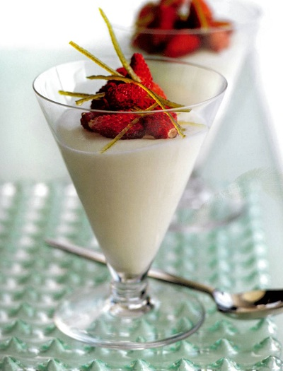

# Lime mousse with wild strawberries

*Any delicate berries can be used instead of wild strawberries, try raspberries instead.*

**Serves:** 8

## Ingredients
- 1 sheet leaf gelatine
- 100 ml lime juice
- 45 grams caster sugar
- 100 grams warm [meringue Italienne](../../baking/meringue/meringue-italienne.md)
- 170 ml whipping cream
- 10 grams lime zest (julienne)
- 250 grams hulled wild strawberries

## Overview
A zesty and sophisticated mousse infused with fresh lime juice and zest, lightened with Italian meringue and whipped cream, and garnished with delicate wild strawberries. The vibrant tartness of lime creates an elegant palate cleanser that tastes light and refreshing despite its creamy texture.

## Method
1. Soften the gelatine in a shallow dish of cold water to cover for about 5 minutes.
1. In a small saucepan, heat half the lime juice with 15 grams of the sugar until the sugar has dissolved and the lime syrup is hot, then remove from the heat.
1. Immediately drain the gelatine and squeeze out the excess water, then add to the lime syrup, stirring until melted. Stir in the rest of the lime juice.
1. Pour the lime syrup into the meringue and mix it in lightly, using a whisk.
1. In another bowl, whip the cream to a ribbon consistency, then fold into the lime mixture using a spatula.
1. Divide between 8 glasses and refrigerate.
1. In a small saucepan, dissolve the remaining 30 grams of sugar in 6 tablespoons of water and bring gently to the boil.
1. Add the lime zest julienne and simmer for 1 minutes, stirring with a fork, then drain the zest and set aside.
1. To serve, neatly pile the strawberries on top of each lime mousse and arrange the zest julienne on top.
1. Serve lightly chilled, not too cold.

## Notes
- Use fresh limes with thin skins, as thick-skinned limes tend to be less juicy; juice the limes just before use for maximum flavor
- The gelatine must dissolve completely in hot lime syrup; cool it slightly before mixing with meringue to prevent deflating the egg whites
- The candied lime zest julienne adds visual appeal and intense flavor; prepare it just before serving to maintain its glossy appearance and prevent it from becoming sticky
- Whip the cream to ribbon consistency only (slightly thickened but still pourable); overwhipping creates graininess

## Serving
Serve in elegant glasses or coupes, piling fresh wild strawberries generously on top and threading thin candied lime zest across the surface for an elegant presentation. The tartness of lime and strawberries create a perfect balance. Serve lightly chilled, not too cold, to appreciate all flavors.

## Storage
Once set in glasses (after 2-3 hours refrigeration), cover with plastic film and keep refrigerated for up to 2 days. The candied zest should be stored separately in an airtight container. Fresh wild strawberries should be added just before serving to prevent them from weeping and softening. If strawberries must be added ahead, reserve some for garnishing at the last moment.

