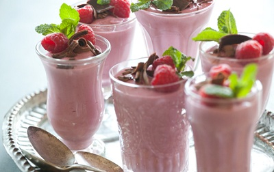

# Raspberry mousse

*An easy dessert, which also works well with strawberries, blackcurrants or blackberries. The eau-de-vie helps to bring out the flavour of the berries, but if  the fruit seems to be lacking in flavour, add a squeeze of lemon juice to the purée.*

**Serves:** 6 - 8

## Ingredients
-  ½ sheets of gelatine
- 400 grams raspberries
- 120 grams [meringue Italienne](../../baking/meringue/meringue-italienne.md)
- 100 ml whipping cream
- 2 tablespoons raspberry eau-de-vie or kirsch
- 18 raspberries to finish

## Overview
A light and fruity mousse that lets the pure, bright flavor of raspberry shine through, combined with airy Italian meringue and whipped cream for a luxurious texture. This elegant dessert celebrates the essence of raspberries without overwhelming them with other flavors or fussy presentation.

## Method
1. Purée the raspberries, and tip into a chinois or fine-meshed conical sieve set over a bowl.
1. Push the purée mixture through the sieve using a ladle, discarding the harsh seeds.
1. Soak the gelatine in a shallow dish of cold water to soften for about 5 minutes.
1. Pour the raspberry purée into a bowl and mix in the meringue Italienne, using a balloon whisk.
1. In another bowl, whip the cream to soft peaks.
1. Using a rubber spatula, gently fold the whipped cream into the meringue and purée mixture.
1. Warm the eau-de-view or kirsch in a small pan to about 50°C.
1. Drain the gelatine, squeezing out the excess water and add to the alcohol, off the heat, stirring to dissolve.
1. Pour into the mousse mixture, folding it in with the spatula until evenly combined.
1. Spoon the mousse into 6 - 8 glasses and refrigerate for at least 2 hours.
1. To serve, top each mousse with a trio of raspberries.

## Notes
- Choose ripe, fragrant raspberries at peak season; the quality of fruit is paramount since it is the sole flavor driver in this dessert
- Pushing the purée through a fine sieve removes the harsh seeds; this creates silky texture and prevents a gritty mouthfeel
- The eau-de-vie or kirsch should be warmed to about 50°C (warm to the touch) before adding gelatine; too-hot liquid can cause overcooking
- Fold gently when combining components; roughness will deflate the airy meringue and result in a dense texture

## Serving
Top each mousse with three beautiful raspberries arranged in a trio, perhaps dusted lightly with icing sugar for elegance. Serve lightly chilled as a standalone elegant dessert. The simplicity of presentation allows the pure, clean flavor of raspberry to shine.

## Storage
Once set and refrigerated (2+ hours), cover with plastic film and keep for up to 2 days. The freshest possible raspberries should be reserved for garnishing just before serving. If preparing ahead, add reserved raspberries within 1 hour of serving to prevent them from softening or leaking red color onto the mousse.

