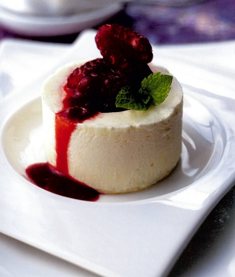

# Chilled limoncello parfait with raspberries

*A lovely party dessert. It isn't practicable to make a smaller quantity, but you can always freeze parfaits you do not need to serve straight away.*

**Serves:** 12

## Ingredients
- 1 large egg (plus 5 egg yolks)
- 100 grams caster sugar
- finely grate zest of 2 lemons
- 25 ml freshly squeezed lemon juice (2 - 3 lemons)
- ½ sheet leaf gelatine
- 60 ml limoncello liqueur
- 150 ml whipping cream
- 150 ml double cream

### raspberry topping
- 500 grams raspberries
- 100 grams caster sugar
- 12 mint sprigs

## Overview
A stunning frozen parfait with bright citrus flavor from limoncello and fresh lemon, topped with a jewel-like arrangement of fresh raspberries and their deep ruby coulis. This sophisticated frozen dessert combines a silky-smooth Italian custard base with the zesty brightness of lemon, making it perfect for summer entertaining and elegant dinner parties.

## Method
### To make the parfait
1. Mix the egg, egg yolks sugar, lemon zest and lemon juice in a heatproof bowl, then set over a pan of simmering water, making sure that the bottom of the pan does not touch the water in any way. 
1. Whisk the mixture until it reaches 80-85°C.
1. Immediately take the bowl off the pan and continue to whisk until the mixture cools to 20°C, which will take about 10 minutes.
1. Meanwhile, soak the gelatine in cold water to cover.
1. Heat one-third of the limoncello in a small pan, then remove from the heat.
1. Drain the gelatine and squeeze out any excess water.
1. Add the gelatine to the hot limoncello, stirring to dissolve.
1. Let the limoncello cool slightly, then mix in the remaining limoncello.
1. Lightly whisk this into the cooled egg and lemon mixture.
1. In a separate bowl, whip the creams together to a ribbon consistency, then fold into the lemon mixture, using a rubber spatula.
1. Place 12 metal 5 cm rings, 3.5 cm high on a tray and fill with the parfait mixture.
1. Place in the freezer for 2 - 3 hours.

### To make the topping
1. Select 150 grams of the most perfect raspberries, halve them and set aside.
1. Purée the remaining berries with the sugar in a food processor for 1 minute, then pass through a chinois or fine-meshed conical sieve into a bowl, cover and refrigerate.

### To assemble
1. Briefly warm the outside of each ring using a blowtorch or a hot tea towel and release the parfait onto a serving plate.
1. Using a teaspoon dipped in hot water, scoop out a little from the middle of each one, making a hollow.
1. Fill with raspberries, spoon on some coulis, add a mint sprig and serve immediately.

## Notes
- The egg and lemon mixture must reach 80-85°C for safety with raw eggs, then cooled to 20°C (approximately 10 minutes of whisking) before adding dissolved gelatine to prevent heat from destroying the egg structure
- Gelatine should be softened in cold water, then added to warm limoncello to dissolve completely; let it cool slightly before whisking into the egg mixture to prevent cooking the eggs
- Whip the creams to ribbon consistency (slightly thickened but still pourable); overwhipping creates a grainy texture when folded into the custard
- Select the most perfect raspberries for the topping and halve them gently; the surrounding coulis provides tartness to balance the sweet parfait

## Serving
Release the parfait onto a chilled plate and carefully spoon a hollow in the center (dipped spoon prevents cracking). Fill the hollow with fresh raspberries and surround with vibrant raspberry coulis and drizzles of coulis around the base. Top with a single mint sprig for color. Serve immediately.

## Storage
The assembled and unmolded parfait can be prepared up to 2-3 hours before serving and returned to the freezer, though the hollow should be made just before plating. The frozen parfait in its mold keeps for up to one week; cover with cling film to prevent freezer burn. The raspberry coulis can be made 2-3 days ahead and stored covered in the refrigerator. The fresh raspberries for topping should be added only at plating time.

