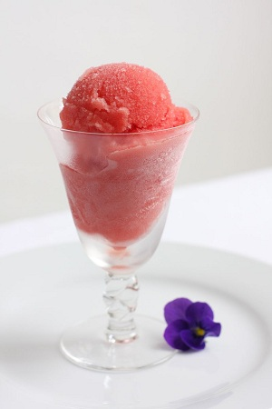

# Blood orange sorbet

*A sorbet should be on the tart side rather than overly sweet. You may need to adjust the quantity of sugar syrup according to how sweet or acidic the fruit is.*

**Serves:** 8 - 10

## Ingredients
- 170 grams caster sugar
- 30 ml liquid glucose
- 1 dried red chilli (broken into pieces)
- 1 thyme sprig
- 8 blood oranges

## Overview
A refreshing, jewel-bright sorbet made from tart blood orange juice infused with a hint of thyme and chilli, creating a sophisticated palate cleanser or light dessert. The deep crimson color and complex flavors make this an elegant choice for finishing a meal, and its intense acidity balances rich preceding courses.

## Method
1. Put the sugar, liquid glucose and 200 ml of water in a pan over a medium heat.
1. Bring to the boil, skim if necessary, then add the chilli and thyme.
1. Boil for 30 seconds, then remove from the heat, cover and set aside to infuse.
1. Once cold, strain through a chinois or fine-meshed sieve into a bowl and refrigerate.
1. Cut the oranges in half and squeeze out as much juice as possible.
1. Strain through a chinois or fine meshed-sieve to remove any fibrous pulp and pips.
1. Pour the orange into the chilled syrup and stir briefly with a wooden spoon
1. Start the ice- cream machine churning, then immediately pour in the sorbet mixture.
1. After 15 - 20 minutes, turn off the machine and use a spatula to bring the partially set sorbet around the sides into the middle.
1. Churn for a further 10 minutes, or until the sorbet reaches a firm consistency.
1. Turn the machine off.
1. Scoop the sorbet into serving glasses, using an ice-cream scoop dipped in cold water.

## Notes
- Sorbets should taste pleasantly tart rather than cloying; the sugar syrup provides texture but not sweetness, so fruit quality and tartness are essential
- Infusing the syrup with thyme and chilli before cooling adds subtle background notes; strain carefully to ensure no herb pieces remain
- Fresh fruit juice yields superior flavor and texture compared to commercial juices; squeeze blood oranges just before making sorbet for best results
- The ice-cream machine must be thoroughly chilled before churning begins; work quickly to prevent melting when transferring the mixture

## Serving
Serve in chilled glasses or coupes immediately after churning while the texture is at its peak creaminess. Garnish with a thin twist of blood orange zest or a fresh thyme sprig for visual appeal. Pair with light almond cookies or langue de chat for an elegant finish.

## Storage
Sorbets are best enjoyed immediately after churning. If making ahead, transfer to the freezer in an airtight container; re-churn or allow to soften briefly at room temperature before serving, as sorbets can become hard and icy during storage. Will keep in the freezer for up to 5 days, though texture deteriorates after 2-3 days.

