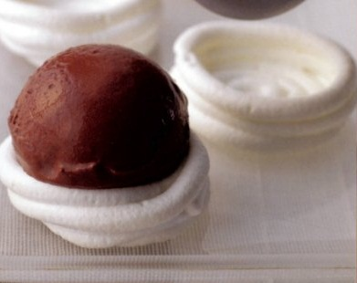

# Chocolate sorbet

*The contrast of dark with white, and of the crisp meringue with the soft sorbet, makes this dessert particularly special. You can make the meringue nests the day before, or if you prefer, serve the sorbet as it is.*

**Serves:** 8

## Ingredients
- 100 ml milk
- 150 grams caster sugar
- liquid glucose
- 30 grams dark, bitter cocoa powder
- 100 grams dark chocolate couveture (chopped)
- 8 meringue nests

## Overview
A rich, bittersweet chocolate sorbet with an elegant presentation, served on crispy meringue nests for textural contrast. This sophisticated dessert combines the cooling refreshment of sorbet with the textural pleasure of meringue, creating a dessert that balances richness with lightness in every spoonful.

## Method
1. Put 400 ml of water into a saucepan with the milk, glucose and cocoa powder.
1. Bring to the boil over a medium heat, whisking with a balloon whisk.
1. Lower the heat to a simmer for 2 minutes.
1. Remove from the heat, add the chopped chocolate and stir with a whisk for 2 minutes until melted.
1. Strain through a chinois or fine-meshed conical sieve into a bowl and set aside to cool, whisking from time to time.
1. Once cooled, cover and refrigerate for an hour.
1. Start the ice-cream machine churning, then immediately pour in the sorbet mixture.
1. Churn for 15 - 20 minutes, until thick.
1. Turn off the machine.
1. Place a meringue nest on each serving plate, and using an ice cream scoop, dipped in hot water, place a scoop of sorbet on each nest.
1. Serve immediately.

## Notes
- Use high-quality dark cocoa powder and couverture chocolate for superior flavor; cocoa solids at 70% or higher give the best depth and bitterness
- Whisk the mixture thoroughly as it cools to prevent skin formation and ensure smooth texture after churning
- The meringue nests provide a pleasant textural contrast and can be prepared 1-2 days ahead, making this dessert suitable for advance preparation
- Chill the machine bowl thoroughly before churning; work quickly to prevent warmth from affecting texture

## Serving
Place a meringue nest on each chilled serving plate and top with a generous scoop of sorbet. Serve immediately for the best contrast between warm-temperature sorbet and crispy-cold meringue. A drizzle of warm chocolate ganache around the plate adds elegance and additional chocolate flavor.

## Storage
The meringue nests keep for 2-3 days in an airtight container at room temperature (in a dry climate). The sorbet is best served immediately after churning, but may be stored in the freezer for up to 3-4 days in an airtight container. Re-churn or soften slightly before serving if frozen for storage, as it becomes hard and icy over time.

