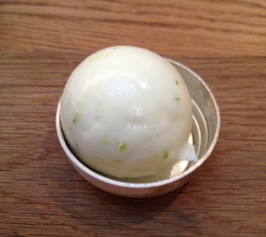

# Thyme-scented fromage frais sorbet

*When they are in season, raspberries or wild strawberries are superb served with with delicately flavoured sorbet.*

**Serves:** 6

## Ingredients
- 350 ml [sirop a sorbet](../../base-ingredients/syrup/sirop-a-sorbet.md)
- 2 thyme sprigs
- 400 grams fromage frais (20 - 40% fat)
- juice of 2 lemons (strained)
- pinch of white pepper

## Overview
An exceptionally delicate and refreshing sorbet made with tangy fromage frais and fragrant thyme, lighter than traditional fruit sorbets while still providing elegant sophistication. This charming dessert showcases the subtle interplay of herbs and dairy, offering a unique and palate-cleansing finish to dinner.

## Method
1. Bring the sirop a sorbet to the boil in a saucepan with the thyme sprigs added, then take off the heat and leave to infuse for 2 - 3 minutes.
1. Remove the thyme and set the syrup aside to cool completely.
1. Put the fromage frais in a bowl and whisk in the cooled syrup, lemon juice and pepper until evenly incorporated.
1. Start the ice-cream machine churning, then immediately pour in the sorbet mixture.
1. Churn for 15 - 20 minutes, until the sorbet reaches a firm consistency.
1. Turn the machine off.
1. Serve immediately.

## Notes
- Fromage frais quality is crucial; use the highest fat percentage available for the creamiest, richest texture when churned
- The thyme infusion must be brief (2-3 minutes only) to prevent bitterness; remove the sprigs and cool the syrup completely before combining with fromage frais
- The lemon juice provides both tartness and helps balance the richness of the fromage frais; taste and adjust to your preference as acidity varies by batch
- A pinch of white pepper adds subtle spice and complexity without being detectable as pepper; it enhances the thyme flavor beautifully

## Serving
Serve in well-chilled glasses or coupes immediately after churning for the best texture and presentation. Garnish with a tiny thyme leaf or lemon zest. Pair exceptionally well with fresh raspberries or wild strawberries when in season, either served alongside or folded in just before serving.

## Storage
Sorbets are best enjoyed fresh from the machine. If freezing for later use, store in an airtight, freezer-safe container and serve within 2-3 days, as the texture becomes increasingly hard and icy with storage. Allow to soften slightly at room temperature for 5-10 minutes before scooping if frozen for more than a few hours.

