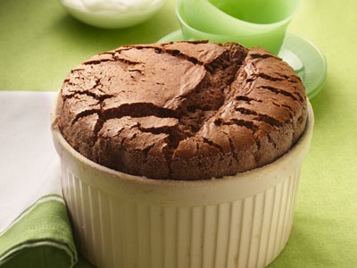

# Chocolate Soufflé

**Prep Time:** 10 minutes
**Cook Time:** 10 minutes
**Serves:** 4

## Ingredients
### For the soufflé
- 85 grams dark chocolate (chopped)
- 4 free-range eggs (separated)
- 85 grams caster sugar
- butter (for greasing)

### For the sauce
- 100 ml water
- 40 grams caster sugar
- 55 grams dark chocolate
- 40 grams cocoa powder
- 1 tablespoon cream
- icing sugar (to dust)

## Overview
A rich and airy chocolate soufflé that rises dramatically in the oven, creating a show-stopping dessert with a molten chocolate center. This classic French preparation requires precision timing and technique, but rewards you with an elegant and impressive dessert that looks far more complicated than it actually is.

## Method
1. Preheat the oven to 220°C.
1. Place a glass bowl over a pan of simmering water. Add the chopped chocolate and melt.
1. Once the chocolate has melted, stir in the egg yolks.
1. In a large clean bowl, whisk the egg whites to form soft peaks.
1. Add the sugar and whisk again to make stiff, glossy peaks.
1. Fold the egg whites into the chocolate mixture.
1. Grease two chefs' rings with butter and place on a baking sheet. Divide the soufflé mixture between the rings and then bake in the oven for 8-10 minutes, until well risen.
1. To make the sauce, heat the water, sugar, chocolate and cocoa powder in a pan, whisking constantly to make a glossy chocolate sauce.
1. Remove the soufflés from the oven, place onto serving plates and pour the sauce around. Drizzle with a little cream, and dust with icing sugar to serve.

## Notes
- Ensure egg whites are completely grease-free for maximum volume when whisking; even a trace of yolk will prevent proper stiffness and result in a flat soufflé
- The soufflé must go directly into the preheated oven and remain undisturbed during cooking; opening the oven door will cause it to collapse
- For a molten center, slightly underbake (8 minutes); for a fully set interior, bake the full 10 minutes
- Use a metal ring mold or ramekin to help the soufflé rise evenly and achieve a professional appearance

## Serving
Serve immediately from the oven on warm plates. Accompany with the warm chocolate sauce pooled around the soufflé, or serve a separate jug of crème anglaise or whipped cream on the side. A light dusting of icing sugar adds elegance.

## Storage
Soufflés do not store well as they deflate quickly after baking. Serve immediately after removing from the oven for best presentation and texture. The uncooked mixture can be prepared up to 1 hour in advance and kept covered in the refrigerator.

