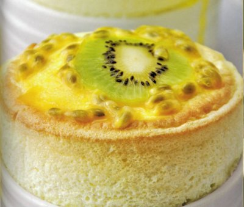

# Passion fruit and kiwi soufflé

**Serves:** 10

## Ingredients
- 70 grams butter (softened)
- 70 grams caster sugar
- 70 grams caster sugar (to coat the dishes)
- 5 kiwi fruit
- 10 passion fruit
- 6 egg whites

### Crème patissière
- 4 egg yolks
- 50 grams caster sugar
- 25 grams plain flour
- 250 ml milk

### To finish
- 2 kiwi fruit (peeled and finely sliced)
- 3 passion fruit (pulp and seeds scooped out)

## Overview
An elegant and aromatic soufflé combining tropical passion fruit and kiwi in individual dishes, topped with fresh fruit for a striking presentation. The tart passion fruit and sweet kiwi create a perfectly balanced flavor that rises beautifully and impresses dinner guests with its show-stopping appearance.

## Method
1. Brush the insides of 10 individual soufflé dishes, about 10 cm in diameter and 6 cm high, with the softened butter.
1. Add the 70 grams of caster sugar to one of the buttered moulds, and rotate it at an angle so that the sugar coats the entire inside of the mould.
1. Tip the excess sugar into another mould, tapping as you do so and repeat to coat the insides of all the moulds.
1. Peel the kiwi fruit, cut into chunks and then purée in a food processor for 30 seconds, making sure that the seeds are not crushed, or the mixture will taste bitter.
1. Pour the purée into a chinois or fine-meshed conical sieve, set over a bowl and press down with a ladle to extract the juice. You will need about 45 ml.
1. Halve the passion fruit, scoop the pulp and seeds out into the (clean) food processor and purée for 45 seconds.
1. Pour the purée into a chinois or fine-meshed conical sieve, set over a bowl and press down with a ladle to extract the juice. You will need about 90 ml.

### For the crème patissière
1. Whisk the egg yolks with one-third of the sugar in a bowl, until it reaches a ribbon consistency.
1. Add the flour and mix in well.
1. Heat the milk with the remaining two-thirds of the sugar in a large pan.
1. As soon as it comes to the boil, add the passion fruit juice and heat again, whisking from time to time until it reaches the boil again.
1. Immediately pour the milk on to the egg yolk mixture, whisking all the time.
1. Pour the mixture back in to the pan and cook over a medium heat, stirring with a whisk continuously for 2 minutes.
1. Pour the mixture into a bowl and set aside for 5 minutes to cool slightly.
1. Pour the kiwi juice into the créme patissiére, mixing well with a whisk.

### To make the soufflé
1. Preheat the oven to 190°C.
1. Whisk the egg whites in a clean bowl to soft peaks.
1. Gradually whisk in the 70 grams of sugar and continue to whisk until almost firm, but not overly stiff peaks.
1. Whisk one-third of the egg whites into the tepid créme patissiére (at 40 - 50°C), then gently fold in the remaining two-thirds, using a rubber spatula.
1. Place the prepared dishes on a baking sheet lined with greaseproof paper and fill each with the soufflé mixture, using a large spoon.
1. Smooth the tops with a palette knife.
1. Run the blade of a small knife around the inside of each dish, to detach the soufflé mixture from it, just a little.
1. Bake in the oven for 7 minutes (or 5 - 6 minutes if using small dishes).
1. As soon as the soufflés are out of the oven, place a slice of kiwi on top of each and spoon some passion fruit pulp and seeds around the kiwi.
1. Place each soufflé dish on a small plate lined with a small napkin and serve immediately.

## Notes
- When processing kiwi fruit, pulse briefly to avoid crushing the seeds, which will become bitter if broken; extract the juice through a sieve without pressing hard
- The passion fruit seeds add beautiful visual appeal and textural contrast; prepare these just before serving to prevent them from becoming overly soft
- Ensure the crème patissière has cooled to 40-50°C before folding in the whisked egg whites, as overly hot mixture will collapse them
- Run a knife blade around the inside rim of each soufflé dish before baking to help achieve the characteristic rise and shape

## Serving
Serve immediately upon removal from the oven on individual plates lined with small napkins. Top each warm soufflé with a thin slice of kiwi and a spoonful of passion fruit pulp and seeds while the soufflé is still puffed. Serve with lime crème anglaise or a light passion fruit coulis on the side.

## Storage
Soufflés must be served immediately from the oven as they deflate within a few minutes. The crème patissière base can be prepared 2-3 hours ahead and stored covered in the refrigerator. The kiwi and passion fruit components should be prepared just before assembly to maintain their fresh appearance and flavor.

