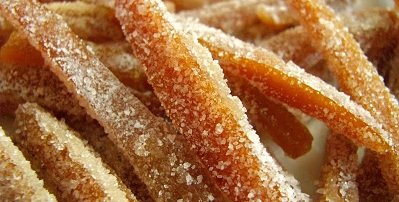

# Candied Fruit Peel

*These jewel-bright citrus peels are slowly poached in sugar syrup until tender and translucent, then coated with sparkling sugar. Elegant petit fours perfect for afternoon tea, or dipped in dark chocolate for a simple confection.*

**Yield:** Approximately 20 pieces

## Overview
Candied fruit peel represents a medieval technique that preserves fruit while developing profound sweetness and translucent beauty. The gradual infusion of sugar into peel tissue requires patience and multiple cooking stages; rushing this process results in tough, crystalline texture rather than the desired tender, glossy finish. Citrus peels, particularly grapefruit and bitter orange, shine when candied, their bitterness transformed into complexity through the sugaring process. These jeweled confections require nothing more than a hot drink or strong coffee to shine.

## Ingredients

### Citrus Selection
- 3 grapefruits OR 6 oranges (approximately 1.2 kilograms)

### Sugar Syrup
- 600 grams caster sugar
- 450 milliliters water (for initial syrup)
- Additional water (for repeated poaching, as needed)

### Sugar Coating
- 75 grams granulated sugar (for final coating)

## Method

### Stage 1 – Prepare & Cut Peels
1. Using a sharp, flexible knife, cut a 5-millimeter slice from the base of each fruit.
1. Starting at the top and following the contour of the fruit toward the base, cut 7 strips of peel (including the white pith) approximately 3 centimeters wide from each grapefruit (or 5 strips from each orange).
1. Cut each strip into baton shapes approximately 1 centimeter wide.
1. You should have approximately 20 batons per fruit, so 60 batons from 3 grapefruits or similar count from 6 oranges.

### Stage 2 – Blanch Multiple Times
1. Place all cut peel strips into a large saucepan.
1. Cover completely with cold water.
1. Bring to a rolling boil over high heat.
1. Drain completely through a colander and refresh the peels with fresh cold water.
1. Drain again.
1. Repeat this blanch-drain-refresh cycle 4 times total (for a total of four blanching stages).
1. This repeated blanching removes bitterness while retaining the peel's structure.
1. After the final blanching, drain the peels thoroughly and set aside.

### Stage 3 – First Poaching
1. Dissolve 600 grams caster sugar in 450 milliliters water in a large saucepan over low heat.
1. Stir occasionally until the sugar dissolves completely.
1. Bring the syrup to a gentle simmer and skim any surface foam if necessary.
1. Immerse the blanched peel strips in the syrup.
1. Maintain a bare simmer (very gentle, small bubbles at the surface only) for 2 hours for orange peels or 3 hours for grapefruit peels.
1. The peels should gradually become tender and translucent as sugar penetrates the tissue.
1. Do not allow the mixture to boil rapidly; a bare simmer is essential.

### Stage 4 – Drain & Cool
1. After poaching, remove from heat.
1. Allow the peels to cool in the syrup until warm to the touch (approximately 30-45 minutes).
1. Remove the peels from the syrup using a slotted spoon.
1. Place them on a wire rack, keeping them separated so they don't stick together as they cool further.
1. Allow to cool completely to room temperature (at least 1-2 hours).

### Stage 5 – Sugar Coating
1. Once fully cooled, roll each peel baton in the 75 grams of granulated sugar.
1. Coat both sides evenly.
1. Place coated peels back onto the wire rack.
1. Allow the sugar coating to set for at least 30 minutes before packaging.

## Notes
- **Multiple Blanching Essential:** The four blanching cycles are crucial to remove bitterness while maintaining peel structure; never skip or reduce blanching repetitions.
- **Gentle Heat Critical:** Maintaining a bare simmer (not a boil) is essential; vigorous boiling will damage the delicate peel tissue and create a mushy result.
- **Citrus Selection:** Thick-skinned grapefruit requires the full 3 hours; thinner-skinned oranges need only 2 hours.
- **Translucency Indicator:** As you'll see the peels gradually turn translucent as sugar penetrates; this is the desired endpoint.
- **Complete Cooling:** The peels must cool completely before sugar-coating; warm peels won't hold sugar adhesion effectively.
- **Separation During Cooling:** Keep peels separated on the rack during cooling; they'll stick together if touching.

## Variations
**Orange-Only Version:** Use 6 medium oranges instead of grapefruits for shorter poaching time (2 hours).
**Lemon Peel:** Thinner-skinned lemons require reduced cooking time (~1.5 hours per poaching).
**Mixed Citrus:** Combine grapefruit, orange, and lemon peels for visual variety and flavor complexity.
**Chocolate-Dipped:** After sugar-coating, dip the bottom third of each peel into tempered dark chocolate using a small fork.
**Vanilla-Sugar Coating:** Replace half the granulated sugar with vanilla sugar for fragrant finish.

## Serving
Perfect with: Strong tea or coffee, afternoon tea service, as part of a petit four platter, alongside dark chocolate, holiday gifts
Temperature: Room temperature
Context: Elegant presentations, tea service, seasonal celebrations

## Storage
- Store in an airtight container in the refrigerator, interleaving peels with parchment paper to prevent sticking: 2-3 weeks
- Can keep at room temperature in a cool, dry environment: 1-2 weeks (requires airtight container)
- Do not freeze; sugar coating will crystallize and texture may suffer.
- Keep away from direct heat and high humidity.
- If peels become sticky during storage, briefly dry in a warm, dry environment.
- Transfer to fresh parchment if they begin to adhere together.