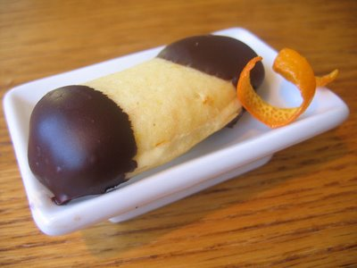

# Chocolate-Dipped Langues de Chat

*These delicate, tongue-shaped butter cookies piped from a paté à langue batter are baked until golden and crisp, then half-coated in glossy dark chocolate. A classic petit four served alongside coffee after formal dinners, or paired with fruit desserts and ice cream.*

**Yield:** Approximately 40 cookies

## Overview
Langues de chat, "cat's tongues", are among the most elegant petit four cookies. Their delicate, crisp texture and subtle almond-vanilla flavor make them perfect foils for strong coffee or rich desserts. The batter is intentionally thin and piped, creating cookies with slightly crispy edges and possibly softer centers depending on baking time. The chocolate dipping offers visual refinement and flavor complexity. These require a steady hand at the piping bag and careful timing in the oven; they should be just bisque-colored when removed, with minimal browning.

## Ingredients

### Cookie Dough
- 125 grams butter (room temperature, softened)
- 125 grams icing sugar
- 25 grams ground almonds
- 3 egg whites (room temperature, approximately 100 milliliters)
- 165 grams plain flour (sifted)
- 1 vanilla pod (split lengthwise, seeds scraped out, or 1/2 teaspoon vanilla extract)

### Chocolate Coating
- 200 grams dark chocolate (70% cocoa solids minimum)
- 1 tablespoon butter or coconut oil (optional, for chocolate fluidity)

## Method

### Stage 1 – Prepare Cookie Dough
1. In a large bowl, beat together 125 grams softened butter and 100 grams of the icing sugar with a wooden spoon.
1. Beat for approximately 1 minute; the mixture should become light and pale.
1. In a separate bowl, sift together 25 grams ground almonds and the remaining 25 grams icing sugar.
1. Sift this almond-sugar mixture into the butter mixture.
1. Stir to combine completely.

### Stage 2 – Add Egg Whites & Flour
1. Add 3 egg whites to the mixture, incorporating them one at a time while stirring constantly.
1. Stir until each egg white is fully incorporated before adding the next.
1. Finally, sift 165 grams plain flour into the mixture.
1. Add vanilla seeds (or vanilla extract).
1. Mix gently until just combined; do not overmix (which would toughen the cookies).
1. The batter should be thin and uniform, ready for piping.

### Stage 3 – Rest the Batter
1. Cover the bowl with cling film (plastic wrap).
1. Allow the batter to rest at room temperature for at least 20 minutes.
1. This resting period relaxes the gluten and allows flavors to meld.

### Stage 4 – Pipe Cookies
1. Preheat your oven to 190°C (375°F).
1. Transfer the batter to a piping bag fitted with a 1-centimeter plain round nozzle.
1. Pipe 6-7 neat lengths onto a non-stick baking sheet (or a regular baking sheet lightly buttered and dusted with flour).
1. Space the piped cookies approximately 2 centimeters apart; they will spread slightly during baking.
1. Each "tongue" should be approximately 5 centimeters long and 1 centimeter wide.
1. Smooth the piped ends with a slightly damp finger if desired, but this is optional.

### Stage 5 – Bake Cookies
1. Place the baking sheet in the preheated 190°C oven.
1. Bake for 5-6 minutes.
1. The cookies should be very lightly colored, pale gold or bisque is correct; avoid browning.
1. Overbaking will create tough, excessively crisp cookies and dark color.
1. They may still feel slightly soft when warm; this is correct (they firm up as they cool).
1. Remove from oven and allow to set for 1-2 minutes on the baking sheet.

### Stage 6 – Cool Cookies
1. Using a small palette knife (offset spatula), carefully transfer each cookie to a wire cooling rack.
1. Handle gently; they're delicate when still warm.
1. Allow to cool completely to room temperature (approximately 30 minutes).
1. The cookies will become thoroughly crisp as they cool.

### Stage 7 – Prepare & Apply Chocolate
1. Place 200 grams dark chocolate (chopped) in a heatproof bowl.
1. Optional: add 1 tablespoon butter or coconut oil (this makes tempered chocolate slightly more fluid and easier to work with).
1. Set the bowl over a saucepan of barely simmering water (double boiler method).
1. The bottom of the bowl should not touch the water.
1. Gently melt the chocolate, stirring occasionally until smooth and fluid.
1. Remove from heat once fully melted.

### Stage 8 – Dip Cookies
1. Line a baking tray with parchment paper.
1. Taking one cooled cookie at a time, hold it by its uncut end.
1. Partially dip it into the melted chocolate, coating approximately the bottom third to half of the cookie.
1. Allow excess chocolate to drip back into the bowl.
1. Place the cookie onto the parchment-lined tray, chocolate-coated side down.
1. Repeat with each cookie.
1. Leave the tray undisturbed at room temperature (or briefly in a cool environment if needed to accelerate chocolate setting).
1. The chocolate will set in 10-15 minutes.

## Notes
- **Butter Softness Critical:** Soft, room-temperature butter incorporates more easily and creates a better texture; cold butter will create lumps.
- **Thin Batter Correct:** The batter is intentionally thin and piping readily from the bag; if it's too thick, the texture will be cakey rather than crisp.
- **Egg White Temperature:** Room-temperature egg whites incorporate more smoothly than cold eggs.
- **Minimal Flour Mixing:** Overmixing after flour addition toughens the cookies; mix just until combined.
- **Baking Time Critical:** 5-6 minutes is exact; even 30 seconds extra creates excessive browning. Watch carefully after 5 minutes.
- **Pale Color Target:** Langues de chat should be pale gold or bisque when removed from the oven; dark browning indicates overbaking.
- **Chocolate Melting:** Use a gentle double-boiler method; direct heat will cause chocolate to seize (become grainy).
- **Partial Dipping:** The chocolate coating should be half or less; excessive coating overwhelms the delicate cookie flavor.

## Variations
**Vanilla Bean Emphasis:** Use 1.5 vanilla pods for heightened vanilla aroma.
**No Almonds:** Substitute 25 grams flour for the ground almonds (creating a pure butter cookie).
**Milk Chocolate Dipping:** Use milk chocolate (40-50% cocoa) for sweeter, more buttery character.
**White Chocolate Dipping:** Use tempered white chocolate for delicate appearance (though flavor becomes less balanced).
**Hazelnut Version:** Replace ground almonds with ground hazelnuts for nuttier profile.

## Serving
Perfect with: Strong coffee or espresso, afternoon tea service, as part of petit four platter, with fruit desserts, alongside ice cream, after formal dinners
Temperature: Room temperature
Context: Coffee service, elegant finales, special occasions, tea time

## Storage
- Store interleaved with greaseproof or parchment paper in an airtight container in a cool, dry place: up to 1 week
- Keep away from direct heat and humidity (moisture will soften the crisp texture).
- Do not refrigerate; cold temperatures can cause condensation and soften cookies.
- Do not freeze; chocolate coating becomes brittle and texture suffers.
- Can be stored in a sealed tin for up to 5-7 days with minimal quality degradation.
- Consume within 3-4 days for maximum crispness; after that, they gradually soften despite airtight storage.