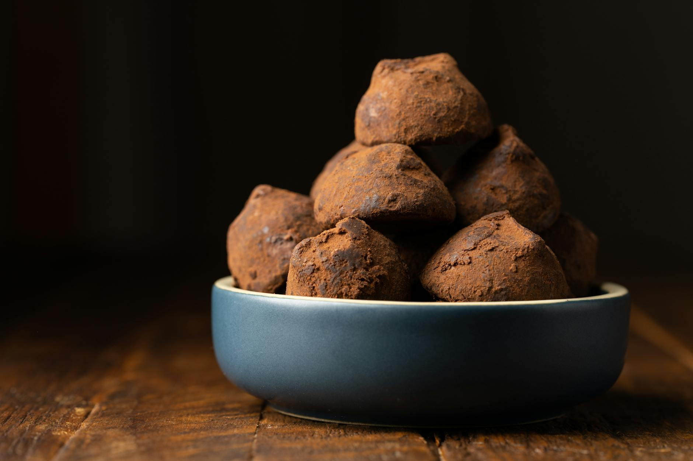

# Chocolate Truffles

*These dark, rich truffles are sophisticated petit fours made from silky chocolate ganache enhanced with Armagnac. Dust-coated in cocoa powder, they are elegant served with pre-dinner drinks or after formal dinners alongside strong coffee.*

**Yield:** Approximately 80 truffles

## Overview
Chocolate truffles represent the simplest and most elegant form of chocolate confection: ganache (chocolate emulsified with cream and butter), scented with liqueur, shaped into spheres, and coated in cocoa powder. The truffle's appeal lies in its silky texture and intense chocolate flavor, enhanced by the subtle presence of Armagnac. Each truffle should be a perfect sphere with a thin shell of chocolate coating and a smooth, almost melting center when bitten. Success requires controlling temperature carefully and not overworking the ganache.

## Ingredients

### Ganache Base (Primary)
- 450 grams dark chocolate (chopped, 70% cocoa solids)
- 150 milliliters double cream (heavy cream)

### Ganache Enhancement
- 225 grams butter (chopped, room temperature)
- 75 milliliters Armagnac or Grand Marnier liqueur

### Assembly & Finishing
- 300 grams dark chocolate (chopped, for dipping coat)
- 500 grams dark cocoa powder (for rolling)

## Method

### Stage 1 – Prepare Ganache Base
1. Chop 450 grams dark chocolate into small, uniform pieces.
1. Place into a heatproof bowl that will sit comfortably on a saucepan without touching the bottom.
1. Fill a saucepan one-third full with water.
1. Set the saucepan over gentle heat; the water should reach approximately 55-60°C (130-140°F), never boiling.
1. Set the chocolate bowl over the hot water (double boiler method).
1. Allow the chocolate to melt slowly, stirring occasionally with a silicone spatula.
1. Do not rush this step; high heat or forcing chocolate causes seizing and graininess.
1. Once the chocolate is completely melted and smooth, remove the bowl from heat.
1. The chocolate temperature should be approximately 45-50°C (113-122°F).

### Stage 2 – Add Cream
1. Pour 150 milliliters double cream into a small saucepan.
1. Set over medium heat and bring to a boil.
1. As soon as large bubbles break at the surface (indicating active boil), remove from heat immediately.
1. Allow the cream to cool to approximately 40°C (104°F) before proceeding (approximately 2-3 minutes).
1. Cream that is too hot will cause the chocolate to separate; too cool and it won't emulsify.

### Stage 3 – Create Ganache Emulsion
1. Pour the warm cream into the melted chocolate very slowly while whisking constantly with a balloon whisk.
1. Whisk in smooth, circular motions to create an emulsion.
1. The mixture should begin to thicken and take on a uniform, glossy appearance.
1. Once all cream is incorporated, the mixture is the base ganache (approximately 1200 milliliters).

### Stage 4 – Incorporate Butter
1. Add the chopped room-temperature butter to the ganache a small piece at a time (approximately 30-50 grams at a time).
1. Whisk gently after each addition until fully incorporated.
1. Do not overmix or whisk vigorously; this can cause the ganache to separate (become grainy or oily).
1. Gentle, steady whisking is correct.
1. Once all butter is incorporated, the ganache should be smooth, glossy, and luxurious.

### Stage 5 – Add Liqueur
1. Slowly pour 75 milliliters Armagnac (or Grand Marnier) into the ganache.
1. Whisk gently with the balloon whisk until fully combined.
1. The alcohol scent will be prominent at this point; it mellows as the ganache cools.
1. The mixture should be completely smooth and uniform.

### Stage 6 – Cool & Set
1. Remove the ganache from the heat (if still over the double boiler).
1. Allow to cool at room temperature for approximately 1 hour.
1. The ganache will thicken and firm up but remain piping-soft.
1. Do not chill in the refrigerator; cold ganache will be too firm and difficult to pipe smoothly.
1. The ganache is ready when a small spoon can hold a portion without it immediately collapsing.

### Stage 7 – Pipe Mounds
1. Transfer the cooled ganache to a piping bag fitted with a 1-1.5 centimeter plain round nozzle.
1. Pipe small mounds approximately 2 centimeters in diameter onto trays lined with parchment or greaseproof paper.
1. Space them at least 2 centimeters apart; they don't expand but need space for handling.
1. Pipe approximately 80-100 smallmounds.
1. Once piped, refrigerate the tray for 2 hours until the mounds are firm and cold.

### Stage 8 – Shape into Spheres
1. Remove the chilled mounds from the refrigerator.
1. Quickly and gently, roll each mound in the palm of your hand for 3-5 seconds.
1. The warmth of your hands and brief rolling time will create smooth spheres without melting the ganache.
1. Work quickly; prolonged handling in warm hands will melt the centers.
1. Once all have been rolled into spheres, return them to a parchment-lined tray.
1. Chill again until firm (approximately 1-2 hours).

### Stage 9 – Prepare Second Chocolate (for coating)
1. Chop 300 grams dark chocolate into small, uniform pieces.
1. Place into a heatproof bowl on a double boiler setup (same as before, water at 55-60°C).
1. Melt gently, stirring occasionally, until completely smooth.
1. Once melted, the chocolate should be approximately 45-50°C (113-122°F), fluid but not hot.
1. Remove from heat when ready to dip.

### Stage 10 – Dip & Coat Truffles
1. Spread 500 grams cocoa powder onto a shallow tray or work surface.
1. Remove the chilled ganache spheres from the refrigerator.
1. Using a small fork (or a dedicated truffle dipping fork), pick up one sphere.
1. Quickly dip it into the warm melted chocolate for 1-2 seconds, coating all sides.
1. Immediately transfer the dipped sphere to the cocoa powder tray.
1. Using the fork, turn and roll the truffle through the cocoa powder until evenly coated.
1. Remove and place onto a clean parchment-lined tray.
1. Repeat with each remaining truffle.
1. Work quickly but carefully; slow dipping creates thick chocolate shells, fast dipping creates thin shells.

## Notes
- **Chocolate Melting Temperature Critical:** Overheating chocolate (above 60°C) damages flavor and texture; always use gentle double-boiler method.
- **Cream Temperature Matters:** Cream closer to 40°C emulsifies properly with chocolate; cooler cream won't combine smoothly, hotter cream causes separation.
- **Room-Temperature Butter Essential:** Cold butter creates lumps; butter straight from the refrigerator must come to room temperature first (approximately 20°C).
- **Gentle Whisking:** Vigorous whisking incorporates air and can cause ganache to separate or become grainy; use calm, steady motions.
- **Ganache Cooling Time:** Allow ganache to cool naturally at room temperature; refrigerating too early creates an overly firm, difficult-to-pipe texture.
- **Hand Warmth for Rolling:** The heat from your palms creates the smooth sphere surface; cold hands won't work effectively.
- **Quick Dipping:** 1-2 seconds in warm chocolate is correct; longer immersion creates thick, dull shells; shorter dipping might leave bare spots.
- **Alcohol Content:** Armagnac and Grand Marnier are both 40% ABV; they add flavor and extend shelf-life (both act as preservatives).

## Variations
**Grand Marnier Style:** Use Grand Marnier (orange liqueur) instead of Armagnac for citrus notes.
**Dark Cocoa Emphasis:** Triple-dust in cocoa powder (dip in chocolate, coat in cocoa, then dip again and coat again) for extra-dark appearance.
**White Chocolate Coating:** Use white chocolate for the dipping coat (reduces bitterness, creates visual contrast).
**Spiced Ganache:** Add 1/4 teaspoon ground cinnamon and 1/8 teaspoon cayenne to the ganache for subtle warmth.
**Candied Peel Addition:** Add 2 tablespoons finely minced candied orange peel to the ganache for texture and flavor variation.

## Serving
Perfect with: Strong coffee or espresso after dinner, pre-dinner drinks, petit four platters, holiday gift boxes, special occasions
Temperature: Cool room temperature (allow to sit 10 minutes if refrigerated, so chocolate tempers slightly)
Context: Formal dinners, afternoon gatherings, gift presentations, elegant finales

## Storage
- Refrigerate in an airtight container, layered with parchment paper to prevent sticking: 3-4 weeks
- Room temperature storage in cool, dry environment: 1-2 weeks (cocoa coating prevents melting better than exposed ganache would)
- Do not freeze; chocolate coating becomes brittle and texture suffers significantly.
- Keep away from strong odors (chocolate absorbs flavors)
- Keep away from direct heat and humidity (both cause cocoa powder to stick and presentation to suffer)
- Allow to come to room temperature before serving for optimal texture and flavor expression.
- Alcohol content helps preserve these; they will keep longer than non-alcoholic ganache confections.