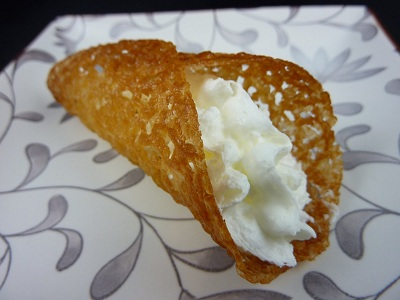

# Vanilla Tuiles

*These ultra-delicate, caramelized cookies are spread thin from a light batter and shaped over a rolling pin while still warm, creating elegant curved tiles. Their caramelized sweetness and crisp, glass-like texture make them perfect alongside ice cream, desserts, or on their own with strong coffee.*

**Prep Time:** 25 minutes
**Cook Time:** 8-10 minutes
**Yield:** Approximately 12 tuiles

## Overview
Tuiles, named for French roof tiles ("tuile") whose curved shape they resemble, are among the most elegant and technically demanding petit fours. The batter is deceptively simple: butter, sugar, egg whites, and flour, spread tissue-thin on a baking sheet, then shaped while hot over a rolling pin. Success requires precision: correct batter consistency, careful spreading, perfect baking time (neither under- nor over-baked), and quick handling while still pliable. The result is a cookie with profound caramel character and glass-like crispness.

## Ingredients

### Cookie Batter
- 110 grams butter (softened, room temperature)
- 120 grams icing sugar
- 4 egg whites (room temperature, approximately 130 milliliters)
- 1/2 teaspoon vanilla extract
- 145 grams self-raising flour

### Equipment & Shaping
- Non-stick baking parchment
- Thin cardboard or plastic stencil (approximately 7 centimeters diameter circle)
- Rolling pin or cylindrical glass jar (for shaping while warm)
- Silicone spatula (offset/flexible type preferred)

## Method

### Stage 1 – Prepare Batter
1. In a large bowl, add 110 grams softened, room-temperature butter.
1. Add 120 grams icing sugar.
1. Cream together with a wooden spoon or electric mixer on medium speed until light, fluffy, and pale (approximately 2-3 minutes).
1. The mixture should be noticeably lighter in color and texture.

### Stage 2 – Incorporate Egg Whites
1. Add 4 egg whites to the creamed butter-sugar mixture.
1. Add them one at a time, beating well after each addition to ensure complete incorporation.
1. If using an electric mixer, use medium speed; if using a spoon, beat vigorously.
1. The mixture may look slightly broken or curdled after a few whites; this is normal and will come together once fully beaten.
1. Once all egg whites are incorporated, the batter should be light, airy, and uniform in color.

### Stage 3 – Add Vanilla & Flour
1. Beat in 1/2 teaspoon vanilla extract.
1. Reduce mixer speed to low (if using an electric mixer).
1. Sift 145 grams self-raising flour into the batter.
1. Fold or mix gently until just combined.
1. Do not overmix; overmixing toughens tuiles and robs them of their delicate texture.
1. The batter should be smooth but not worked.

### Stage 4 – Chill Batter
1. Cover the bowl with cling film (plastic wrap) or a clean kitchen towel.
1. Refrigerate for at least 1 hour (or up to 4 hours).
1. This chill time relaxes the gluten and allows flavors to develop.

### Stage 5 – Preheat Oven & Prepare Equipment
1. Preheat your oven to 170°C (340°F).
1. Line a baking tray with non-stick baking parchment.
1. Prepare a thin cardboard stencil with a circular hole approximately 7 centimeters in diameter.
1. Ensure your rolling pin (or cylindrical glass jar) and silicone spatula are ready and at hand.
1. You'll need to work quickly once cookies come from the oven.

### Stage 6 – Spread Batter (First Batch)
1. Place the stencil on the prepared baking tray.
1. Using a silicone spatula, place a small amount of batter (approximately 1.5-2 teaspoons) in the center of the stencil hole.
1. Using the side of the spatula, spread the batter outward in all directions, filling the stencil hole completely.
1. The layer should be extremely thin, barely visible in some spots is correct.
1. Carefully lift the stencil straight up and away.
1. Repeat until you've spread approximately 4-6 tuiles on the tray (depending on its size).
1. Space them at least 3 centimeters apart (they will spread very slightly).

### Stage 7 – Bake
1. Place the baking tray in the preheated 170°C oven.
1. Bake for 8-10 minutes.
1. Watch carefully: the cookies should be very pale to lightly golden around the edges, with the center still slightly pale.
1. Slight browning around the edges is normal and desirable (indicating caramelization); avoid excessive browning or darkening.
1. The edges should transition from pale to slightly golden, this is your timing cue.
1. Remove from the oven as soon as the edges achieve light golden color.

### Stage 8 – Shape While Warm
1. Working very quickly (the cookies firm rapidly as they cool), use a silicone spatula to loosen one cookie from the parchment.
1. Immediately drape it over the rolling pin (or cylindrical glass jar), shaping it gently to create a curved tile shape.
1. Allow it to set for 10-15 seconds while draped, until it hardens.
1. Carefully remove from the rolling pin and place on a wire cooling rack.
1. Repeat immediately with the next cookie.
1. Do not delay; once thetuiles cool, they become brittle and cannot be shaped.
1. If a cookie hardens before you can shape it, briefly return it to the oven for 30-45 seconds to soften.

### Stage 9 – Cool Completely
1. Once all shaped cookies are on the rack, allow them to cool completely to room temperature.
1. This takes approximately 15-20 minutes.
1. As they cool, they'll become completely crisp and rigid, this is correct.

### Stage 10 – Repeat with Remaining Batter
1. Return the stencil to the prepared (but briefly cooled) baking tray.
1. Repeat the spreading and baking process with the remaining batter.
1. Most batches yield approximately 12-14 tuiles total.

## Notes
- **Batter Consistency:** The batter should be relatively thick but still spreadable; if too thick, thin with a tiny amount of water; if too thin, dust with flour.
- **Temperature Critical:** Room-temperature egg whites and butter incorporate more smoothly and create better texture than cold ingredients.
- **Stencil Essential:** A stencil ensures uniform thickness and size; freehand spreading results in uneven, difficult-to-shape tuiles.
- **Thin Spreading:** The thinner the better; these are tissue-thin cookies, not thick cookies. Aim for near-transparency.
- **Baking Time Exact:** 30 seconds of over-baking darkens cookies and makes them difficult to shape (they harden too quickly).
- **Quick Shaping:** Speed is essential; delay shaping and the cookies become brittle and impossible to curve.
- **Rolling Pin Shaping:** The rolling pin creates the classic curved tile; other shapes (cone, ruffled, flat) are possible but require different shaping tools.
- **Overbaking = Brittleness:** Overbaked tuiles shatter when handled; if yours break, reduce baking time by 20-30 seconds next batch.

## Variations
**Almond Extract:** Replace vanilla extract with 1/4 teaspoon almond extract for different flavor profile.
**Lemon Zest:** Add zest of 1/2 lemon to the batter for citrus notes.
**Orange Zest:** Add zest of 1/4 orange for milder citrus character.
**Caramelized Sugar Emphasis:** Reduce vanilla to 1/4 teaspoon and increase icing sugar by 10 grams for deeper caramel notes.
**Pistachio Dust:** Sprinkle finely ground pistachios on the batter before baking (they sink slightly but add nutty character).

## Serving
Perfect with: Ice cream (particularly vanilla, lavender, or fruit), fruit-based desserts, after formal dinners, strong coffee or espresso, alongside fresh berry platters
Temperature: Room temperature
Context: Elegant dessert finales, tea service, special occasions, plated dessert garnish

## Storage
- Store in an airtight container with parchment paper between layers, in a cool, dry place: up to 1 week
- Keep away from humidity; these are delicate and absorb moisture readily (humidity will soften them within hours).
- Do not refrigerate; condensation will ruin their crispness.
- Do not freeze; the shape will warp and texture will suffer.
- Can be stored in a sealed tin for up to 5-7 days; consume within 3-4 days for optimal crispness.
- If they soften during storage, briefly place in a warm (not hot) oven (100°C for 5 minutes) to re-crisp.