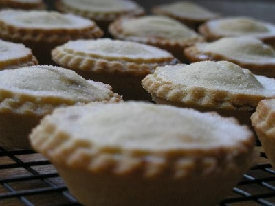

# Mini mince pies

*The mincemeat for these pies needs to macerate for at least 2 weeks before using, so make it well in advance. You'll have more than you need for one batch of pies; save the rest for the following year when it will taste even better.*

*Make the mince pies a few days before Christmas and store in a dry place.*

**Serves:** 48

## Overview
Crispy, buttery shortbread pastry encasing rich, spiced mincemeat studded with dried fruit, nuts, and brandy. A beloved British Christmas tradition, these miniature gems are equally good served warm with sherry or cold with coffee. The mincemeat improves with time, making these ideal for advance preparation.

## Ingredients
- 360 grams [shortbread pastry](../../baking/pastry/shortbread-dough.md) 
- eggwash (1 egg yolk mixed with 1 tablespoon of milk)
- 60 grams caster sugar

### Mincemeat
- 225 grams sultanas
- 450 grams raisins
- 450 grams currant
- 450 grams beef fat or suet (finely minced)
- 1 large cooking apple (peeled, cored and grated)
- 100 grams glacé fruits
- 350 grams soft brown sugar
- 1 teaspoon freshly grated nutmeg
- 1 teaspoon freshly grated mace
- 1 teaspoon ground cloves
- 1 teaspoon ground cinnamon
- 50 ml Cognac
- grated zest and juice of 1 lemon

## Method

### Stage 1 – Make Mincemeat
1. Rinse the dried fruit, dry thoroughly and roughly chop the sultanas and raisins.
1. Put the beef fat or suet in a very large bowl, then add the dried fruit and all the other ingredients in the order listed, mixing with a spatula until well combined.
1. Cover with cling film and leave to macerate in a cool larder or the vegetable drawer of the refrigerator for 24 hours.
1. Pack the mincemeat into sterilised preserving or kilner jars.
1. Make sure there are no air pockets by pushing the mixture hard into the bottom of the jars and filling them to the brim.
1. Cover each with a waxed paper disc and seal the jars with the clip.
1. Store the jars in a larder or the vegetable drawer of the refrigerator.

### Stage 2 – Prepare Pastry
1. Roll out the pastry to a 2 mm thickness and use 6 cm and 4.5 cm pastry cutters to cut out 48 discs of each size.
1. Line 48 lightly greased 4.5 cm diameter (1 cm deep) tartlet tins with the large discs.
1. Prick the bases and fill them with mincemeat.
1. Lightly brush the borders of the smaller discs with cold water and place them on top of the filled mince pies.
1. Press the edges gently to ensure that the lids are sealed to the pastry cases.
1. Leave to rest in the refrigerator for 20 minutes.

### Stage 3 – Bake
1. Preheat the oven to 180°C.
1. Brush the pastry with eggwash and bake the pies for about 10 minutes until pale golden brown.
1. Sprinkle with caster sugar and return to the oven for 1 minute to glaze.
1. Immediately unmould the pies before they cool in the tin, and place on a wire rack.
1. Serve warm, with a glass of sherry or a cup of coffee.

## Notes
- **Mincemeat preparation:** Quality ingredients and at least 2 weeks steeping time are essential. The mixture improves with age.
- **Make-ahead:** Mincemeat keeps indefinitely in sealed jars; use year after year for traditional Christmas baking.
- **Tartlet tins:** Small decorative tins make professional-looking pies; unfilled tins work but are less attractive.
- **Eggwash:** Creates a beautiful golden shine and helps the sugar coating adhere.

## Serving
Serve with: Sherry, brandy butter, or whipped cream
Garnish with: Light dusting of icing sugar and a small sprig of holly (optional)
Accompaniment: Classic pairing with hot coffee or mulled wine

## Storage
- Keeps 5-7 days in an airtight container at room temperature
- Freezes well up to 3 months (freeze baked pies or unbaked dough)
- Best eaten warm on the day of baking
- Can be gently reheated in a 160°C oven for 5 minutes