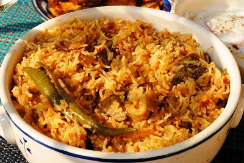

# Biryani

*Biryani is a royal one-pot rice and meat preparation traditionally cooked during festival celebrations, combining yogurt-marinated meat with fragrant basmati rice infused with whole spices and saffron. Each component builds in flavor layering, aromatic yogurt marinade, slow-cooked meat sauce, fragrant rice, creating a dish of profound depth that unites all elements through careful assembly.*

**Prep Time:** 4-6 hours
**Cook Time:** 45 minutes
**Yield:** Approximately 1.5 liters (4-6 servings)

## Overview
Biryani represents the height of Indian culinary technique: multiple components prepared separately with precision, then assembled in layers where flavors permeate through steam cooking. This isn't a one-step rice dish; rather, it's an architectural construction where yogurt-marinated lamb develops tenderization and flavor, then cooks slowly with warm spices and tomato, while basmati rice is independently flavored with saffron infusion and whole spices. Upon assembly, the two elements marry through steam, creating a unified dish where lamb and rice are inseparable in flavor. Traditionally cooked during festivals and royal celebrations, biryani requires patience and multiple steps but rewards with sophistication.

## Ingredients

### Meat Component
- 500 grams lamb (from leg or shoulder, cut into 3-4cm bite-sized pieces)
- 4 tablespoons sunflower oil
- 1 medium onion (approximately 150 grams, finely chopped)
- 1 tablespoon ground coriander
- 1 teaspoon ground cumin
- 1 teaspoon mild chilli powder
- 1 teaspoon ground turmeric
- 225 grams tinned tomatoes (chopped, or fresh tomatoes puréed)
- Fine sea salt to taste
- Freshly ground black pepper to taste

### Yogurt Marinade
- 4 garlic cloves (crushed to paste)
- 1 teaspoon fresh ginger (finely grated or minced)
- 50 milliliters natural yogurt (full-fat, unflavored)
- 6 tablespoons fresh coriander leaves (finely chopped)

### Rice Component
- 4 tablespoons sunflower oil
- 2 teaspoons cumin seeds
- 1 large onion (approximately 200 grams, thinly sliced)
- 6 whole cloves
- 10 black peppercorns
- 4 cardamom pods
- 1 cinnamon stick (approximately 2.5cm / 1 inch)
- 225 grams basmati rice
- 1 teaspoon saffron threads
- 3 tablespoons warm milk (or 2 tablespoons hot water)
- Fine sea salt to taste

### Assembly & Finishing
- Additional 2 tablespoons oil (for assembly)
- Additional fresh coriander leaves (for garnish)
- Fried onions (optional, traditional garnish)

## Method

### Stage 1A – Prepare Yogurt Marinade
1. In a glass bowl (not metal; yogurt reacts with aluminum), combine 4 crushed garlic cloves, 1 teaspoon finely grated ginger, 50 milliliters natural yogurt, and 6 tablespoons finely chopped fresh coriander leaves.
1. Stir until uniformly combined.
1. The marinade should be thick and spiced, aromatic from fresh coriander.

### Stage 1B – Marinate Lamb
1. Cut 500 grams lamb into 3-4 centimeter bite-sized pieces.
1. Add the lamb pieces to the yogurt marinade.
1. Using your hands or a spoon, rub the marinade thoroughly into each lamb piece, ensuring all surface is coated.
1. Cover the bowl loosely with plastic wrap.
1. Refrigerate for 4-6 hours (overnight is ideal; longer marinating tenderizes and flavors more thoroughly).
1. The longer marinating time allows yogurt's acids to tenderize the lamb while spices penetrate the meat.

### Stage 2A – Cook Marinated Lamb
1. Remove marinated lamb from refrigerator; allow to sit at room temperature for 15-20 minutes before cooking (this ensures even cooking).
1. Heat 4 tablespoons sunflower oil in a large, heavy-based saucepan over medium heat.
1. Once oil is shimmering, add 1 finely chopped onion (approximately 150 grams).
1. Cook, stirring occasionally, for 12-15 minutes until the onion becomes lightly golden (not deeply caramelized; we want gentle softening with slight color).
1. Once onion is pale golden, increase heat to high.
1. Add the marinated lamb pieces (including any remaining marinade).
1. Cook over high heat, stirring frequently, for approximately 15 minutes.
1. The lamb will brown on the outside; the yogurt marinade will gradually incorporate into the oil, creating a rich coating.
1. Stir often to prevent sticking and to ensure even browning.

### Stage 2B – Add Spices & Tomatoes
1. Once the lamb has browned, add 1 tablespoon ground coriander, 1 teaspoon ground cumin, 1 teaspoon chilli powder, and 1 teaspoon ground turmeric.
1. Stir continuously for approximately 1 minute to cook the spices and distribute evenly.
1. The pan will smell distinctly aromatic, warm, slightly spicy from the chilli.
1. Add 225 grams tinned tomatoes (chopped), or fresh tomatoes puréed.
1. Stir to combine the tomatoes with the lamb and spices.
1. Bring the mixture to a gentle boil, then reduce heat to low.
1. Simmer gently, uncovered, for approximately 30 minutes.
1. Stir occasionally; the sauce will reduce and the lamb will become very tender.
1. At the end, most of the liquid should be absorbed or syrupy, coating the lamb pieces rather than creating a runny sauce.
1. Season with salt and freshly ground black pepper to taste.
1. Set the cooked lamb aside; it can be held warm or cooled before assembly.

### Stage 3A – Prepare Rice Base
1. While the lamb cooks, place 225 grams basmati rice in a fine-mesh strainer.
1. Rinse under cold running water until water runs mostly clear (approximately 2-3 minutes).
1. Transfer to a clean bowl, cover with cold water, and allow to soak for 15 minutes.
1. After soaking, drain thoroughly.

### Stage 3B – Prepare Saffron Infusion
1. Place 1 teaspoon saffron threads in a small bowl.
1. Pour 3 tablespoons warm milk (or 2 tablespoons hot water) over the saffron.
1. Allow to steep for 5 minutes (the milk will turn golden yellow as saffron releases its color).
1. Set aside.

### Stage 3C – Cook Rice
1. Heat 4 tablespoons sunflower oil in a separate large saucepan over medium heat.
1. Once oil is shimmering, add 2 teaspoons cumin seeds.
1. Stir for about 20 seconds until the seeds pop and release their aroma.
1. Add 1 large thinly sliced onion (approximately 200 grams).
1. Cook, stirring occasionally, for approximately 3-4 minutes until the onion softens (don't brown it excessively).
1. Add 6 whole cloves, 10 black peppercorns, 4 cardamom pods, and 1 cinnamon stick.
1. Stir for approximately 1 minute while the spices warm and release aromatics.
1. Add the drained soaked rice to the spiced oil.
1. Stir constantly for approximately 2 minutes, coating each grain with oil and spices.
1. The rice will begin to smell warmly aromatic.

### Stage 3D – Add Liquid & Cook
1. Meanwhile, bring approximately 450 milliliters water to a boil in a kettle.
1. Pour the boiling water into the rice-spice mixture.
1. Add approximately 0.5 teaspoon salt (adjust if preferred).
1. Stir once, then bring to a boil over medium-high heat.
1. As soon as boiling, reduce heat to low and cover tightly with a well-fitting lid.
1. Cook for 10 minutes undisturbed.
1. After 10 minutes, remove from heat but keep the lid in place.
1. Allow to rest for 5 minutes.
1. The rice will be cooked but with slightly firm grains (not soft).

### Stage 4 – Assemble Biryani
1. Have the cooked lamb component and cooked rice components ready.
1. Choose a heavy-based, oven-safe pot or large saucepan with a well-fitting lid (approximately 3-4 liters capacity).
1. There will be two assembly approaches: traditional layering OR mixed assembly (mixed is simpler for home cooking).

### For Layered Assembly (Traditional):
1. Spread 1/3 of the cooked rice across the bottom of the pot.
1. Top with 1/2 of the cooked lamb and its sauce.
1. Top the lamb with another 1/3 of the rice.
1. Top with remaining 1/2 of the lamb and sauce.
1. Top with final 1/3 of the rice.
1. Sprinkle the saffron milk (with saffron threads) across the top of the rice layer.
1. Drizzle 2 additional tablespoons sunflower oil across the top.
1. Sprinkle with additional fresh coriander leaves and optional fried onions.

### For Mixed Assembly (Simpler):
1. Gently fold the cooked lamb and its sauce into the cooked rice using a fork.
1. Do not overdo the mixing; try to maintain some distinct pieces of lamb.
1. Transfer to a serving vessel or pot.
1. Pour the saffron milk (with threads) across the top.
1. Drizzle with 2 additional tablespoons sunflower oil.
1. Sprinkle with fresh coriander and optional fried onions.

### Stage 5 – Final Cooking & Resting
1. If it's the pot you'll serve from, proceed to steam on stovetop. If in a separate pot, preheat oven to 180°C.
1. Cover the biryani tightly with a well-fitting lid (or aluminum foil if using an oven-safe vessel).
1. Stovetop method: Place the covered pot over the lowest heat for 2-3 minutes (just enough to warm through and allow saffron to distribute).
1. Oven method: Place the covered biryani in the preheated 180°C oven for 5-8 minutes.
1. Once steamed (stovetop) or heated (oven), remove from heat/oven.
1. Allow to rest, covered, for 5 minutes.
1. Gently fluff with a fork before serving.

## Notes
- **Multiple Components:** Biryani success requires proper execution of three separate elements (marinade, meat, rice). Don't rush any component.
- **Overnight Marinating:** The longer marinating period is worth the planning; it tenderizes lamb and develops flavor significantly.
- **Rice Cooked Separately:** Unlike some single-pot rice dishes, biryani requires separate rice cooking to maintain grain integrity.
- **Saffron Infusion:** The milk infusion distributes saffron color and flavor more evenly than dry steeping.
- **Yogurt Marinade Essential:** The yogurt tenderizes lamb through its acids while spices penetrate; this is non-negotiable for authentic biryani.
- **Steam Assembly:** The final brief steaming brings the two components together while allowing flavors to permeate.
- **Fried Onion Garnish:** Traditional and adds textural contrast; not essential but highly recommended.

## Variations
**Chicken Biryani:** Substitute 500 grams boneless, skinless chicken thighs (cut into bite-sized pieces) for lamb. Reduce cooking time to 20-25 minutes (chicken cooks faster than lamb). All other steps remain identical.
**Vegetable Biryani:** Omit meat. Instead, use 300 grams mixed vegetables (potatoes, peas, carrots, beans, bell peppers), cooked separately in same spice treatment as the lamb. Layer with rice as above.
**Seafood Biryani:** Substitute 500 grams firm white fish or shrimp. Reduce marinating to 30-60 minutes and cooking time to 15 minutes (seafood overcooks easily).
**Hyderabadi Style:** Use 1/4 teaspoon more chilli powder for spicier result; add 1 tablespoon mint leaves to the marinade.
**With Fried Ginger:** Add 30 grams julienned ginger, fried crispy, as garnish for extra warmth and texture.

## Serving
Use with: Nothing, biryani is a complete meal in itself. Traditionally accompanied by raita (yogurt sauce) and pickled onions
Temperature: Hot (serve within 15 minutes of final assembly)
Ratio: Serves 4 as main course (approximately 400ml per person)
Context: Festival celebrations, special occasions, Indian formal dinners, showstopper main course

## Storage
- Refrigerate cooked biryani in a sealed container for up to 3 days.
- Reheat gently: add 1-2 tablespoons water, cover, and steam over low heat for 5-7 minutes until heated through. Or reheat covered in oven at 160°C for 10-12 minutes.
- Can be frozen for up to 1 month; thaw in refrigerator overnight and reheat as above.
- Reheating in a wok over medium heat with 1 tablespoon oil, stirring gently, can restore some crispness to rice grains.
- The biryani actually improves slightly after 1 day as flavors continue to meld; however, it's best served fresh.
- Do not microwave; texture deteriorates and steam doesn't distribute evenly.
