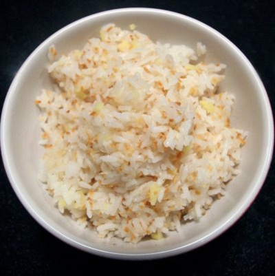

# Coconut Rice

*This aromatic, subtly sweet rice dish perfumes the palate with coconut, tempered by the sharp heat of mustard seeds and the delicate warmth of curry leaves. It's the perfect neutral-yet-interesting accompaniment to any spiced curry, calming heat without competing for attention.*

**Yield:** Approximately 600 milliliters cooked rice (4 servings)

## Overview
Coconut rice represents the intersection of technique and flavor in Indian cooking. The tempering of mustard and cumin seeds in hot oil releases their volatile aromatics, which then permeate the rice as it cooks. Curry leaves contribute herbaceous depth without overwhelming the dish. Coconut cream adds richness and subtle sweetness, creating a rice that's inherently interesting yet supportive of spiced dishes. The final resting period is crucial, steam completes the cooking while the flavors meld. This rice should taste aromatic with individual grains remaining separate.

## Ingredients

### Rice Base
- 225 grams basmati rice

### Tempering Spices & Aromatics
- 2 tablespoons sunflower oil (or light vegetable oil)
- 2 teaspoons black mustard seeds
- 2 teaspoons cumin seeds
- 2 dried red chillies (whole, seeds intact unless milder preferred)
- 10 fresh curry leaves (ideally Indian curry, not kaffir lime)

### Cooking Liquid
- 500 milliliters water (or hot chicken stock for deeper flavor)
- 4 tablespoons coconut cream (or light coconut milk)

## Method

### Stage 1 – Prepare Rice
1. Place 225 grams basmati rice in a fine-mesh strainer.
1. Rinse under cold running water, stirring gently with your hand, until the water runs mostly clear (2-3 minutes of rinsing).
1. This removes excess starch; some cloudiness is acceptable and normal.
1. Transfer the rinsed rice to a clean bowl.
1. Cover with cold water and allow to soak for 15 minutes.
1. This soaking ensures even moisture distribution and prevents some grains from cooking faster than others.
1. After 15 minutes, drain the rice thoroughly in the strainer.

### Stage 2 – Temper Spices
1. Pour 2 tablespoons sunflower oil into a heavy-based saucepan.
1. Set over medium-high heat until the oil is hot and shimmering.
1. Add 2 teaspoons black mustard seeds and 2 teaspoons cumin seeds.
1. Immediately stir constantly with a wooden spoon.
1. The seeds will begin to sizzle, pop, and release their aromatics within 10-20 seconds (this is tempering).
1. Listen for the popping sound; this indicates volatile oils are being released.
1. Do not let them brown or burn; once popping becomes vigorous, proceed to next step.
1. Add 2 whole dried red chillies to the oil.
1. Stir for an additional 10 seconds; the chillies will darken slightly.
1. Add 10 fresh curry leaves.
1. Stir for another 10 seconds until the curry leaves soften and release their aroma.
1. The total tempering time should be approximately 30-40 seconds.

### Stage 3 – Add Rice & Liquid
1. Add the drained rice to the tempered spices and oil.
1. Stir constantly for approximately 1 minute, coating each grain with oil.
1. The rice should smell distinctly aromatic at this point.
1. Meanwhile, have 500 milliliters hot water ready (should be steaming, approximately 95-100°C).
1. Pour the hot water into the rice-spice mixture.
1. Add 4 tablespoons coconut cream.
1. Stir gently with a wooden spoon to combine and distribute coconut cream.
1. Bring the mixture to a rolling boil over medium-high heat (approximately 1-2 minutes).

### Stage 4 – Cook Under Cover
1. Once boiling, immediately reduce heat to the lowest setting (low).
1. Cover the saucepan tightly with a well-fitting lid.
1. Cook, undisturbed and without opening the lid, for 10 minutes.
1. During this time, the rice absorbs the liquid and steams in the residual heat.
1. Do not stir or peek during cooking; opening the lid breaks the steam seal.

### Stage 5 – Rest & Fluff
1. After 10 minutes of covered cooking, remove the saucepan from heat.
1. Leave the lid in place and allow the rice to rest, undisturbed, for 10 minutes.
1. During this resting period, residual heat completes the cooking process and flavors meld further.
1. Very carefully remove the lid (steam will be quite hot; direct it away from your face).
1. Using a fork, gently fluff the rice by lifting grains from the bottom.
1. The rice should be fluffy, aromatic, and with grains remaining separate.

## Notes
- **Oil Temperature Crucial:** The oil must be hot enough to properly temper the spices; cold oil won't release aromatic volatiles.
- **Mustard Seed Tempering:** The distinct popping sound indicates tempering success; this releases volatile oils that flavor the entire rice.
- **Curry Leaves Fresh:** Indian curry leaves (not kaffir lime) are essential; dried curry leaves lose all character and flavor.
- **Coconut Cream vs. Milk:** Full-fat coconut cream creates richness; lighter coconut milk (5% fat) works but creates less rich result.
- **Stock Alternative:** Hot chicken or vegetable stock substitutes for water, deepening flavor significantly; if stock is pre-salted, adjust salt elsewhere.
- **Lid Must Seal:** A tight-fitting lid is essential; steam loss means uneven cooking with both crunchy and mushy sections.
- **No Stirring During Cooking:** Resist opening or stirring; this breaks the steam seal and creates uneven cooking.

## Variations
**Spicier Version:** Increase dried red chillies to 3-4, or add 1/2 teaspoon red chilli powder alongside the tempering spices.
**Less Coconut:** Reduce coconut cream to 2-3 tablespoons for lighter, less rich result.
**More Indian:** Add 4-5 curry leaves (closer to traditional quantity), 2-3 cardamom pods, and 2-3 cloves during tempering.
**With Green Herbs:** Fold 2-3 tablespoons fresh coriander leaves into the finished rice just before serving (don't heat; preserve freshness).
**Cashew Crunch:** Toast 2-3 tablespoons raw cashew pieces in the oil before adding spice seeds, creating textural contrast and richness.

## Serving
Use with: Any spiced curry (vindaloo, korma, balti, madras, jalfrezi), grilled proteins with spice rubs, stir-fries, braised meat dishes
Temperature: Hot or warm (serve within 15 minutes of completion for maximum aroma)
Ratio: 150ml uncooked rice per person (yields approximately 150ml cooked rice per serving)
Context: Indian and South Asian meals, curry accompaniment, aromatic neutral rice

## Storage
- Refrigerate cooked rice in a sealed container for up to 3-4 days.
- Reheat gently: add 1-2 tablespoons water, cover, and steam over low heat for 2-3 minutes, or microwave covered with damp paper towel for 1-2 minutes.
- Can be frozen in sealed containers or bags for up to 2 months (defrost in refrigerator overnight before reheating).
- Coconut-based rice hardens more noticeably as it cools; this is normal and doesn't indicate spoilage.
- Re-tempering a small amount of spices and folding into leftover rice can refresh it significantly.
- Do not store at room temperature; bacteria proliferate in moist starch environments.