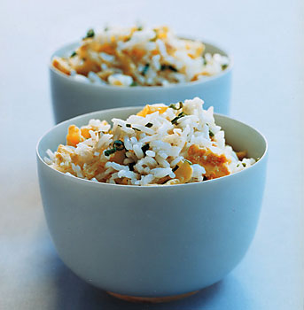

# Fried Rice

*In China, fried rice is eaten as a 'filler' at the end of formal dinner parties, never as the primary starch accompanying other dishes. Despite its ubiquity in Western Chinese restaurants, authentic fried rice is frequently incorrectly cooked. This version, with crispy rice grains coated individually with oil, tender bean sprouts, savory Parma ham, and silky scrambled egg, represents traditional execution.*

**Yield:** Approximately 600 milliliters cooked fried rice (4 servings)

## Overview
Fried rice is fundamentally about texture contrast: individual grains coated entirely with hot oil, remaining crispy and separate, never clumped or greasy. Success requires three critical elements: Cold rice (overnight-refrigerated best), sufficiently hot oil (nearly smoking), and a light hand with seasonings. The beaten egg is never pre-cooked; instead, it's added raw to the hot rice and oil where residual heat cooks it silkily, coating the grains. Bean sprouts provide fresh textural contrast. This is not comfort food; it's refined technique applied to simple ingredients.

## Ingredients

### Rice Base
- 400 milliliters steamed rice (cold, preferably overnight refrigerated)

### Proteins & Meat
- 50 grams Parma ham (or quality cured ham)
- 2 large eggs (room temperature)

### Vegetables
- 110 grams fresh bean sprouts (about 1 cup)
- 2 tablespoons spring onions (finely chopped, reserved for garnish)

### Cooking Fats & Seasonings
- 2 tablespoons groundnut oil (or light vegetable oil, never olive)
- 1 tablespoon toasted sesame oil
- 2 tablespoons light soy sauce
- Pinch of ground white pepper
- Fine sea salt to taste (if needed)

### Equipment
- Wok or large frying pan (14-inch / 35cm preferred)
- Wooden spatula or wok turner

## Method

### Stage 1 – Prepare Ingredients
1. Cut 50 grams Parma ham into fine dice (approximately 5mm cubes).
1. Ensure the Parma ham is at room temperature; cold ham won't incorporate smoothly.
1. Place 2 eggs in a bowl and beat with a fork until uniformly yellow (no visible whites or yolks).
1. Set aside; eggs should remain at room temperature.
1. Measure 400 milliliters steamed rice.
1. If fresh, spread onto a tray and refrigerate for at least 4 hours (overnight is ideal).
1. Cold rice has evaporated much moisture; warm rice will become greasy when fried.
1. The rice should feel dry and separate when pressed with a spoon, not clumped.

### Stage 2 – Heat Wok & Oil
1. Place a wok or large frying pan over high heat.
1. Allow it to heat for 2-3 minutes until the surface begins to smoke slightly.
1. The wok bottom should be very hot, nearly impossible to hold your hand over (approximately 200-220°C / 390-425°F).
1. Add 2 tablespoons groundnut oil to the center of the wok.
1. Tilt the wok to coat the sides; the oil should shimmer and move like water (not thick or slow).
1. If the oil smokes immediately, the wok is ready. If it sits passively, continue heating for another 30 seconds.

### Stage 3 – Add Rice & Initial Frying
1. Add all 400 milliliters cold rice to the hot oil.
1. Using a wooden spatula or wok turner, immediately begin breaking up any rice clumps by pressing and stirring.
1. Stir constantly and aggressively for approximately 1 minute.
1. Every grain should contact the hot oil; listen for the sizzle and smell the fragrant toasting aroma.
1. The rice will begin to heat through and individual grains will look glossy and coated with oil.
1. There should be no visible uncoated rice (white grains). All grains should appear golden and oily.

### Stage 4 – Add Parma Ham
1. Add the diced Parma ham to the hot rice and oil.
1. Continue to stir-fry over high heat for an additional 5 minutes.
1. Stir constantly; do not walk away from the wok.
1. The ham will warm through and its savory flavor will permeate the rice.
1. The rice should continue to smell fragrant and toasted, never burnt or acrid.
1. If beginning to smell burnt, reduce heat to medium-high.

### Stage 5 – Add Egg & Bean Sprouts
1. While still stir-frying constantly, pour the beaten eggs directly into the hot rice and oil.
1. Do NOT pre-scramble the eggs; add them raw to the hot wok.
1. The residual heat will cook them immediately as you fold and stir them into the rice.
1. Continue stir-frying for approximately 1 minute, breaking the egg into small pieces as it cooks.
1. The egg will initially look glossy and raw, then gradually firm up and become opaque.
1. Once the egg appears mostly cooked (no pools of raw-looking liquid), add 110 grams fresh bean sprouts.
1. Stir-fry for another 1-2 minutes until the bean sprouts are heated through but still crisp and fresh-tasting (not soft).
1. The total cooking time from adding egg to finished product should be approximately 2-3 minutes.

### Stage 6 – Season & Finish
1. Add 2 tablespoons light soy sauce to the rice and stir to distribute evenly.
1. Add 1 tablespoon toasted sesame oil; stir to combine (the sesame oil adds fragrance, not heat).
1. Add a pinch of ground white pepper; stir once more.
1. Taste a small spoonful of the rice.
1. The flavor should be savory from soy, nutty from sesame, with subtle pepper warmth.
1. If underseasoned, add a small pinch of fine sea salt and taste again.
1. Soy sauce already provides significant salt; taste before adding more.

### Stage 7 – Plate & Garnish
1. Using a large spoon or spatula, transfer the fried rice to a serving platter or individual bowls.
1. Top with 2 tablespoons finely chopped spring onion greens.
1. Serve immediately while still hot.
1. The rice should be hot enough to steam slightly; cold or tepid fried rice lacks character.

## Notes
- **Cold Rice Essential:** Overnight-refrigerated rice has lost moisture and doesn't become greasy when oil is applied. Warm or fresh rice will absorb oil excessively and become heavy.
- **Oil Temperature Critical:** Nearly-smoking oil is correct; insufficient heat means grains won't coat properly and rice will be greasy rather than dry-textured.
- **Wok is Superior:** A properly curved wok distributes heat better than a flat-bottomed pan; the sides stay hot enough to toast grains edges.
- **Egg Never Pre-cooked:** Raw egg added to hot rice cooks instantly and remains silky; pre-cooked scrambled egg becomes tough and granular.
- **Bean Sprouts Raw:** Don't over-cook; they should remain crisp and fresh-tasting, not wilted or soft.
- **Soy Sauce Quantity:** 2 tablespoons is appropriate; more creates salty, one-dimensional result.
- **Rice Ratio:** 400ml rice creates 4 servings; this is a "filler" course, not the main starch.
- **Never MSG:** Authentic fried rice uses no MSG; soy sauce provides all umami depth required.

## Variations
**Vegetable Version:** Omit Parma ham; add 50 grams carrots (diced fine), 50 grams peas, and 25 grams corn before bean sprouts. Stir-fry vegetables for 2 minutes before adding egg.
**Shrimp Fried Rice:** Omit Parma ham; add 100 grams small shrimp (peeled, deveined) instead. Add shrimp to hot oil with rice; they'll cook in 1-2 minutes.
**More Assertive Sesame:** Increase sesame oil to 1.5 tablespoons for stronger sesame aroma (be cautious; too much becomes overwhelming).
**Garlic Version:** Add 1-2 small cloves minced garlic to the oil before adding rice; let it toast for 30 seconds.
**White Pepper Emphasis:** Increase white pepper to 1/4 teaspoon for more pronounced subtle heat.

## Serving
Use with: Dim sum courses, as a dessert-like final dish after savory stir-fries and curries, standalone lunch, Chinese formal dinners
Temperature: Hot (serve within 2 minutes of finishing)
Ratio: 150ml per serving
Context: Finale course at Chinese dinners, light lunch, "filler" course to complete a meal

## Storage
- Refrigerate leftovers in a sealed container for up to 3 days (quality degrades significantly after 1-2 days).
- Reheat in a wok over high heat with 1 tablespoon oil, stirring constantly for 2-3 minutes until heated through.
- Do not microwave; texture becomes mushy and unpleasant.
- Best served fresh; reheated fried rice never has quite the same texture as freshly made.
- Can be partially prepared ahead: cold rice and beaten eggs prepared in advance. Oil the wok and finish cooking at service time.
- Do not freeze; the texture degrades significantly and becomes unpleasant upon reheating.
