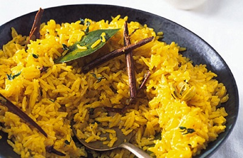

# Pilau Rice

*This aromatic Indian pilau is infused with warm spices, cardamom, cloves, cinnamon, and bay, that perfume butter-coated grains individually with their volatile aromatics. Saffron adds subtle floral notes and golden hue. The result is an elegant, fragrant rice suitable for formal Indian dinners or as a special-occasion starch.*

**Prep Time:** 35 minutes
**Cook Time:** 15 minutes
**Yield:** Approximately 1.3 liters cooked rice (6-8 servings)

## Overview
Pilau rice exemplifies spiced Indian cooking at its most refined. Rather than cooking spices into the rice (as in some Indian rices), pilau relies on whole-spice tempering in ghee or butter, which releases volatile aromatics that then coat each grain. The basmati rice absorbs flavored stock rather than plain water, creating depth. The final resting period allows flavors to marry while residual heat completes cooking. This rice is meant to be eaten as an accompaniment to curries, the aromatic warmth complementing rather than competing with the main dish.

## Ingredients

### Rice Base
- 450 grams basmati rice

### Aromatics & Spices
- 1 large onion (approximately 200 grams, finely chopped)
- 1 large knob butter (approximately 40-50 grams, plus extra to serve)
- 4 cardamom pods (or 8 crushed seeds if pods unavailable)
- 8 whole cloves
- 1 cinnamon stick (approximately 2.5 cm / 1 inch long)
- 1 pinch saffron threads (approximately 10-15 threads)
- 2 bay leaves

### Cooking Liquid & Seasoning
- 600 milliliters chicken stock (or vegetable stock; must be hot)
- Fine sea salt to taste (approximately 1/2 teaspoon)
- Water (for soaking rice)

## Method

### Stage 1 – Prepare Rice
1. Place 450 grams basmati rice in a fine-mesh strainer.
1. Rinse under cold running water, stirring gently, until the water runs mostly clear (approximately 2-3 minutes).
1. This removes excess starch; some cloudiness is acceptable.
1. Transfer rinsed rice to a clean bowl.
1. Cover completely with cold water (approximately 1 liter).
1. Allow to soak for approximately 30 minutes.
1. This soaking ensures even moisture distribution throughout all grains.
1. After soaking, drain thoroughly in the strainer; excess water remaining will make rice mushy.

### Stage 2 – Prepare Aromatics
1. Peel and finely chop 1 large onion (approximately 200 grams).
1. Have at hand: 4 cardamom pods, 8 whole cloves, 1 cinnamon stick, 1 pinch saffron threads, and 2 bay leaves.
1. Have 600 milliliters chicken or vegetable stock ready (should be steaming, approximately 90-100°C).
1. If stock is cold or room temperature, warm it briefly before using; cold stock will lower the temperature of the butter and rice excessively.

### Stage 3 – Begin Cooking Onions
1. In a large, heavy-based saucepan with a well-fitting lid, melt approximately 40-50 grams butter over medium heat.
1. Continue heating until the butter begins to bubble and foam.
1. Add the finely chopped onion to the foaming butter.
1. Cook, stirring occasionally with a wooden spoon, for approximately 5 minutes.
1. The onion should soften and become translucent (not golden brown; we want gentle softening, not caramelization).
1. Continue to stir occasionally; aim for even softening throughout the onions.

### Stage 4 – Add Whole Spices
1. Add 4 cardamom pods to the butter and onions.
1. Add 8 whole cloves.
1. Add 1 cinnamon stick.
1. Add 2 bay leaves.
1. Reduce heat to low.
1. Cook, stirring gently, for approximately 2 minutes.
1. The spices will begin to darken and release their aromatics; you'll smell warming cinnamon and cardamom.
1. Do not allow them to brown or burn; low heat is essential.
1. The onions and spice combination should smell distinctly aromatic now.

### Stage 5 – Add Saffron
1. While the spices cook on low heat, take 1 pinch saffron threads (approximately 10-15 threads).
1. Place them in a small bowl or cup.
1. Pour approximately 2 tablespoons of the hot stock over the saffron.
1. Allow saffron to steep and hydrate (this happens almost immediately).
1. The stock will turn golden yellow as saffron releases its color and flavor compounds.
1. Set aside the saffron-infused stock.

### Stage 6 – Add Rice
1. Add the drained soaked rice to the spice-butter-onion mixture on the low-heat stovetop.
1. Using a wooden spoon, stir gently but continuously for approximately 1-2 minutes.
1. Each grain should become coated with the butter and spice oil.
1. The rice should smell distinctly aromatic, warming spice scents should be pronounced.
1. The rice grains will begin to look slightly translucent at their edges.

### Stage 7 – Add Hot Stock
1. Remove the saucepan from direct heat temporarily.
1. Pour the 600 milliliters hot stock into the rice and butter mixture.
1. Add the saffron-infused stock (with the saffron threads).
1. Stir once or twice to distribute the stock evenly.
1. Add approximately 1/2 teaspoon fine sea salt to taste (adjust based on stock's saltiness; if using pre-salted stock, reduce).
1. Stir once more to ensure salt dissolves.

### Stage 8 – Cook Under Cover
1. Bring the mixture to a rolling boil over medium-high heat (approximately 2-3 minutes).
1. As soon as the liquid boils vigorously, reduce heat to the lowest setting (low).
1. Cover the saucepan with a tight-fitting lid.
1. If the lid has any gap or vent, cover with aluminum foil to seal it completely before putting the lid on.
1. The seal is crucial; any steam loss means uneven cooking.
1. Cook, undisturbed and without opening the lid, for 10 minutes.

### Stage 9 – Rest & Fluff
1. After 10 minutes of covered cooking, remove the saucepan from heat.
1. Leave the lid in place and allow to rest, completely undisturbed, for 5 minutes.
1. During this resting period, residual steam completes the cooking and flavors marry.
1. Very carefully remove the lid (steam will be quite hot; direct it away from your face).
1. Using a fork (never a spoon, which breaks grains), gently fluff the rice by lifting from bottom.
1. Break up any clumped areas without pressing or stirring aggressively.
1. The rice should be fluffy, fragrant, and with individual grains remaining separate (not mushy).

### Stage 10 – Final Enrichment
1. Add an additional knob of butter (approximately 15 grams) to the fluffed rice.
1. Fold gently with a fork to distribute the butter evenly.
1. The extra butter adds richness and ensures grains remain separate as the rice cools.

## Notes
- **Saffron Steeping:** Pre-steeping saffron in hot stock (rather than dry-toasting it) distributes its color and flavor more evenly throughout the rice.
- **Stock Quality:** Use quality, flavorful stock; its taste directly becomes the rice's flavor. Weak stock = weak pilau.
- **Pre-soaking Rice:** The 30-minute soak ensures even cooking; without it, grains cook at different rates.
- **Whole Spices:** Never substitute ground versions; whole spices provide distinct, delicate aromatics (ground becomes bitter during cooking).
- **Lid Must Seal:** Steam escaping means uneven cooking with both mushy and crunchy grains.
- **No Stirring During Cooking:** Resist opening; residual steam is essential for final texture.
- **Low Heat Critical:** Medium or high heat creates mushy rice; low heat allows gentle, even cooking.
- **Cardamom Pods:** These can be eaten (provided in many Indian restaurants); some diners remove them, others eat them for their subtle warm sweetness.

## Variations
**With Peas:** Fold 50 grams frozen (or freshly cooked) peas into finished rice; they'll warm from residual heat.
**Fragrant Basmati Emphasis:** Use fragrant basmati varieties (Basmati 370, Basmati PC) for enhanced natural rice aroma.
**Ghee Version:** Substitute clarified butter (ghee) for regular butter; provides more authentic Indian character and distinct nutty aroma.
**Extra Cardamom:** Increase cardamom pods to 6 for stronger spice emphasis (traditional in some regions).
**With Fried Onions:** Top finished pilau with crispy fried onions (traditional garnish); adds textural contrast.

## Serving
Use with: Mild to medium curries (korma, dopiaza, jalfrezi), grilled meats, tandoori chicken, rice-based Indian meals
Temperature: Hot or warm
Ratio: 60ml uncooked rice per person (yields approximately 150ml cooked pilau)
Context: Indian formal dinners, special occasions, curried dishes where rice partners with sauce

## Storage
- Refrigerate cooked pilau in a sealed container for up to 3-4 days.
- Reheat gently: add 1-2 tablespoons water, cover, and steam over low heat for 2-3 minutes until heated through. Do not microwave; texture suffers.
- Can be frozen in sealed containers for up to 2 months; defrost in refrigerator overnight and reheat gently.
- The whole spices will soften further during storage; this is normal and doesn't affect quality.
- Leftover pilau can be refried: heat 1 tablespoon butter in a wok, add cold pilau, and fry over high heat for 2-3 minutes, stirring constantly, to restore crispness.
- Do not store at room temperature; bacteria proliferate in moist starch environments.
