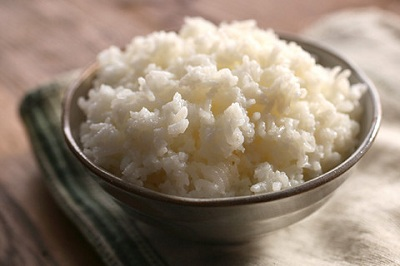

# Steamed Rice

*This Chinese steaming method produces fluffy, individual grains of long-grain rice through a two-stage cooking process: initial boiling to evaporate surface liquid, then gentle steaming in residual moisture. The result is uniformly cooked rice that never becomes sticky, ideal as a neutral accompaniment to any Asian-inspired dish.*

**Yield:** Approximately 1.2 liters cooked rice (4-5 servings)

## Overview
Chinese steamed rice exemplifies the power of patience and precise technique. The key principle is using high heat initially to evaporate surface water visibly (watching for characteristic "crater" pattern), then radically reducing heat to allow gentle steaming. The lid must never be opened during steaming; this breaks the seal and ruins the delicate cooking process. The result is fluffy rice with grains that remain separate, never mushy or sticky. Long-grain rice (jasmine or basmati) works best; short-grain varieties retain excess moisture and become sticky regardless of technique.

## Ingredients

### Rice Base
- 400 milliliters long-grain rice (approximately 2 cups)
- 900 milliliters water (approximately 3.75 cups)

### Equipment
- Heavy-bottomed pot with tight-fitting lid (crucial for steam seal)
- Large bowl (for washing rice)

## Method

### Stage 1 – Wash Rice
1. Place 400 milliliters long-grain rice in a large bowl.
1. Cover with cold water.
1. Stir gently with your hand; rice will become cloudy as starch releases.
1. Pour off the cloudy water carefully.
1. Repeat the washing process 3-4 times until water runs mostly clear (some cloudiness is acceptable).
1. Washing removes excess starch; this prevents stickiness during cooking.
1. Drain the rice thoroughly in a fine-mesh strainer.

### Stage 2 – Initial Boil (High Heat)
1. Pour the washed, drained rice into a heavy-bottomed pot.
1. Add 900 milliliters cold water.
1. Set over high heat and bring to a rolling boil.
1. Watch the pot: the water will bubble vigorously and begin to evaporate from the surface.
1. Continue boiling for approximately 15-20 minutes.
1. The water level will drop visibly; watch for the characteristic "pitted crater" pattern to appear on the rice surface.
1. This pattern indicates most surface liquid has evaporated and rice has absorbed water into its structure.
1. The remaining water should be approximately 3-5 millimeters above the rice surface.

### Stage 3 – Transition to Low Heat & Seal
1. As soon as the crater pattern appears, reduce heat to the absolute lowest setting (or below minimum if your stove allows).
1. Some cooks place a diffuser under the pot to reduce heat further.
1. Immediately cover the pot with a tight-fitting lid.
1. The seal is critical; steam cannot escape or the cooking process fails.
1. If your lid has a vent hole, cover it with aluminum foil to create a complete seal.

### Stage 4 – Gentle Steam Cooking
1. Do not open the lid for any reason during steaming.
1. Opening the lid breaks the steam seal and ruins the rice (and is considered bad luck in Chinese cooking tradition).
1. Allow the rice to steam, undisturbed, for 15-20 minutes.
1. You may hear very subtle bubbling or hissing from beneath the lid; this is correct.
1. There should be no vigorous boiling or steam escaping visibly.
1. The gentle residual heat cooks remaining water into the rice.

### Stage 5 – Rest & Fluff
1. After 15-20 minutes of gentle steaming, remove the pot from heat.
1. Allow it to rest, still covered, for 2-3 minutes.
1. Carefully remove the lid (steam will be very hot; direct it away from your face).
1. Using a fork, gently fluff the rice by lifting grains from the bottom, breaking up any clumped areas.
1. Do not stir vigorously; gentle fluffing preserves grain integrity.

## Notes
- **Long-Grain Essential:** Long-grain rice (jasmine, basmati, or Uncle Ben's) remains separate; short-grain varieties become sticky regardless of technique.
- **Crater Pattern:** This is your visual cue for transition point; don't skip this observation, it ensures proper timing.
- **Lid Must Seal Completely:** Any steam loss means uneven cooking; cover heat vents with foil if necessary.
- **Never Open the Lid:** Resist all temptation; opening breaks the seal and creates uneven cooking with both mushy and dry grains.
- **Heat Reduction Critical:** Low heat is essential; vigorous simmering after the crater pattern appears ruins the rice texture.
- **Water Ratio Precise:** 400ml rice to 900ml water is calculated specifically for long-grain varieties; deviations create problems.
- **Rest Period Important:** The final 2-3 minute rest allows residual heat to finish cooking without direct flame.

## Variations
**Jasmine Rice:** Substitute jasmine rice (fragrant, subtly sweet); requires same cooking time and water ratio.
**Basmati Rice:** Substitute basmati (long grain, aromatic); cooking time may reduce slightly (watch for crater pattern to appear earlier).
**Coconut Liquid:** Replace 200ml water with 200ml coconut milk for subtle fragrance (maintain 900ml total liquid).
**Chicken Stock:** Replace water entirely with chicken or vegetable stock for deeper flavor (if using already-salted stock, reduce added salt elsewhere).
**Infused Aromatics:** Add 2-3 bruised cardamom pods, 1 bay leaf, or 1-inch fresh ginger slice at the start of cooking (remove before serving).

## Serving
Use with: Any Asian-inspired cuisine (Thai, Vietnamese, Chinese, Indian), spicy curries, stir-fries, broiled or grilled proteins, vegetable preparations
Temperature: Hot or warm
Ratio: 1 cup cooked rice per person (or 150ml uncooked rice per person)
Context: Neutral starch base, everyday cooking, meals where rice complements rather than dominates

## Storage
- Refrigerate cooked rice in a sealed container for up to 4 days.
- Reheat gently: add 1-2 tablespoons water, cover, and steam over low heat for 2-3 minutes, or microwave covered with damp paper towel for 1-2 minutes per cup.
- Can be frozen in sealed containers or plastic bags for up to 2 months.
- Freezing causes some textural change; thaw at room temperature or reheat directly from frozen.
- Do not store rice at room temperature for extended periods; bacteria can proliferate in moist starch.
- Leftover rice hardens as it cools; this is normal and doesn't indicate spoilage if refrigerated promptly.