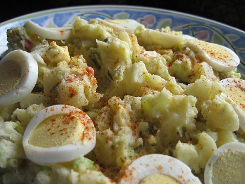

# Hot Cajun Potato Salad

*In Cajun country, where Tabasco originates, hot means really hot, and this potato salad is no exception.*

**Serves:** 6

**Prep Time:** 10 minutes

**Cook Time:** 25 minutes

## Overview
A fiery potato salad blending Cajun spices with a mayo-based dressing, featuring hard-boiled eggs, spring onions, and diced green chilli. The warming garam masala, cumin, and cayenne create authentic Cajun heat balanced with fresh herbs.

## Ingredients
### Vegetables
- 8 waxy potatoes
- 1 green chilli (deseeded and diced)
- 4 spring onions (shredded)

### Protein and dairy
- 3 eggs (hard-boiled, shelled, and chopped)
- 250 ml mayonnaise

### Seasonings and spices
- 1 tbsp Dijon mustard
- Tabasco sauce (to taste)
- ¼ tsp garam masala
- ¼ tsp ground cumin
- ¼ tsp dried coriander
- ¼ tsp cayenne pepper
- 2 tsp thyme (chopped)
- Salt and ground black pepper

### To serve
- Salad leaves

## Method

### Stage 1 – Cook potatoes
1. Put unpeeled potatoes in a pan of cold salted water.
1. Bring to the boil and cook for 20–30 mins until tender.
1. Drain and set aside to cool enough to handle.
1. Peel and cut into large chunks.

### Stage 2 – Combine vegetables and protein
1. Place potatoes in a large bowl and add the diced chilli, spring onions, and eggs.
1. Mix gently.

### Stage 3 – Make dressing
1. In a separate bowl, mix mayonnaise with mustard and season with salt and black pepper.
1. Add Tabasco sauce to taste.
1. Mix in cumin, coriander, and thyme.

### Stage 4 – Finish salad
1. Add dressing to the potato mixture and toss gently to coat.
1. Sprinkle over the cayenne and garam masala.
1. Serve on salad leaves.

## Notes
- **Heat level:** Adjust Tabasco to preference; start with less and build up.
- **Waxy potatoes:** Essential for maintaining texture; floury varieties will disintegrate.
- **Warm salad:** Some prefer serving warm rather than chilled; both work well.

## Serving
Serve on a bed of fresh salad leaves. Great as a side dish for grilled meats or as part of a buffet spread.

## Storage
- Refrigerate up to 2 days in an airtight container.
- Bring to room temperature 30 mins before serving for best flavour.
- Do not freeze.