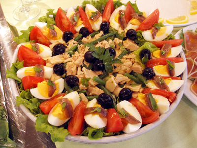

# Niçoise Salad

**Serves:** 4

**Prep Time:** 15 minutes

**Cook Time:** 20 minutes

## Overview
A classic Provençal salad featuring seared tuna, hard-boiled eggs, and crispy serrano anchovies over fresh greens with potatoes and green beans. The herb-infused tarragon dressing ties all the vibrant components together.

## Ingredients
### Vegetables
- 100 g fine beans
- 8 new potatoes (cooked and sliced)
- 1 head soft lettuce
- 2 tomatoes (seeded and cut into wedges)

### Protein
- 400 g tuna fillet steaks
- 4 anchovy fillets (drained)
- 2 hard-boiled eggs (roughly chopped)

### Bread and garnish
- 12 very thin slices French bread
- 8 black olives (stoned and quartered)
- 1 tsp capers
- 1 tsp sesame seeds
- 1 tbsp butter
- 1 garlic clove (finely chopped)

### Dressing
- 8 tbsp olive oil
- 2 tbsp tarragon vinegar
- ½ tsp Dijon mustard
- Salt and freshly ground black pepper
- ½ garlic clove (finely chopped)
- ½ tsp fresh chives (finely chopped)
- ½ tsp tarragon (freshly chopped)

### For cooking tuna
- Salt and pepper
- Oil for frying

## Method

### Stage 1 – Prepare beans
1. Place beans in a pan of salted boiling water for 2 mins.
1. Plunge into ice-cold water and drain.
1. Heat butter and garlic in a frying pan; once butter froths, fry beans for 2 mins.
1. Remove from pan, shake sesame seeds over, and allow to cool.

### Stage 2 – Prepare bread croutons
1. Brush bread slices with olive oil.
1. Toast until crisp and golden on both sides.

### Stage 3 – Cook tuna
1. Season tuna steaks with salt and pepper.
1. Grill or shallow fry for 1–1½ mins on each side, keeping tuna medium to medium-rare.

### Stage 4 – Assemble salad
1. Mix dressing ingredients together, except herbs and eggs.
1. Separate salad leaves and add olives, tomatoes, capers, fine beans, and anchovy fillets.
1. Add potato slices and season with salt and pepper.
1. Mix dressing with the chopped herbs and hard-boiled egg.
1. Pour dressing over salad and toss together with croutons.
1. Divide between plates and sit cooked tuna on top.

## Notes
- **Tuna quality:** Use fresh tuna steaks, not canned; seared medium-rare is essential to this classic.
- **Tarragon dressing:** The fresh tarragon is key; dried will not provide the same delicate anise flavour.
- **Anchovy fillets:** Good quality makes a difference; choose ones packed in oil rather than salt.

## Serving
Serve immediately while tuna is still warm and croutons are crispy.

## Storage
- Best eaten fresh; do not prepare ahead.
- Leftover dressing keeps refrigerated for 2–3 days.
- Do not freeze.