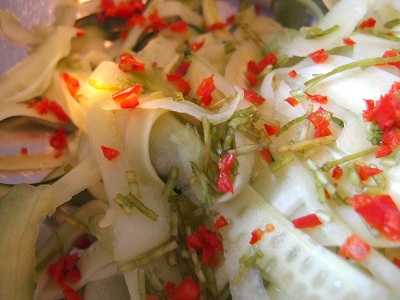

# Thai Cucumber Salad

*A piquant and sour salad that complements Thai red or green curry wonderfully.*

**Serves:** 4

**Prep Time:** 10 minutes

**Cook Time:** 0 minutes

## Overview
A refreshing, vibrant Thai salad featuring ribboned cucumbers in a tangy ginger-lime dressing with fresh coriander and chilli heat. Its bright, sour notes cut through rich curries perfectly while remaining light and crisp.

## Ingredients
### Base
- 2 cm piece fresh ginger
- 1 tbsp soy sauce
- 1 tsp sesame oil

### Vegetables
- 1 cucumber
- 1 fresh red chilli (halved)

### Aromatics and garnish
- 1 lime
- 1 small handful fresh coriander
- Sesame seeds (for garnish)

## Method

### Stage 1 – Make dressing base
1. Peel and grate ginger onto a serving platter.
1. Add soy sauce and sesame oil.
1. Squeeze lime juice over and check seasoning.

### Stage 2 – Prepare cucumber
1. Use a speed-peeler to peel cucumber in long ribbons over the platter.
1. Discard the watery core.

### Stage 3 – Prepare aromatics
1. Take a small handful of coriander and finely chop the stalks; set leaves aside.
1. Sprinkle coriander stalks over the cucumber.
1. Finely chop the chilli and sprinkle over.

### Stage 4 – Finish
1. Take to the table but don't toss until ready to eat.
1. Just before serving, toss together to combine dressing.
1. Sprinkle sesame seeds over the salad.

## Notes
- **Timing:** This salad is best dressed just before serving; tossing ahead causes wilting and cucumber releases water.
- **Coriander stalks:** These provide delicate flavour; don't discard them like many do.
- **Cucumber ribbons:** The speed-peeler creates thin, elegant ribbons that absorb the dressing better than chunks.

## Serving
Serve immediately alongside Thai curries to balance heat and richness with bright, tangy notes.

## Storage
- Best eaten fresh and crisp; do not prepare ahead.
- Leftover dressing may be stored refrigerated for 1 day.
- Do not freeze.
