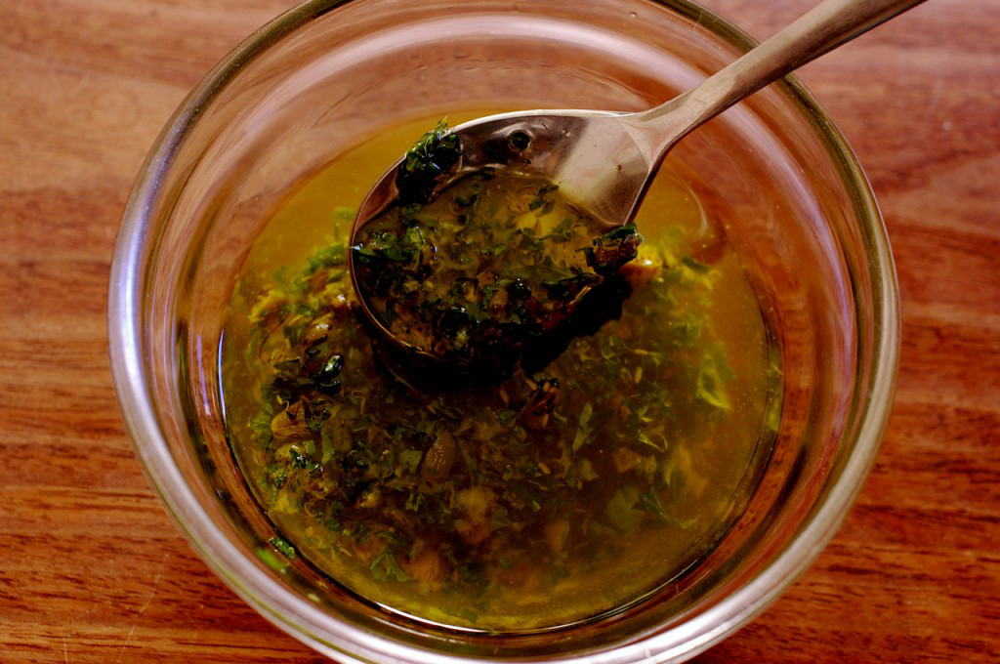

# Herb Salsa

*This delicate, herbaceous salsa pairs beautifully with fresh pasta, especially tortellini or cappelletti filled with ricotta or similar light fillings. The boiled potato base provides body, while fines herbes (a classic French blend of parsley, chives, tarragon, and chervil) offers bright, fresh herb character with subtle anise notes from the tarragon.*

**Yield:** Approximately 300 milliliters (6 servings)

## Overview
Herb salsa is uniquely French despite the Spanish name: it's essentially a warm salsa based on creamy, newly cooked potato and fine herbs. Unlike the fresh salsas of Mexico and Mediterranean regions, this version relies on cooked potato for texture and structure, with sherry vinegar providing acid, and a combination of mustard and lemon juice offering complexity. The blend of fines herbes (parsley, chives, tarragon, chervil) creates aromatic brightness without the intensity of larger basil-based sauces. This is best served warm or at room temperature, never chilled; cold dulls the delicate herb character.

## Ingredients

### Potato Base
- 60 grams potato (1 medium-sized)
- Water (for boiling)

### Herbs & Aromatics
- 60 grams fresh fines herbes (approximately 4 tablespoons, or substitute 2 tablespoons parsley + 1.5 tablespoons chives + 0.5 tablespoon fresh tarragon + 0.5 tablespoon chervil if fines herbes unavailable)

### Oil & Acid
- 120 milliliters extra virgin olive oil (approximately 1 cup)
- 40 milliliters sherry vinegar (approximately 3 tablespoons)

### Other Seasonings
- Juice of 1 lemon (approximately 2-3 tablespoons)
- 30 grams spring onions (approximately 2 large, finely chopped)
- 1 tablespoon coarse-grain Meaux mustard (or whole-grain Dijon)
- Salt and freshly ground pepper to taste

## Method

### Stage 1 – Prepare & Boil Potato
1. Place 1 medium potato (approximately 60 grams) in a saucepan.
1. Cover completely with cold water.
1. Set over high heat and bring to a boil.
1. Reduce heat to a simmer.
1. Cook the potato until completely tender when pierced with a knife (approximately 12-15 minutes).
1. Drain the potato and allow to cool slightly until it can be handled.
1. Do not peel until the potato is still warm; warm peels remove more easily and cleanly than cold ones.

### Stage 2 – Rice Potato
1. While the potato is still warm, peel off the skin.
1. Cut the peeled potato into chunks.
1. Pass the chunks through a potato ricer into a clean bowl.
1. The resulting purée should be smooth and light, without lumps.
1. Allow the potato to cool to warm room temperature (approximately 20 minutes).

### Stage 3 – Prepare Herbs
1. If using pre-mixed fines herbes, measure approximately 60 grams (about 4 tablespoons).
1. If making your own blend: mix together 2 tablespoons fresh parsley (finely chopped), 1.5 tablespoons fresh chives (finely snipped), 0.5 tablespoon fresh tarragon (finely chopped), 0.5 tablespoon fresh chervil (finely chopped).
1. The combination of these four herbs creates the distinctive fines herbes flavor profile.

### Stage 4 – Combine Components
1. To the cooled riced potato, add 120 milliliters extra virgin olive oil.
1. Add 40 milliliters sherry vinegar.
1. Add the juice of 1 lemon (approximately 2-3 tablespoons).
1. Add the prepared fines herbes (approximately 60 grams).
1. Add 30 grams finely chopped spring onions.
1. Add 1 tablespoon Meaux mustard (or whole-grain Dijon).

### Stage 5 – Mix & Season
1. Using a wooden spoon, stir all ingredients together gently but thoroughly.
1. The mixture should be uniform and creamy, with visible herb flecks throughout.
1. Taste the salsa.
1. Season with salt and freshly ground pepper as needed.
1. Begin conservatively, adjusting salt gradually; fines herbes and mustard already provide seasoning complexity.

## Notes
- **Warm Potato Essential:** A warm potato absorbs the oil and vinegar more readily than cold potato; chilled potatoes create a denser, less well-integrated salsa.
- **Fines Herbes Fresh Only:** This salsa depends entirely on fresh herbs; dried variants are completely inadequate.
- **Ricer vs. Fork:** A potato ricer creates smooth, light purée; mashing with a fork creates a denser, lumpier result (less ideal).
- **Tarragon Anise Notes:** The tarragon in fines herbes provides subtle anise/licorice notes; this is characteristic and essential to the blend's identity.
- **Meaux Mustard Character:** Meaux mustard has whole grain texture and assertive flavor; Dijon substitutes work but are milder and smoother.
- **Sherry Vinegar Important:** Sherry vinegar's warmth and slight sweetness are key; red wine vinegar will be too acidic; white wine vinegar too neutral.
- **Spring Onion Freshness:** Fresh spring onion provides onion flavor without the harshness of raw shallot; only fresh works.

## Variations
**Without Capers:** Substitute 1 tablespoon of chopped pickled cornichons for texture and tang (if herbs alone seem under-flavored).
**Extra Mustard:** Increase mustard to 1.5 tablespoons for more assertive, sharper character.
**Lighter Version:** Reduce olive oil to 90 milliliters and add 30 milliliters water or chicken stock (creates a looser sauce, less rich).
**More Tarragon:** Increase tarragon to 1 full tablespoon for heightened anise notes (French classic approach).
**With Shallot:** Add 1/2 small shallot (finely minced) alongside the spring onion for deeper onion flavor.

## Serving
Perfect with: Fresh pasta (tortellini, cappelletti, ravioli), delicate white fish, roasted chicken, spring vegetables, light potato preparations
Temperature: Warm or room temperature (never chilled)
Ratio: 2-3 tablespoons per serving
Context: Light pasta course, delicate plated presentations, spring dinners

## Storage
- Refrigerate in a sealed glass container for up to 3-4 days.
- If chilled, allow to come to room temperature before serving (cold salsa tastes flat and herb character is muted).
- The salsa is best consumed within 1-2 days for maximum herb freshness.
- Do not freeze; potato texture breaks down and herbs lose character entirely.
- The potato base provides stability; this is more shelf-stable than purely fresh herb salsas.
- Best served within 2 hours of final preparation for maximum herb aroma.