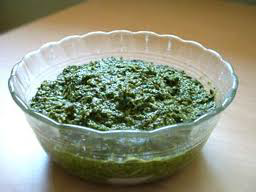

# Pesto

*This classic Italian basil sauce is silky, nutty, and herbaceous, the quintessential condiment for fresh pasta, focaccia dipping, or layered into Béchamel for lasagne. The balanced combination of fresh basil, garlic, pine nuts, extra virgin olive oil, and Parmesan creates one of the world's most versatile sauces.*

**Yield:** Approximately 180 milliliters (approximately 10-12 servings as a pasta sauce)

## Overview
Pesto represents the height of simplicity: five ingredients (basil, garlic, pine nuts, olive oil, Parmesan) combined to create a sauce of profound flavor and silky texture. The key to successful pesto lies in ingredient quality and processing technique. Fresh, fragrant basil is non-negotiable; aged or heat-stressed basil creates harsh, off-flavored results. Pine nuts must be fresh (rancid pine nuts ruin pesto instantly). Garlic should be mild and rounded by the pesto's other elements. Parmesan must be freshly grated; pre-grated cheese creates a grainy, inferior result. Traditional pesto is made by mortar and pestle, which bruises rather than cuts the basil, preserving its vibrant green color and fresh character. Modern food processors work adequately but can create a less vibrant result if over-processed.

## Ingredients

### Herb Base
- 40 grams fresh basil leaves (approximately 1 densely packed cup, washed and dried thoroughly)

### Other Components
- 1 clove garlic (mild, peeled)
- 30 grams pine nuts (fresh, high quality)
- 120 milliliters extra virgin olive oil (fruity, good quality)
- 20 grams Parmesan cheese (finely grated fresh, Parmigiano-Reggiano preferred)

### Finishing
- 1 pinch fine sea salt (to taste)

## Method

### Stage 1 – Prepare Basil
1. Select fresh, tender basil leaves.
1. Wash gently under cool water and dry very thoroughly using paper towels or a clean kitchen towel.
1. Any excess water on the basil will dilute the pesto and create a watery, thin result.
1. Measure approximately 40 grams of dried basil leaves (approximately 1 densely packed cup).
1. Remove and discard any large stems; small stem portions are acceptable.

### Stage 2 – Prepare Pine Nuts & Garlic
1. Toast the pine nuts very briefly: place 30 grams pine nuts in a dry skillet over medium heat.
1. Shake the pan constantly for approximately 2-3 minutes until fragrant (but not browned).
1. This toasting enhances pine nut flavor but must be careful not to burn them (which makes them bitter).
1. Remove from heat and allow to cool slightly.
1. Peel 1 clove garlic and mince very fine (approximately 1/4 teaspoon minced).

### Stage 3 – Create Pesto (Mortar & Pestle Method – Preferred)
1. Place the toasted pine nuts in a mortar (stone or ceramic preferred).
1. Using the pestle, crush the nuts gently until they release their oils and become paste-like (approximately 1 minute).
1. Add the minced garlic to the crushed pine nuts.
1. Gently pound the garlic with the nuts (approximately 30 seconds).
1. Add approximately 10 grams fresh basil leaves (about 1/4 of the total).
1. Gently bruise the basil with the pestle (not pounding violently; use a gentle crushing motion).
1. As the basil releases its juices and begins to break down, add another 10 grams basil.
1. Continue this gradual addition until all 40 grams basil is incorporated.
1. Work gently; aggressive pounding creates heat that damages basil's bright character.
1. Once all basil is incorporated and partially broken down (but still retaining texture), the mixture should be a thick paste (approximately 5-7 minutes total work).

### Stage 3B – Create Pesto (Food Processor Method – Faster)
1. Place the toasted pine nuts in a food processor fitted with a metal blade.
1. Pulse to break into small pieces (approximately 2-3 pulses).
1. Add the minced garlic.
1. Pulse once to combine.
1. Add all 40 grams fresh basil leaves at once.
1. Pulse gently 3-4 times until the basil is broken down but still retains a slightly chunky texture.
1. The mixture should be a thick, textured paste, not a purée.
1. Do not overprocess; excessive pulsing creates a fine purée that feels pasty rather than textured and fresh.

### Stage 4 – Incorporate Olive Oil (Both Methods)
1. Whether using mortar or processor, continue with this step.
1. Slowly add 120 milliliters extra virgin olive oil to the pesto paste.
1. If using a mortar, add the oil very gradually (approximately 1 tablespoon at a time) while stirring gently with the pestle.
1. If using a processor, use the feed tube and drizzle the oil slowly while pulsing gently (2-3 pulses per addition).
1. The oil will begin to break down the basil and create a more fluid, cohesive sauce.
1. Once all oil is incorporated, the pesto should be silky, cohesive, and vibrant green.
1. Do not over-emulsify; pesto is not an emulsion (like mayonnaise); it's a broken suspension where oil and herb elements remain somewhat distinct.

### Stage 5 – Add Cheese & Season
1. Transfer the pesto to a bowl (if made in mortar, or if desired).
1. Fold in 20 grams freshly grated Parmesan cheese (Parmigiano-Reggiano preferred).
1. Fold gently with a spoon; don't stir vigorously.
1. Add 1 small pinch fine sea salt to taste.
1. Taste the pesto; it should be herbaceous, garlicky, nutty, and rich.
1. Adjust salt gently if needed (Parmesan already provides saltiness).
1. The pesto is now complete and ready to serve.

## Notes
- **Basil Handling Critical:** Fresh basil must be thoroughly dried before processing; wet basil creates thin, watery pesto. Gentle bruising (not cutting aggressively) preserves bright green color.
- **Pine Nuts Essential & Expensive:** Fresh, high-quality pine nuts are crucial; rancid or stale nuts ruin pesto instantly. Check smell before purchasing.
- **Toasting Pine Nuts:** Brief toasting (2-3 minutes maximum) enhances flavor; longer toasting creates bitterness and burnt character.
- **Garlic Subtlety:** One clove is correct, the garlic should enhance, not dominate, the pesto's character. Mincing very fine ensures even distribution.
- **Extra Virgin Olive Oil Only:** The quality of oil is crucial; use fruity, high-quality extra virgin olive oil. Refined or lesser oils create flat, characterless pesto.
- **Parmesan Freshness:** Pre-grated cheese contains anti-caking agents that create a grainy, unsatisfactory texture; grate Parmigiano-Reggiano fresh.
- **Warm Temperature Caution:** Hot pesto (from warm ingredients) becomes less vibrant; work with ingredients at room temperature when possible.
- **Mortar Superiority:** Traditional mortar-and-pestle pesto retains better texture and brighter color than food processor versions; worth the extra effort.

## Variations
**Raw Pine Nuts:** Skip the toasting step for a less nutty, more delicate character (acceptable alternative if toasting nuts seems undesirable).
**With Walnuts:** Substitute 15 grams walnuts for 15 grams pine nuts (less expensive, earthier flavor, traditional in some regions).
**Cheese Options:** Use Pecorino Romano instead of Parmesan for sharper, more assertive character.
**With Lemon Zest:** Add zest of 1/2 lemon for brightness and herbal lift.
**Lighter Version:** Reduce olive oil to 90 milliliters and add 30 milliliters light vegetable stock (creates thinner sauce, less rich).

## Serving
Perfect with: Fresh tagliatelle or fettuccine, focaccia for dipping, layered into Béchamel for lasagne, dolloped on minestrone or vegetable soup, spread on grilled bread, tossed with roasted potatoes
Temperature: Room temperature (never heated; heat damages basil character)
Ratio: 1-2 tablespoons per serving of pasta
Application: Toss with hot pasta immediately before service; heat from pasta gently warms pesto without cooking it

## Storage
- Refrigerate in a sealed glass jar, with parchment or plastic wrap pressed directly onto the pesto surface (to minimize air exposure): up to 2 weeks
- The pesto may darken slightly during storage; this is normal (oxidation doesn't affect flavor significantly).
- Can be topped with a thin layer of olive oil before storage to further protect from oxidation.
- Freeze in small portions (using ice cube trays): up to 3 months (flavor is diminished somewhat after freezing)
- Do not store at room temperature; bacteria can proliferate in the moist basil-oil environment.
- Best consumed within 3-4 days for maximum bright herb character and vibrant green color.
- After refrigeration, allow to come to room temperature before serving for optimal texture and flavor expression.