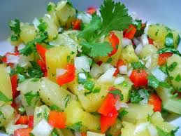

# Pineapple Salsa with Coriander

*This sweet, spicy, caramelized salsa pairs beautifully with smoky grilled and barbequed dishes, pork spareribs, sausages, duck breast, or swordfish. The warm pineapple base is enhanced with fresh red chilli heat, sambal oelek umami, and fresh coriander's bright herbaceous notes. Served warm, this salsa's flavors sing and complement rich, smoky proteins perfectly.*

**Yield:** Approximately 350 milliliters (4 servings)

## Overview
Pineapple salsa bridges sweet tropical fruit with heat and umami. The key technique here is caramelizing the pineapple in its own sugar and brown sugar, which develops deeper flavor and slight bitterness to offset the fruit's natural sweetness. Fresh red chilli provides heat, sambal oelek adds fermented chilli depth and umami, and lime juice brightens the overall composition. Fresh coriander added at the very end preserves its herbaceous aroma, the hallmark of this dish. Crucially, this salsa is served warm; warming brings out pineapple's natural sweetness and spices' aromatic qualities. Chilled pineapple salsa becomes dull and the fruit hard.

## Ingredients

### Pineapple Base
- 300 grams fresh pineapple (cut into 1-centimeter cubes, approximately 1 small pineapple)
- 1 tablespoon soft brown sugar (or light brown sugar)

### Heat & Umami Layers
- 1/2 fresh red chilli (mild varieties preferred unless more heat desired, finely diced with seeds)
- 1 tablespoon sambal oelek (Indonesian chilli paste)

### Acid & Brightness
- 1 teaspoon fresh lime juice (never bottled)

### Fresh Herbs & Finishing
- 2 tablespoons fresh coriander leaves (chopped, added just before serving)
- 1 pinch fine sea salt (to taste)

## Method

### Stage 1 – Prepare Pineapple
1. Select a ripe pineapple (it should yield slightly to palm pressure and smell sweetly aromatic).
1. Cut the pineapple in half lengthwise and remove the tough core.
1. Cut the flesh into 1-centimeter cubes (approximately 300 grams cubed pineapple).
1. Set aside any pineapple juices that accumulate during cutting; these will be used in cooking.

### Stage 2 – Caramelize Pineapple
1. Place a non-stick frying pan over medium heat (no oil or butter needed).
1. Sprinkle 1 tablespoon soft brown sugar directly into the dry pan.
1. Allow the sugar to melt (approximately 1-2 minutes) until it begins to bubble and turn golden amber.
1. Watch carefully; the sugar transitions from melted to caramelized quickly (a matter of seconds).
1. As soon as the sugar caramelizes to light amber (not dark brown), add the cubed pineapple.
1. Be careful: the initial caramel will bubble vigorously when the cold pineapple is added.

### Stage 3 – Cook Pineapple
1. Using a wooden spatula, stir the pineapple constantly to coat it with caramel.
1. Cook over medium heat, stirring occasionally (every 30-45 seconds), for approximately 4-5 minutes total.
1. The pineapple will begin to caramelize at its edges, turning light brown and developing deeper flavor.
1. Some of the pineapple cubes may begin to break down slightly at their edges; this is desired.
1. The main goal is to develop brown, caramelized spots on the pineapple surfaces while maintaining some cube structure.
1. The pan's contents will take on a richer, deeper golden color.

### Stage 4 – Add Chilli & Sambal
1. Add 1 finely diced red chilli (seeds included for regular heat, removed for milder result) to the hot pineapple.
1. Stir to combine (approximately 30 seconds).
1. Add 1 tablespoon sambal oelek.
1. Stir thoroughly to distribute the sambal evenly; the mixture will smell intensely spicy and aromatic.
1. The heat will blend with the caramelized pineapple's sweetness.

### Stage 5 – Finish & Cool Briefly
1. Remove the pan from heat.
1. Add 1 teaspoon fresh lime juice (squeeze directly from a lime; never use bottled).
1. Stir once to combine.
1. Add 1 pinch fine sea salt to taste and stir.
1. Allow the mixture to cool slightly (approximately 2-3 minutes) so it's warm but not dangerously hot.

### Stage 6 – Add Fresh Coriander
1. Just before serving (no more than 15 minutes before service), add 2 tablespoons fresh coriander leaves (chopped).
1. Stir once to distribute the coriander throughout.
1. The freshly added coriander will provide bright, herbaceous aroma.
1. Do not add coriander too far in advance; it will wilt and darken.
1. Serve the salsa warm (not hot, not cold).

## Notes
- **Pineapple Ripeness Critical:** Underripe pineapple is tough and acidic; fully ripe (slightly soft to pressure) yields sweet, tender fruit ideal for caramelizing.
- **Caramelization Essential:** The caramelization step develops deeper, more complex flavors; skipping this creates a flat, one-note fruit salsa.
- **Brown Sugar Preferred:** Brown sugar caramelizes more readily and adds subtle molasses depth; white sugar works but is less ideal.
- **Red Chilli Selection:** Mild red chillies (like long red Asian varieties) provide heat without overwhelming. Thai chillies are much hotter; adjust quantity accordingly.
- **Sambal Oelek Intensity:** This Indonesian chilli paste provides fermented depth; start with 1 tablespoon and increase if more sambal character is desired.
- **Fresh Lime Only:** Bottled lime juice tastes chemical and flat; fresh lime is essential for brightness.
- **Coriander Timing:** Fresh coriander must be added immediately before serving; it wilts and discolors within 15-20 minutes if added earlier.
- **Warm Service:** This salsa develops its full flavor profile only when served warm; chilled version becomes dull and pineapple hardens.

## Variations
**Extra Heat:** Add 1 additional whole red chilli (seeds included) for significantly more heat.
**Mango Combination:** Substitute 150 grams mango for 150 grams pineapple for different fruit character.
**With Habanero:** Replace red chilli with 1/4 habanero for seriously hot, fruity heat (be cautious; habanero is very hot).
**Mint Instead of Coriander:** Use fresh mint leaves for different herbaceous character (less pungent, more cooling).
**With Fish Sauce:** Add 1/2 teaspoon fish sauce alongside sambal for deeper umami (Vietnamese approach).

## Serving
Perfect with: Grilled pork ribs, sausages, duck breast, grilled swordfish or firm fish, barbequed chicken, smoky meats, spicy rice, crispy spring rolls
Temperature: Warm (approximately 40-50°C at service)
Ratio: 2-3 tablespoons per serving
Context: Barbecue accompaniment, grilled fish pairing, Southeast Asian-inspired dishes

## Storage
- Serve immediately or within 15-20 minutes of final preparation (coriander freshness is paramount).
- Refrigerate uneaten portions (without coriander) in a sealed container for up to 2-3 days.
- Reheat gently before serving; never serve chilled (flavor and texture are compromised).
- Do not freeze; pineapple texture breaks down and spice character becomes muted.
- Without the fresh coriander, the salsa base (pineapple with chilli and sambal) can be made 4-6 hours ahead and reheated before adding fresh coriander at service.
- Best consumed warm within 1 hour of final preparation for maximum fresh herb aroma and optimal pineapple character.