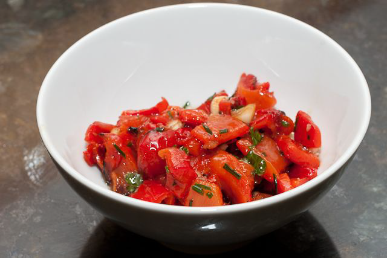

# Red pepper salsa

*This salsa works well with pasta or in bouchée as a canapé*

**Servings:** 8

## Overview
A vibrant, deeply flavoured roasted red pepper salsa with shallots, fresh thyme, basil, lemon, and olive oil. Roasting the peppers until blackened intensifies their sweetness and adds a subtle smokiness. Versatile enough to serve with pasta, spread in a bouchée canapé, or as an accompaniment to grilled meats and fish.

## Ingredients
- 4 red peppers
- 2 shallots (finely chopped)
- 2 sprigs thyme (leaves only, chopped)
- 12 basil leaves (snipped)
- 125 ml olive oil
- 2 lemons (juice only)
- salt and pepper (to taste)

## Method
1. Lightly oil the peppers, and either grill or roast them in the oven until the skin is blackened. 
1. Place in a plastic food bag, and leave to sweat. 
1. Once cooled, peel off the skin, and remove the core, seeds and white membrane.
1. Dice the peppers as finely as possible and place in a bowl. 
1. The texture should be between tiny dice and a coulis.
1. Add the shallots, thyme and basil to the peppers and season with salt and pepper, stir in the olive oil and lemon juice.
1. Taste and add seasoning if necessary.

## Notes
- Roasting until blackened is essential; this removes the bitter raw pepper skin and develops the characteristic sweetness
- Sweating the peppers in a sealed bag makes peeling easy; the steam loosens the skin from the flesh
- Removing all seeds, membrane, and white pith ensures a clean, sweet flavour without bitterness
- The salsa can be made up to a day in advance; the flavours meld and improve on resting

## Serving
Serve with: Pasta, in bouchée canapés, alongside grilled meats or fish, with crusty bread
Temperature: Room temperature or lightly warmed
Amount: 2-3 tablespoons per portion as a condiment

## Storage
- Refrigerate in an airtight container for up to 3 days
- The olive oil may solidify when cold; return to room temperature before serving
- Do not freeze; the texture of the diced pepper becomes watery when thawed
