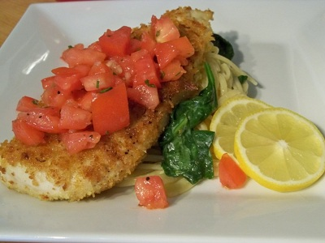

# Tomato and Basil Salsa

*This delicate, bright salsa showcases ripe summer tomatoes enhanced with briny capers, salty black olives, and fruity olive oil. Fresh basil provides the signature aromatic flourish at service. Perfect with lightly grilled seafood, delicate white fish, or cold chicken and veal, anywhere fresh simplicity and bright herb character are desired.*

**Yield:** Approximately 300 milliliters (6 servings)

## Overview
Tomato and basil salsa is a rustic Italian preparation that celebrates the quality of its primary ingredient: ripe, flavorful tomatoes. The supporting cast, capers, black olives, and lemon juice, merely emphasizes tomato's natural acidity and sweetness without overwhelming. Generous olive oil creates body and richness, while fresh basil added at the final moment introduces herbaceous brightness. The salsa benefits from an hour of resting before service, during which flavors meld and deepen. However, the fresh basil must be added only at the final 30 minutes before serving to preserve its aroma and color.

## Ingredients

### Tomato Base
- 200 grams very ripe tomatoes (approximately 3-4 medium tomatoes, fully ripe)

### Briny Elements
- 3 tablespoons capers (well drained, rinsed briefly if very salty)
- 50 grams black olives (pitted and finely diced, approximately 1/3 cup diced)

### Oil & Acid
- 150 milliliters extra virgin olive oil (fruity, good quality)
- Juice of 1 lemon (approximately 2-3 tablespoons)

### Fresh Finish
- 20 grams fresh basil leaves (finely snipped or torn, approximately 2-3 tablespoons packed)

### Seasonings
- Fine sea salt to taste
- Freshly ground white pepper (or black pepper if white unavailable) to taste

## Method

### Stage 1 – Prepare Tomatoes
1. Select 3-4 very ripe, flavorful tomatoes (approximately 200 grams total).
1. The tomatoes should smell distinctly sweet and fragrant; underripe tomatoes will create a thin, acidic salsa.
1. Using a small serrated knife, remove the stem end and cut a shallow X into the bottom of each tomato.
1. Bring a pot of water to a boil and carefully place 1-2 tomatoes into the boiling water for 30-45 seconds.
1. Remove with a slotted spoon and place in a bowl of ice water to cool completely.
1. The skin will slip off easily; peel away and discard the skin.
1. Repeat with remaining tomatoes.

### Stage 2 – De-seed & Dice
1. Halve each peeled tomato horizontally.
1. Gently squeeze each half to remove seeds and excess juice (reserve this juice if it's flavorful).
1. Using a small knife, remove any remaining seed pockets.
1. Dice the tomato flesh into approximately 5-millimeter cubes.
1. You should have approximately 150-160 grams of diced tomato flesh.
1. Place the diced tomato and any reserved, high-quality juice into a large bowl.

### Stage 3 – Prepare Capers & Olives
1. Measure 3 tablespoons capers (if they seem very salty, rinse briefly under cool water and pat dry).
1. Pit and finely dice 50 grams black olives (approximately 1/3 cup total).
1. Add both capers and diced olives to the tomato mixture.

### Stage 4 – Create Base Salsa
1. Add 150 milliliters extra virgin olive oil to the tomato-caper-olive mixture.
1. Add the juice of 1 lemon (approximately 2-3 tablespoons).
1. Using a wooden spoon, stir gently to combine all elements.
1. The salsa should be cohesive but retain visible tomato pieces, capers, and olives.

### Stage 5 – Season
1. Taste the salsa.
1. Add fine sea salt gradually (begin with 1/4 teaspoon and taste after each small addition).
1. Add freshly ground white pepper to taste (start with a few grinds).
1. The capers and olives already provide saltiness; season accordingly.
1. Stir once more to ensure seasonings are evenly distributed.

### Stage 6 – Rest & Meld
1. Cover the bowl loosely with a plate or partial plastic wrap.
1. Set aside at room temperature for approximately 45-60 minutes.
1. During this time, flavors will marry and deepen; the tomato will release additional juices that blend with the oil and acid.
1. Do not refrigerate at this stage; cold dulls flavor significantly.

### Stage 7 – Add Fresh Basil Before Service
1. Approximately 30 minutes before serving (no earlier), add 20 grams fresh basil leaves (finely snipped or torn, approximately 2-3 tablespoons packed).
1. The basil should be torn or snipped into small, irregular pieces, not chopped fine.
1. Stir once gently to distribute the basil throughout.
1. The freshly added basil will provide bright, herbaceous aroma and green color.
1. Do not add basil too far in advance; it will wilt, discolor, and oxidize within 20-30 minutes.

## Notes
- **Tomato Ripeness Essential:** Underripe tomatoes create thin, acidic, unpleasant salsa; select fully ripe, fragrant tomatoes only.
- **De-seeding Important:** Seeds create watery texture and sharp acidity; removing them improves the salsa's texture and balance.
- **Caper Selection:** Good-quality capers (not tiny nonpareille, but medium capucine size) provide better flavor; rinse salty varieties briefly.
- **Black Olives Preferred:** Brined black olives (like Kalamata) provide better flavor than green olives; pit whole olives before dicing.
- **Extra Virgin Olive Oil Essential:** Quality, fruity olive oil provides body and flavor; lesser oils create flat, thin results.
- **Lemon Over Other Acids:** Lemon juice is preferred over vinegar for this delicate preparation; vinegar overpowers.
- **Room Temperature Resting:** Never chill before service; cold mutes flavor entirely. Room temperature resting allows flavors to develop.
- **Fresh Basil Timing:** Must be added 30 minutes or less before serving; it discolors and loses aroma rapidly if added earlier.
- **White Pepper Preferred:** White pepper provides subtle heat without visual black specks; black pepper works but looks less refined.

## Variations
**With Shallot:** Add 1/2 small shallot (very finely minced) at the resting stage for subtle onion depth.
**Extra Basil:** Increase basil to 30 grams (approximately 1/4 cup) for stronger herbal character (watch for wilting if using full amount earlier than 30 minutes before service).
**With Anchovy:** Add 1/2 anchovy fillet (finely minced) to the oil for deeper umami (classic Italian approach).
**Oregano Instead of Basil:** Substitute fresh oregano for basil for different herbaceous character (more assertive, less sweet).
**Red Wine Vinegar Version:** Add 1 tablespoon red wine vinegar alongside lemon juice for sharper, more assertive acid profile.

## Serving
Perfect with: Lightly grilled or poached seafood, delicate white fish (sole, halibut, sea bass), cold roasted chicken or veal, room-temperature vegetable preparations, on grilled bread
Temperature: Room temperature (never chilled or warm)
Ratio: 2-3 tablespoons per serving
Context: Light fish course, cold meat appetizers, elegant summer service

## Storage
- The base salsa (without basil) can be refrigerated in a sealed glass container for up to 2-3 days.
- If refrigerated, allow the salsa to come to room temperature before serving (cold salsa tastes flat and tomato becomes hard).
- Add fresh basil only within 30 minutes of serving (it discolors and wilts if stored with the salsa).
- Do not freeze; tomato texture breaks down and fresh vegetable character is lost entirely.
- This salsa is best consumed on the day of preparation; after 24 hours, the salsa becomes watery and less vibrant.
- Prepare the base salsa 1-2 hours ahead if desired, but add basil immediately before service only.
- Best served within 1-2 hours of final preparation (after basil is added) for maximum herb aroma and fresh character.