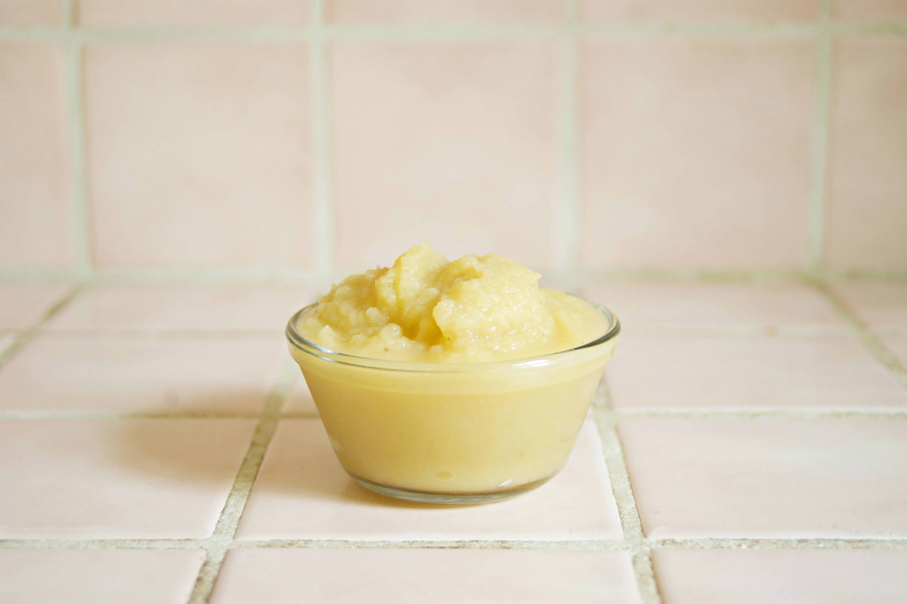

# Apple sauce

**Serves:** 6

**Prep Time:** 10 minutes

**Cook Time:** 25 minutes

## Overview
A smooth, silky apple compote with warm spice notes from cinnamon. This classic sauce brings bright acidity and natural sweetness to game, pork, and duck, while the tender texture makes it perfect for serving alongside both hot and cold meats.

## Ingredients

### Base
- 500 grams dessert apples (preferably Cox's)
- 20 grams caster sugar
- juice of half a lemon
- half a stick cinnamon
- 30 grams butter
- pinch of salt

## Method

### Stage 1 – Cook apples
1. Peel, core and finely dice the apples. 
1. Place them in a heavy-based saucepan with 150 ml water, along with the sugar, lemon juice and cinnamon.
1. Bring to a simmer over a medium heat, then cover and cook for about 15 minutes until the apples are tender but not dried out. 

### Stage 2 – Finish sauce
1. Discard the cinnamon stick.
1. Take the pan off the heat and, using a small whisk, incorporate the butter and a pinch of salt to make a smooth compote. 
1. The consistency will vary according to how ripe or green the apples are. 
1. If the sauce seems too thick, add a couple of tablespoons of water to thin it slightly. 

## Notes
- **Cinnamon selection:** Use a fresh stick for best flavour; discard before serving to prevent fragments in the sauce.
- **Texture variation:** The final consistency depends on the moisture content of your apples; adjust water or cooking time accordingly.
- **Apples to use:** Cox's apples provide excellent balance of sweetness and acidity; Bramleys can be substituted for a more tart sauce.

## Serving
Serve warm or at room temperature alongside roasted duck, pork, or game dishes. Also excellent with charcuterie and pâté.

## Storage
- Keeps refrigerated for 3–4 days in an airtight container.
- Freezes well for up to 3 months; thaw to room temperature before serving.
- Best eaten warm; reheat gently over low heat before serving.